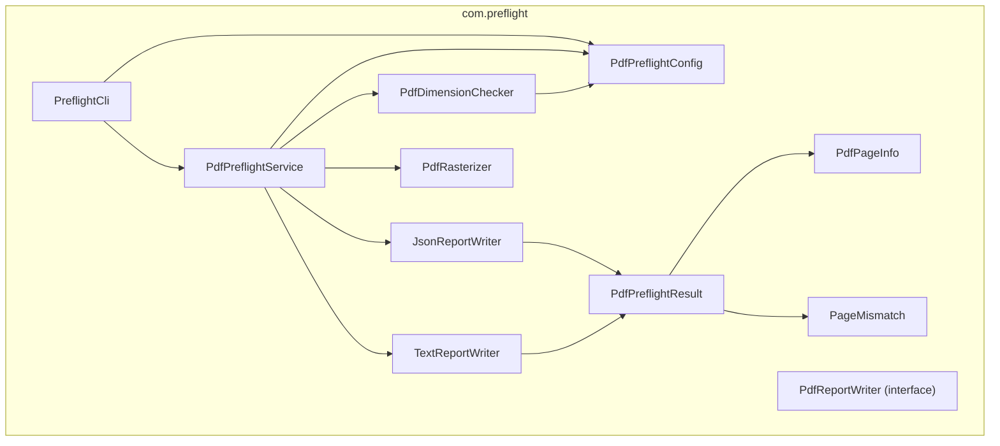
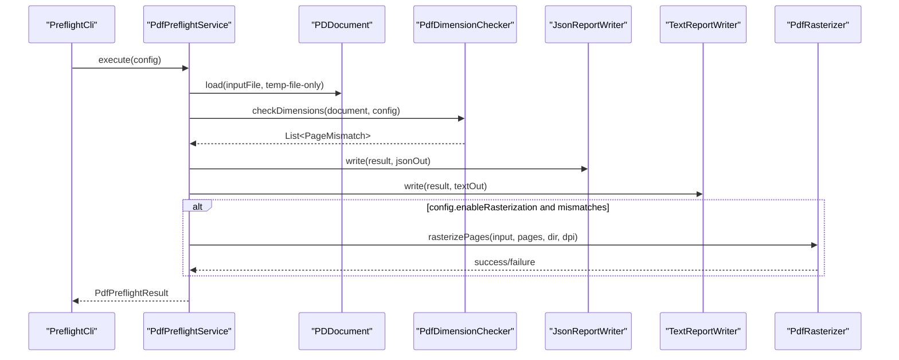
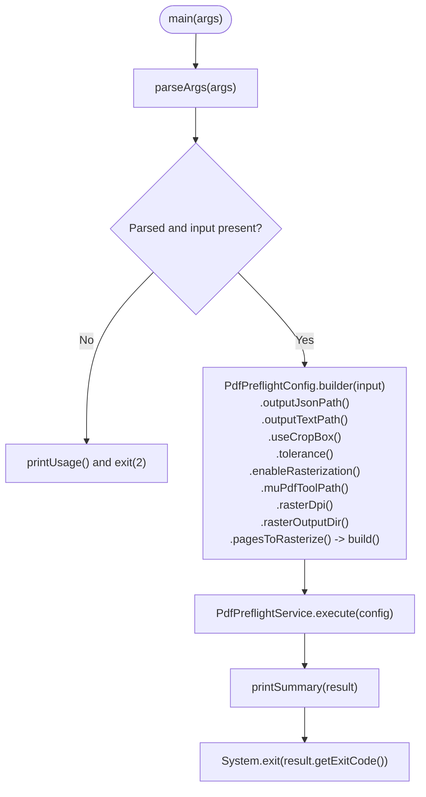
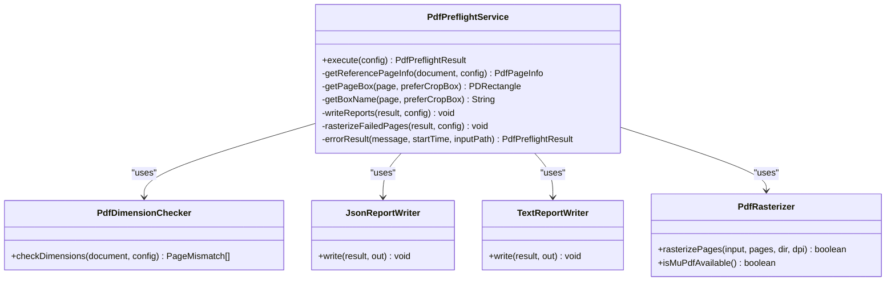
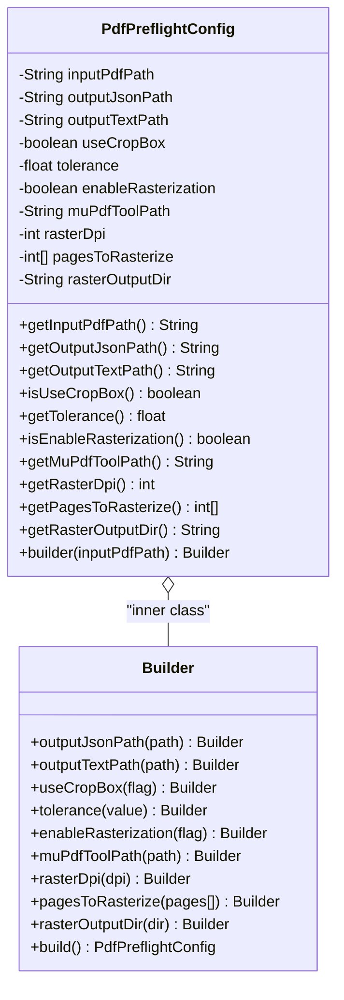
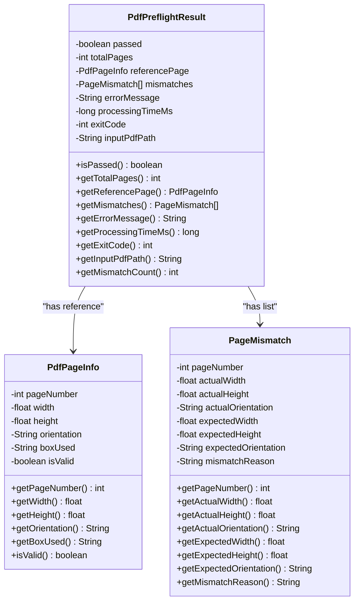
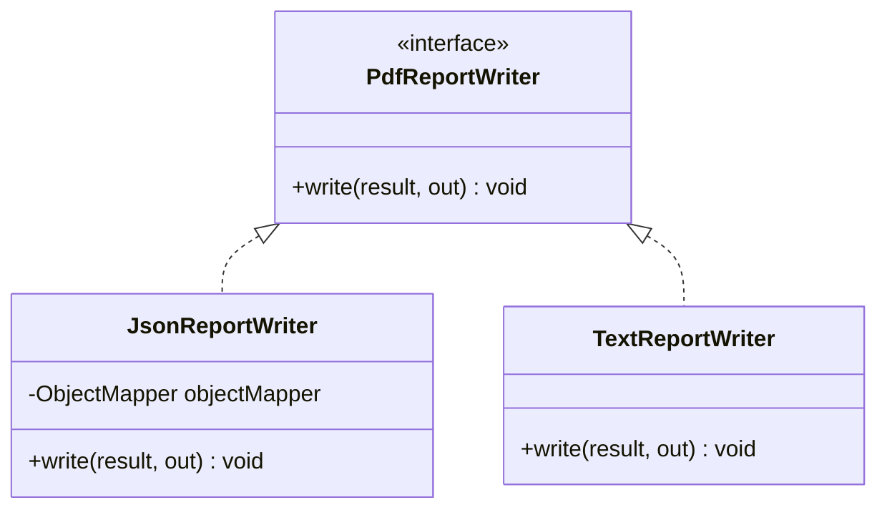
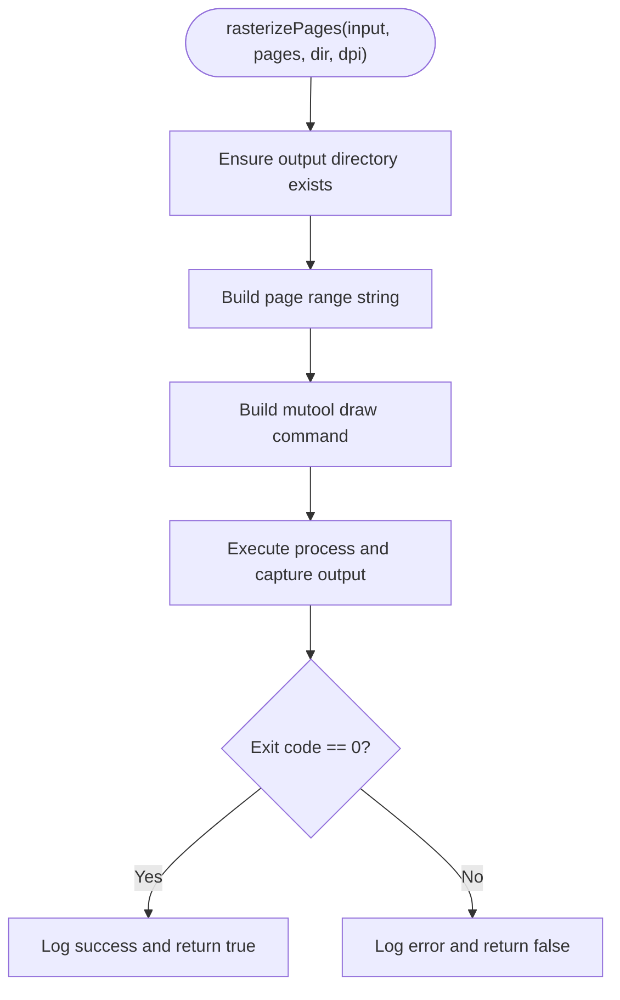
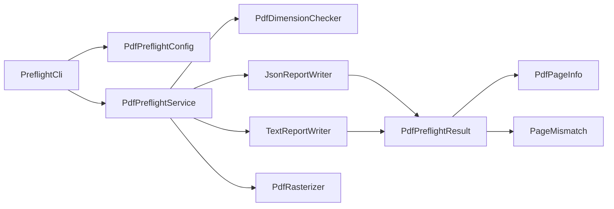

# API Reference

<cite>
**Referenced Files in This Document**
- [PreflightCli.java](file://pdf-preflight/src/main/java/com/preflight/PreflightCli.java)
- [PdfPreflightService.java](file://pdf-preflight/src/main/java/com/preflight/service/PdfPreflightService.java)
- [PdfPreflightConfig.java](file://pdf-preflight/src/main/java/com/preflight/config/PdfPreflightConfig.java)
- [PdfPreflightResult.java](file://pdf-preflight/src/main/java/com/preflight/model/PdfPreflightResult.java)
- [PdfPageInfo.java](file://pdf-preflight/src/main/java/com/preflight/model/PdfPageInfo.java)
- [PageMismatch.java](file://pdf-preflight/src/main/java/com/preflight/model/PageMismatch.java)
- [PdfRasterizer.java](file://pdf-preflight/src/main/java/com/preflight/rasterizer/PdfRasterizer.java)
- [PdfDimensionChecker.java](file://pdf-preflight/src/main/java/com/preflight/checker/PdfDimensionChecker.java)
- [PdfReportWriter.java](file://pdf-preflight/src/main/java/com/preflight/report/PdfReportWriter.java)
- [JsonReportWriter.java](file://pdf-preflight/src/main/java/com/preflight/report/JsonReportWriter.java)
- [TextReportWriter.java](file://pdf-preflight/src/main/java/com/preflight/report/TextReportWriter.java)
- [README.md](file://pdf-preflight/README.md)
- [CLI_EXAMPLES.md](file://pdf-preflight/CLI_EXAMPLES.md)
- [QUICKSTART.md](file://pdf-preflight/QUICKSTART.md)
- [PdfPreflightServiceTest.java](file://pdf-preflight/src/test/java/com/preflight/PdfPreflightServiceTest.java)
- [PdfDimensionCheckerTest.java](file://pdf-preflight/src/test/java/com/preflight/PdfDimensionCheckerTest.java)
</cite>

## Table of Contents
1. [Introduction](#introduction)
2. [Project Structure](#project-structure)
3. [Core Components](#core-components)
4. [Architecture Overview](#architecture-overview)
5. [Detailed Component Analysis](#detailed-component-analysis)
6. [Dependency Analysis](#dependency-analysis)
7. [Performance Considerations](#performance-considerations)
8. [Troubleshooting Guide](#troubleshooting-guide)
9. [Conclusion](#conclusion)
10. [Appendices](#appendices)

## Introduction
This document provides a comprehensive API reference for the PDF Preflight Module. It covers the command-line entry point, the orchestration service, configuration builder, model classes, report writers, and the optional rasterizer. It also includes usage examples, integration patterns, error handling, and guidance on versioning and backward compatibility.

## Project Structure
The module is organized into packages that separate concerns:
- config: Configuration with a fluent builder
- model: Immutable data carriers for results and mismatches
- checker: Validation logic for dimensions and orientation
- report: Report writer interface and implementations
- rasterizer: Optional MuPDF-based rasterization
- service: Orchestration service integrating all components
- PreflightCli: Command-line entry point

**Diagram sources**
- [PreflightCli.java:18-62](file://pdf-preflight/src/main/java/com/preflight/PreflightCli.java#L18-L62)
- [PdfPreflightService.java:28-40](file://pdf-preflight/src/main/java/com/preflight/service/PdfPreflightService.java#L28-L40)
- [PdfPreflightConfig.java:7-31](file://pdf-preflight/src/main/java/com/preflight/config/PdfPreflightConfig.java#L7-L31)
- [PdfDimensionChecker.java:17-26](file://pdf-preflight/src/main/java/com/preflight/checker/PdfDimensionChecker.java#L17-L26)
- [PdfReportWriter.java:11-21](file://pdf-preflight/src/main/java/com/preflight/report/PdfReportWriter.java#L11-L21)
- [JsonReportWriter.java:19-26](file://pdf-preflight/src/main/java/com/preflight/report/JsonReportWriter.java#L19-L26)
- [TextReportWriter.java:16-16](file://pdf-preflight/src/main/java/com/preflight/report/TextReportWriter.java#L16-L16)
- [PdfRasterizer.java:20-28](file://pdf-preflight/src/main/java/com/preflight/rasterizer/PdfRasterizer.java#L20-L28)
- [PdfPreflightResult.java:9-42](file://pdf-preflight/src/main/java/com/preflight/model/PdfPreflightResult.java#L9-L42)
- [PdfPageInfo.java:6-31](file://pdf-preflight/src/main/java/com/preflight/model/PdfPageInfo.java#L6-L31)
- [PageMismatch.java:6-30](file://pdf-preflight/src/main/java/com/preflight/model/PageMismatch.java#L6-L30)

**Section sources**
- [README.md:238-261](file://pdf-preflight/README.md#L238-L261)

## Core Components

### PreflightCli
Entry point for command-line usage. Parses arguments, builds configuration via the builder, executes the service, prints a summary, and exits with appropriate codes.

Key behaviors:
- Parses required and optional arguments
- Builds PdfPreflightConfig using the builder
- Invokes PdfPreflightService.execute
- Prints a human-friendly summary
- Exits with 0 (pass), 1 (fail), or 2 (error)

Usage examples are provided in the CLI examples documentation.

**Section sources**
- [PreflightCli.java:20-62](file://pdf-preflight/src/main/java/com/preflight/PreflightCli.java#L20-L62)
- [PreflightCli.java:184-213](file://pdf-preflight/src/main/java/com/preflight/PreflightCli.java#L184-L213)
- [CLI_EXAMPLES.md:1-427](file://pdf-preflight/CLI_EXAMPLES.md#L1-L427)

### PdfPreflightService
Main orchestration service that loads a PDF, runs validations, writes reports, and optionally rasterizes failed pages.

Public API:
- execute(config): Orchestrates the full workflow and returns PdfPreflightResult

Behavior highlights:
- Validates input existence and readability
- Loads PDF with temp-file-backed memory settings
- Extracts reference page info (first page)
- Runs PdfDimensionChecker
- Writes JSON and text reports
- Optionally rasterizes failed pages via PdfRasterizer

Error handling:
- Returns error result on missing/empty/corrupt files
- Closes document in a finally block
- Logs unexpected errors and returns an error result

**Section sources**
- [PdfPreflightService.java:48-125](file://pdf-preflight/src/main/java/com/preflight/service/PdfPreflightService.java#L48-L125)
- [PdfPreflightService.java:130-159](file://pdf-preflight/src/main/java/com/preflight/service/PdfPreflightService.java#L130-L159)
- [PdfPreflightService.java:164-183](file://pdf-preflight/src/main/java/com/preflight/service/PdfPreflightService.java#L164-L183)
- [PdfPreflightService.java:188-230](file://pdf-preflight/src/main/java/com/preflight/service/PdfPreflightService.java#L188-L230)
- [PdfPreflightService.java:235-240](file://pdf-preflight/src/main/java/com/preflight/service/PdfPreflightService.java#L235-L240)

### PdfPreflightConfig (Builder Pattern)
Immutable configuration built via a fluent builder.

Constructor and getters:
- PdfPreflightConfig(builder)
- getInputPdfPath()
- getOutputJsonPath()
- getOutputTextPath()
- isUseCropBox()
- getTolerance()
- isEnableRasterization()
- getMuPdfToolPath()
- getRasterDpi()
- getPagesToRasterize()
- getRasterOutputDir()

Builder methods:
- builder(inputPdfPath)
- outputJsonPath(path)
- outputTextPath(path)
- useCropBox(flag)
- tolerance(value)
- enableRasterization(flag)
- muPdfToolPath(path)
- rasterDpi(dpi)
- pagesToRasterize(pages[])
- rasterOutputDir(dir)
- build()

Defaults:
- outputJsonPath: "preflight-report.json"
- outputTextPath: "preflight-report.txt"
- useCropBox: true
- tolerance: 0.01f
- enableRasterization: false
- muPdfToolPath: "mutool"
- rasterDpi: 150
- pagesToRasterize: null
- rasterOutputDir: "rasterized-pages"

**Section sources**
- [PdfPreflightConfig.java:20-71](file://pdf-preflight/src/main/java/com/preflight/config/PdfPreflightConfig.java#L20-L71)
- [PdfPreflightConfig.java:73-141](file://pdf-preflight/src/main/java/com/preflight/config/PdfPreflightConfig.java#L73-L141)

### Model Classes

#### PdfPreflightResult
Immutable result container.

Constructors:
- Success constructor: sets passed, totalPages, referencePage, mismatches, processingTimeMs, inputPdfPath; exitCode is 0 if passed else 1
- Error constructor: sets passed=false, totalPages=0, referencePage=null, mismatches=[], errorMessage, processingTimeMs, inputPdfPath; exitCode=2

Public methods:
- isPassed(): boolean
- getTotalPages(): int
- getReferencePage(): PdfPageInfo
- getMismatches(): List<PageMismatch>
- getErrorMessage(): String
- getProcessingTimeMs(): long
- getExitCode(): int
- getInputPdfPath(): String
- getMismatchCount(): int

**Section sources**
- [PdfPreflightResult.java:20-42](file://pdf-preflight/src/main/java/com/preflight/model/PdfPreflightResult.java#L20-L42)
- [PdfPreflightResult.java:44-78](file://pdf-preflight/src/main/java/com/preflight/model/PdfPreflightResult.java#L44-L78)

#### PdfPageInfo
Immutable representation of a page’s dimensions and orientation.

Constructors:
- Valid page: pageNumber, width, height, boxUsed
- Invalid page: pageNumber, isValid (false indicates invalid)

Public methods:
- getPageNumber(): int
- getWidth(): float
- getHeight(): float
- getOrientation(): String ("landscape" or "portrait")
- getBoxUsed(): String ("CropBox" or "MediaBox")
- isValid(): boolean

**Section sources**
- [PdfPageInfo.java:15-31](file://pdf-preflight/src/main/java/com/preflight/model/PdfPageInfo.java#L15-L31)
- [PdfPageInfo.java:37-59](file://pdf-preflight/src/main/java/com/preflight/model/PdfPageInfo.java#L37-L59)

#### PageMismatch
Represents a mismatch between a page and the reference page.

Constructor:
- PageMismatch(pageNumber, actualWidth, actualHeight, actualOrientation, expectedWidth, expectedHeight, expectedOrientation, mismatchReason)

Public methods:
- getPageNumber(): int
- getActualWidth(): float
- getActualHeight(): float
- getActualOrientation(): String
- getExpectedWidth(): float
- getExpectedHeight(): float
- getExpectedOrientation(): String
- getMismatchReason(): String

**Section sources**
- [PageMismatch.java:17-30](file://pdf-preflight/src/main/java/com/preflight/model/PageMismatch.java#L17-L30)
- [PageMismatch.java:31-61](file://pdf-preflight/src/main/java/com/preflight/model/PageMismatch.java#L31-L61)

### Report Writers

#### PdfReportWriter (Interface)
Defines a contract for writing preflight results to an output stream.

Methods:
- write(result, out): throws IOException

**Section sources**
- [PdfReportWriter.java:11-21](file://pdf-preflight/src/main/java/com/preflight/report/PdfReportWriter.java#L11-L21)

#### JsonReportWriter
Implements machine-readable JSON reports.

Behavior:
- Serializes PdfPreflightResult to JSON with formatted indentation
- Includes passed, totalPages, processingTimeMs, exitCode, inputPdf, referencePage, mismatches, mismatchCount
- Rounds numeric values to two decimals

**Section sources**
- [JsonReportWriter.java:19-26](file://pdf-preflight/src/main/java/com/preflight/report/JsonReportWriter.java#L19-L26)
- [JsonReportWriter.java:28-56](file://pdf-preflight/src/main/java/com/preflight/report/JsonReportWriter.java#L28-L56)
- [JsonReportWriter.java:58-83](file://pdf-preflight/src/main/java/com/preflight/report/JsonReportWriter.java#L58-L83)

#### TextReportWriter
Implements human-readable text reports.

Behavior:
- Writes a formatted report including status, totals, reference page details, processing time, and mismatch summaries
- Converts points to inches for readability

**Section sources**
- [TextReportWriter.java:16-16](file://pdf-preflight/src/main/java/com/preflight/report/TextReportWriter.java#L16-L16)
- [TextReportWriter.java:18-94](file://pdf-preflight/src/main/java/com/preflight/report/TextReportWriter.java#L18-L94)

### PdfRasterizer API
Optional rasterizer that renders PDF pages to images using MuPDF.

Public API:
- rasterizePages(inputPdfPath, pageNumbers[], outputDir, dpi): boolean
- isMuPdfAvailable(): boolean

Behavior:
- Creates output directory if needed
- Builds a page range string and executes mutool draw with specified DPI
- Captures process output and logs errors
- Returns success/failure based on process exit code

Notes:
- Completely isolated from core logic; failures do not affect preflight pass/fail
- Requires mutool availability

**Section sources**
- [PdfRasterizer.java:20-28](file://pdf-preflight/src/main/java/com/preflight/rasterizer/PdfRasterizer.java#L20-L28)
- [PdfRasterizer.java:39-98](file://pdf-preflight/src/main/java/com/preflight/rasterizer/PdfRasterizer.java#L39-L98)
- [PdfRasterizer.java:104-117](file://pdf-preflight/src/main/java/com/preflight/rasterizer/PdfRasterizer.java#L104-L117)
- [PdfRasterizer.java:122-135](file://pdf-preflight/src/main/java/com/preflight/rasterizer/PdfRasterizer.java#L122-L135)

## Architecture Overview

**Diagram sources**
- [PreflightCli.java:31-50](file://pdf-preflight/src/main/java/com/preflight/PreflightCli.java#L31-L50)
- [PdfPreflightService.java:48-125](file://pdf-preflight/src/main/java/com/preflight/service/PdfPreflightService.java#L48-L125)
- [PdfPreflightService.java:164-183](file://pdf-preflight/src/main/java/com/preflight/service/PdfPreflightService.java#L164-L183)
- [PdfPreflightService.java:188-230](file://pdf-preflight/src/main/java/com/preflight/service/PdfPreflightService.java#L188-L230)
- [PdfDimensionChecker.java:26-99](file://pdf-preflight/src/main/java/com/preflight/checker/PdfDimensionChecker.java#L26-L99)
- [JsonReportWriter.java:28-56](file://pdf-preflight/src/main/java/com/preflight/report/JsonReportWriter.java#L28-L56)
- [TextReportWriter.java:18-94](file://pdf-preflight/src/main/java/com/preflight/report/TextReportWriter.java#L18-L94)
- [PdfRasterizer.java:39-98](file://pdf-preflight/src/main/java/com/preflight/rasterizer/PdfRasterizer.java#L39-L98)

## Detailed Component Analysis

### PreflightCli Analysis

**Diagram sources**
- [PreflightCli.java:20-62](file://pdf-preflight/src/main/java/com/preflight/PreflightCli.java#L20-L62)
- [PreflightCli.java:67-156](file://pdf-preflight/src/main/java/com/preflight/PreflightCli.java#L67-L156)
- [PreflightCli.java:184-213](file://pdf-preflight/src/main/java/com/preflight/PreflightCli.java#L184-L213)

**Section sources**
- [PreflightCli.java:20-62](file://pdf-preflight/src/main/java/com/preflight/PreflightCli.java#L20-L62)
- [PreflightCli.java:67-156](file://pdf-preflight/src/main/java/com/preflight/PreflightCli.java#L67-L156)
- [PreflightCli.java:184-213](file://pdf-preflight/src/main/java/com/preflight/PreflightCli.java#L184-L213)

### PdfPreflightService Analysis

**Diagram sources**
- [PdfPreflightService.java:28-40](file://pdf-preflight/src/main/java/com/preflight/service/PdfPreflightService.java#L28-L40)
- [PdfPreflightService.java:127-159](file://pdf-preflight/src/main/java/com/preflight/service/PdfPreflightService.java#L127-L159)
- [PdfPreflightService.java:164-183](file://pdf-preflight/src/main/java/com/preflight/service/PdfPreflightService.java#L164-L183)
- [PdfPreflightService.java:188-230](file://pdf-preflight/src/main/java/com/preflight/service/PdfPreflightService.java#L188-L230)
- [PdfDimensionChecker.java:17-26](file://pdf-preflight/src/main/java/com/preflight/checker/PdfDimensionChecker.java#L17-L26)
- [JsonReportWriter.java:19-26](file://pdf-preflight/src/main/java/com/preflight/report/JsonReportWriter.java#L19-L26)
- [TextReportWriter.java:16-16](file://pdf-preflight/src/main/java/com/preflight/report/TextReportWriter.java#L16-L16)
- [PdfRasterizer.java:20-28](file://pdf-preflight/src/main/java/com/preflight/rasterizer/PdfRasterizer.java#L20-L28)

**Section sources**
- [PdfPreflightService.java:48-125](file://pdf-preflight/src/main/java/com/preflight/service/PdfPreflightService.java#L48-L125)
- [PdfPreflightService.java:127-159](file://pdf-preflight/src/main/java/com/preflight/service/PdfPreflightService.java#L127-L159)
- [PdfPreflightService.java:164-183](file://pdf-preflight/src/main/java/com/preflight/service/PdfPreflightService.java#L164-L183)
- [PdfPreflightService.java:188-230](file://pdf-preflight/src/main/java/com/preflight/service/PdfPreflightService.java#L188-L230)

### PdfPreflightConfig Builder Analysis

**Diagram sources**
- [PdfPreflightConfig.java:7-31](file://pdf-preflight/src/main/java/com/preflight/config/PdfPreflightConfig.java#L7-L31)
- [PdfPreflightConfig.java:73-141](file://pdf-preflight/src/main/java/com/preflight/config/PdfPreflightConfig.java#L73-L141)

**Section sources**
- [PdfPreflightConfig.java:73-141](file://pdf-preflight/src/main/java/com/preflight/config/PdfPreflightConfig.java#L73-L141)

### Model Classes Analysis

**Diagram sources**
- [PdfPreflightResult.java:9-42](file://pdf-preflight/src/main/java/com/preflight/model/PdfPreflightResult.java#L9-L42)
- [PdfPageInfo.java:6-31](file://pdf-preflight/src/main/java/com/preflight/model/PdfPageInfo.java#L6-L31)
- [PageMismatch.java:6-30](file://pdf-preflight/src/main/java/com/preflight/model/PageMismatch.java#L6-L30)

**Section sources**
- [PdfPreflightResult.java:20-78](file://pdf-preflight/src/main/java/com/preflight/model/PdfPreflightResult.java#L20-L78)
- [PdfPageInfo.java:15-59](file://pdf-preflight/src/main/java/com/preflight/model/PdfPageInfo.java#L15-L59)
- [PageMismatch.java:17-61](file://pdf-preflight/src/main/java/com/preflight/model/PageMismatch.java#L17-L61)

### Report Writers Analysis

**Diagram sources**
- [PdfReportWriter.java:11-21](file://pdf-preflight/src/main/java/com/preflight/report/PdfReportWriter.java#L11-L21)
- [JsonReportWriter.java:19-26](file://pdf-preflight/src/main/java/com/preflight/report/JsonReportWriter.java#L19-L26)
- [TextReportWriter.java:16-16](file://pdf-preflight/src/main/java/com/preflight/report/TextReportWriter.java#L16-L16)

**Section sources**
- [PdfReportWriter.java:11-21](file://pdf-preflight/src/main/java/com/preflight/report/PdfReportWriter.java#L11-L21)
- [JsonReportWriter.java:28-56](file://pdf-preflight/src/main/java/com/preflight/report/JsonReportWriter.java#L28-L56)
- [TextReportWriter.java:18-94](file://pdf-preflight/src/main/java/com/preflight/report/TextReportWriter.java#L18-L94)

### PdfRasterizer Analysis

**Diagram sources**
- [PdfRasterizer.java:39-98](file://pdf-preflight/src/main/java/com/preflight/rasterizer/PdfRasterizer.java#L39-L98)
- [PdfRasterizer.java:104-117](file://pdf-preflight/src/main/java/com/preflight/rasterizer/PdfRasterizer.java#L104-L117)

**Section sources**
- [PdfRasterizer.java:39-98](file://pdf-preflight/src/main/java/com/preflight/rasterizer/PdfRasterizer.java#L39-L98)
- [PdfRasterizer.java:104-135](file://pdf-preflight/src/main/java/com/preflight/rasterizer/PdfRasterizer.java#L104-L135)

## Dependency Analysis

**Diagram sources**
- [PreflightCli.java:3-5](file://pdf-preflight/src/main/java/com/preflight/PreflightCli.java#L3-L5)
- [PdfPreflightService.java:3-11](file://pdf-preflight/src/main/java/com/preflight/service/PdfPreflightService.java#L3-L11)
- [JsonReportWriter.java:3-7](file://pdf-preflight/src/main/java/com/preflight/report/JsonReportWriter.java#L3-L7)
- [TextReportWriter.java:3-6](file://pdf-preflight/src/main/java/com/preflight/report/TextReportWriter.java#L3-L6)
- [PdfPreflightResult.java:3-4](file://pdf-preflight/src/main/java/com/preflight/model/PdfPreflightResult.java#L3-L4)
- [PdfPageInfo.java:3-4](file://pdf-preflight/src/main/java/com/preflight/model/PdfPageInfo.java#L3-L4)
- [PageMismatch.java:3-4](file://pdf-preflight/src/main/java/com/preflight/model/PageMismatch.java#L3-L4)

**Section sources**
- [PreflightCli.java:3-5](file://pdf-preflight/src/main/java/com/preflight/PreflightCli.java#L3-L5)
- [PdfPreflightService.java:3-11](file://pdf-preflight/src/main/java/com/preflight/service/PdfPreflightService.java#L3-L11)
- [JsonReportWriter.java:3-7](file://pdf-preflight/src/main/java/com/preflight/report/JsonReportWriter.java#L3-L7)
- [TextReportWriter.java:3-6](file://pdf-preflight/src/main/java/com/preflight/report/TextReportWriter.java#L3-L6)
- [PdfPreflightResult.java:3-4](file://pdf-preflight/src/main/java/com/preflight/model/PdfPreflightResult.java#L3-L4)
- [PdfPageInfo.java:3-4](file://pdf-preflight/src/main/java/com/preflight/model/PdfPageInfo.java#L3-L4)
- [PageMismatch.java:3-4](file://pdf-preflight/src/main/java/com/preflight/model/PageMismatch.java#L3-L4)

## Performance Considerations
- Memory usage: Uses temp-file-only mode for PDFBox to handle large files efficiently
- Streaming: Processes pages sequentially to minimize memory footprint
- No rendering by default: Core validation avoids page rendering unless rasterization is enabled
- Single-pass checking: Combines dimension and orientation checks for efficiency

**Section sources**
- [README.md:273-283](file://pdf-preflight/README.md#L273-L283)
- [PdfPreflightService.java:66-73](file://pdf-preflight/src/main/java/com/preflight/service/PdfPreflightService.java#L66-L73)
- [PdfDimensionChecker.java:26-99](file://pdf-preflight/src/main/java/com/preflight/checker/PdfDimensionChecker.java#L26-L99)

## Troubleshooting Guide
Common issues and resolutions:
- MuPDF not available: Install mupdf-tools or specify a custom path; rasterization is optional
- Corrupt or encrypted PDFs: Returns error exit code with descriptive message
- Missing input file: Returns error exit code indicating file not found
- OutOfMemoryError with large files: Ensure Java 11+ and consider increasing heap size

**Section sources**
- [README.md:347-361](file://pdf-preflight/README.md#L347-L361)
- [PdfPreflightService.java:54-83](file://pdf-preflight/src/main/java/com/preflight/service/PdfPreflightService.java#L54-L83)
- [PdfRasterizer.java:122-135](file://pdf-preflight/src/main/java/com/preflight/rasterizer/PdfRasterizer.java#L122-L135)

## Conclusion
The PDF Preflight Module offers a robust, modular, and extensible API for validating PDF page dimensions and orientation. Its builder-based configuration, immutable models, and pluggable report writers enable flexible integration in both CLI and programmatic contexts. Optional rasterization enhances diagnostics without affecting core pass/fail logic.

## Appendices

### API Usage Examples and Integration Patterns
- CLI usage examples and exit codes are documented in CLI examples and quick start guides
- Programmatic usage follows building a configuration via the builder and invoking the service

Integration best practices:
- Always check exit codes in scripts and CI/CD pipelines
- Use absolute paths for input and output files
- Set tolerance according to your PDF generation workflow
- Enable rasterization for visual inspection of failed pages
- Archive reports for audit trails

**Section sources**
- [CLI_EXAMPLES.md:1-427](file://pdf-preflight/CLI_EXAMPLES.md#L1-L427)
- [QUICKSTART.md:1-80](file://pdf-preflight/QUICKSTART.md#L1-L80)
- [PdfPreflightServiceTest.java:30-223](file://pdf-preflight/src/test/java/com/preflight/PdfPreflightServiceTest.java#L30-L223)
- [PdfDimensionCheckerTest.java:24-231](file://pdf-preflight/src/test/java/com/preflight/PdfDimensionCheckerTest.java#L24-L231)

### Versioning and Backward Compatibility
- The project is versioned as 1.0.0 per documentation
- Backward compatibility considerations:
  - Builder pattern allows adding new optional fields without breaking existing code
  - Default values in the builder ensure new options do not change behavior for existing configurations
  - Report writers are interfaces, enabling new implementations without altering existing code
  - Rasterizer is optional and isolated from core logic

Migration guidance:
- When extending functionality, add new builder methods with sensible defaults
- Maintain immutability of model classes to preserve API stability
- Keep report writer interface unchanged to support third-party implementations

**Section sources**
- [README.md:1-390](file://pdf-preflight/README.md#L1-L390)
- [PdfPreflightConfig.java:73-141](file://pdf-preflight/src/main/java/com/preflight/config/PdfPreflightConfig.java#L73-L141)
- [PdfReportWriter.java:11-21](file://pdf-preflight/src/main/java/com/preflight/report/PdfReportWriter.java#L11-L21)
- [PdfRasterizer.java:20-28](file://pdf-preflight/src/main/java/com/preflight/rasterizer/PdfRasterizer.java#L20-L28)