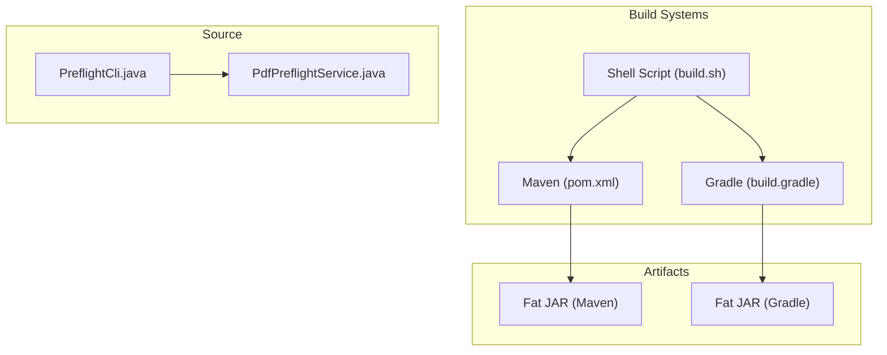
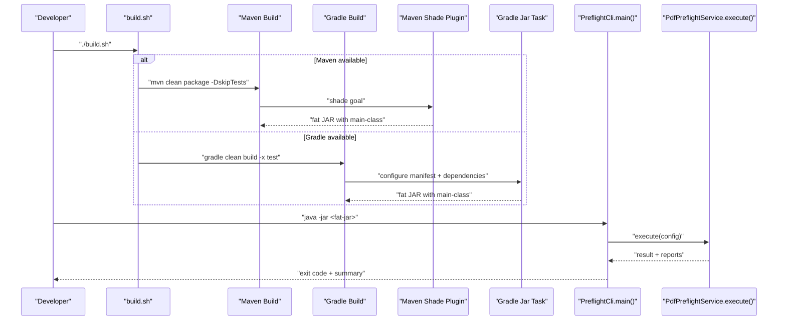
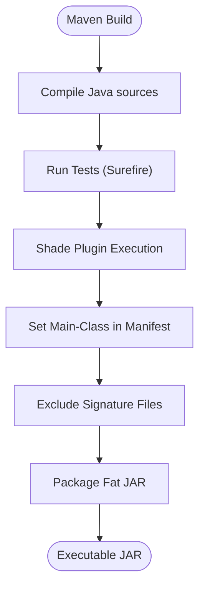
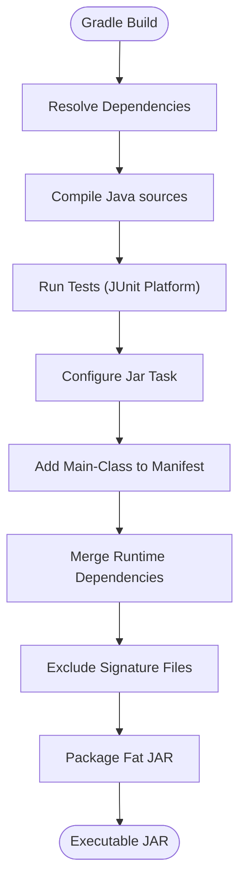
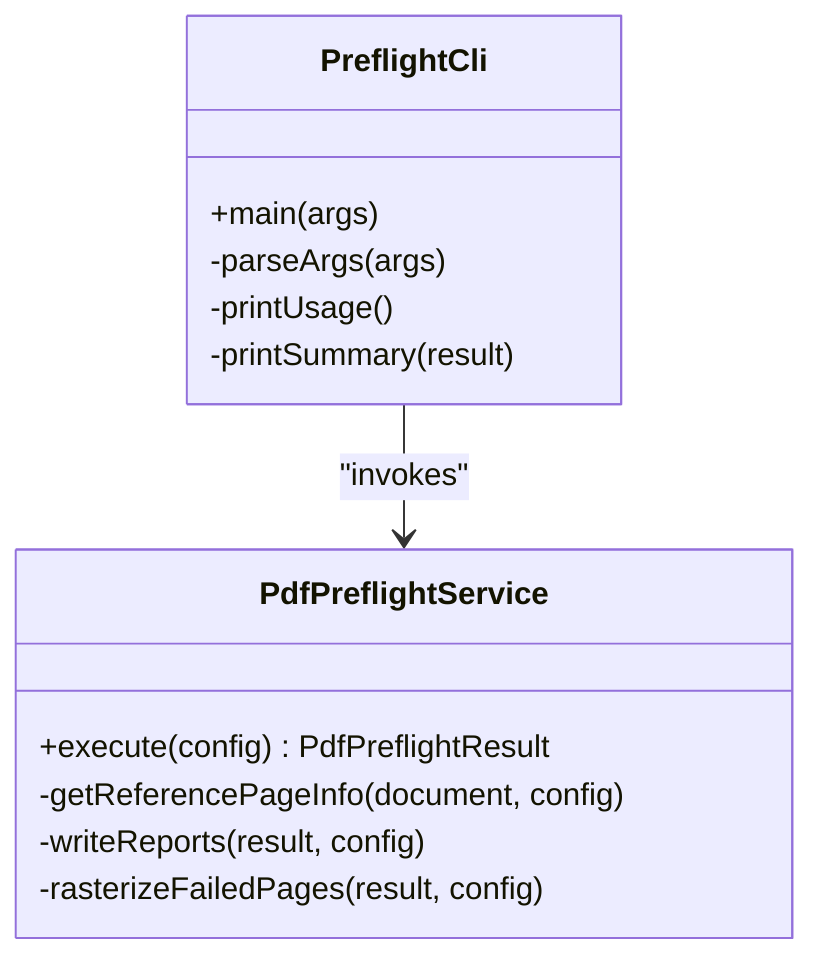
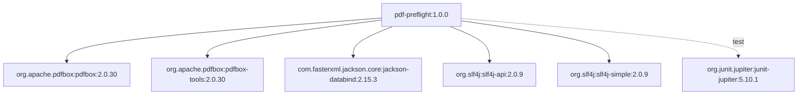

# Build and Deployment

<cite>
**Referenced Files in This Document**
- [pom.xml](file://pdf-preflight/pom.xml)
- [build.gradle](file://pdf-preflight/build.gradle)
- [build.sh](file://pdf-preflight/build.sh)
- [README.md](file://pdf-preflight/README.md)
- [DEPENDENCIES.md](file://pdf-preflight/DEPENDENCIES.md)
- [PreflightCli.java](file://pdf-preflight/src/main/java/com/preflight/PreflightCli.java)
- [PdfPreflightService.java](file://pdf-preflight/src/main/java/com/preflight/service/PdfPreflightService.java)
- [PdfPreflightServiceTest.java](file://pdf-preflight/src/test/java/com/preflight/PdfPreflightServiceTest.java)
- [PdfDimensionCheckerTest.java](file://pdf-preflight/src/test/java/com/preflight/PdfDimensionCheckerTest.java)
- [QUICKSTART.md](file://pdf-preflight/QUICKSTART.md)
</cite>

## Table of Contents
1. [Introduction](#introduction)
2. [Project Structure](#project-structure)
3. [Core Components](#core-components)
4. [Architecture Overview](#architecture-overview)
5. [Detailed Component Analysis](#detailed-component-analysis)
6. [Dependency Analysis](#dependency-analysis)
7. [Performance Considerations](#performance-considerations)
8. [Troubleshooting Guide](#troubleshooting-guide)
9. [Conclusion](#conclusion)
10. [Appendices](#appendices)

## Introduction
This document provides comprehensive build and deployment guidance for the PDF Preflight Module. It covers dual build system support (Maven and Gradle), executable fat JAR creation, shading and manifest configuration, dependency management, build optimization, testing integration, and deployment strategies. It also includes troubleshooting advice for common build and runtime issues.

## Project Structure
The project is organized around a Java module with a CLI entry point and a service layer. Build configurations are provided for both Maven and Gradle, and a convenience shell script automates the build process.

**Diagram sources**
- [pom.xml:1-125](file://pdf-preflight/pom.xml#L1-L125)
- [build.gradle:1-62](file://pdf-preflight/build.gradle#L1-L62)
- [build.sh:1-56](file://pdf-preflight/build.sh#L1-L56)
- [PreflightCli.java:18-62](file://pdf-preflight/src/main/java/com/preflight/PreflightCli.java#L18-L62)
- [PdfPreflightService.java:48-125](file://pdf-preflight/src/main/java/com/preflight/service/PdfPreflightService.java#L48-L125)

**Section sources**
- [pom.xml:1-125](file://pdf-preflight/pom.xml#L1-L125)
- [build.gradle:1-62](file://pdf-preflight/build.gradle#L1-L62)
- [build.sh:1-56](file://pdf-preflight/build.sh#L1-L56)
- [README.md:53-82](file://pdf-preflight/README.md#L53-L82)

## Core Components
- Dual build systems:
  - Maven: Uses the shade plugin to produce an executable fat JAR with a configured main class and excludes signature files.
  - Gradle: Uses the application plugin and a custom jar task to include runtime dependencies and set the main class in the manifest.
- Executable JAR structure:
  - Both builds configure the main class to the CLI entry point, enabling direct execution with java -jar.
- Testing:
  - Maven Surefire plugin and Gradle JUnit Platform are configured for test execution.
- Shell automation:
  - A build script detects Maven or Gradle availability and runs the appropriate build, skipping tests by default.

**Section sources**
- [pom.xml:71-123](file://pdf-preflight/pom.xml#L71-L123)
- [build.gradle:35-61](file://pdf-preflight/build.gradle#L35-L61)
- [build.sh:14-38](file://pdf-preflight/build.sh#L14-L38)
- [README.md:284-294](file://pdf-preflight/README.md#L284-L294)

## Architecture Overview
The build system produces an executable fat JAR that bundles all runtime dependencies. The CLI entry point delegates to the service layer, which orchestrates validation, reporting, and optional rasterization.

**Diagram sources**
- [build.sh:14-38](file://pdf-preflight/build.sh#L14-L38)
- [pom.xml:91-121](file://pdf-preflight/pom.xml#L91-L121)
- [build.gradle:43-61](file://pdf-preflight/build.gradle#L43-L61)
- [PreflightCli.java:20-62](file://pdf-preflight/src/main/java/com/preflight/PreflightCli.java#L20-L62)
- [PdfPreflightService.java:48-125](file://pdf-preflight/src/main/java/com/preflight/service/PdfPreflightService.java#L48-L125)

## Detailed Component Analysis

### Maven Build Configuration
- Properties:
  - Java 11 source/target compatibility.
  - Centralized dependency versions via properties.
- Dependencies:
  - Apache PDFBox (core and tools).
  - Jackson databind for JSON reports.
  - SLF4J API and simple implementation for logging.
  - JUnit 5 for testing.
- Plugins:
  - Compiler plugin sets Java 11.
  - Surefire plugin for test execution.
  - Shade plugin:
    - Configures the main class for the CLI.
    - Excludes signature META-INF files to prevent signing conflicts in the merged JAR.
    - Runs during the package phase to produce the fat JAR.

**Diagram sources**
- [pom.xml:71-123](file://pdf-preflight/pom.xml#L71-L123)

**Section sources**
- [pom.xml:16-24](file://pdf-preflight/pom.xml#L16-L24)
- [pom.xml:26-69](file://pdf-preflight/pom.xml#L26-L69)
- [pom.xml:71-123](file://pdf-preflight/pom.xml#L71-L123)

### Gradle Build Configuration
- Java configuration:
  - Java 11 source/target compatibility.
- Repositories:
  - Maven Central for dependency resolution.
- Dependencies:
  - Same as Maven: PDFBox core/tools, Jackson, SLF4J, JUnit 5.
- Application plugin:
  - Sets the main class for the application.
- Jar task:
  - Adds a manifest attribute for the main class.
  - Includes runtime dependencies by zipping them into the JAR.
  - Excludes signature files.
  - Uses DuplicatesStrategy.EXCLUDE to avoid conflicts.

**Diagram sources**
- [build.gradle:18-33](file://pdf-preflight/build.gradle#L18-L33)
- [build.gradle:43-61](file://pdf-preflight/build.gradle#L43-L61)

**Section sources**
- [build.gradle:9-12](file://pdf-preflight/build.gradle#L9-L12)
- [build.gradle:14-16](file://pdf-preflight/build.gradle#L14-L16)
- [build.gradle:18-33](file://pdf-preflight/build.gradle#L18-L33)
- [build.gradle:35-41](file://pdf-preflight/build.gradle#L35-L41)
- [build.gradle:43-61](file://pdf-preflight/build.gradle#L43-L61)

### Executable JAR Structure and Main Class
- Both Maven and Gradle builds set the main class to the CLI entry point, enabling direct execution with java -jar.
- The CLI parses arguments, constructs configuration, executes the service, prints a summary, and exits with appropriate codes.

**Diagram sources**
- [PreflightCli.java:18-62](file://pdf-preflight/src/main/java/com/preflight/PreflightCli.java#L18-L62)
- [PdfPreflightService.java:48-125](file://pdf-preflight/src/main/java/com/preflight/service/PdfPreflightService.java#L48-L125)

**Section sources**
- [PreflightCli.java:20-62](file://pdf-preflight/src/main/java/com/preflight/PreflightCli.java#L20-L62)
- [PdfPreflightService.java:48-125](file://pdf-preflight/src/main/java/com/preflight/service/PdfPreflightService.java#L48-L125)

### Testing Integration
- Maven:
  - Surefire plugin configured for test execution.
- Gradle:
  - JUnit Platform configured for test execution.
- Tests:
  - Integration tests exercise the full workflow, including file I/O and report generation.
  - Unit tests focus on dimension and orientation checking with various scenarios.

**Section sources**
- [pom.xml:84-89](file://pdf-preflight/pom.xml#L84-L89)
- [build.gradle:39-41](file://pdf-preflight/build.gradle#L39-L41)
- [PdfPreflightServiceTest.java:22-225](file://pdf-preflight/src/test/java/com/preflight/PdfPreflightServiceTest.java#L22-L225)
- [PdfDimensionCheckerTest.java:20-232](file://pdf-preflight/src/test/java/com/preflight/PdfDimensionCheckerTest.java#L20-L232)

## Dependency Analysis
- Production dependencies:
  - Apache PDFBox 2.0.30 for PDF parsing and low-memory document loading.
  - PDFBox Tools for utilities.
  - Jackson Databind 2.15.3 for JSON report generation.
  - SLF4J 2.0.9 for logging.
- Test dependencies:
  - JUnit Jupiter 5.10.1 for unit/integration tests.
- Optional dependency:
  - MuPDF tools for optional rasterization of failed pages.
- Dependency tree and license compatibility are documented.

**Diagram sources**
- [DEPENDENCIES.md:44-66](file://pdf-preflight/DEPENDENCIES.md#L44-L66)
- [pom.xml:26-69](file://pdf-preflight/pom.xml#L26-L69)
- [build.gradle:18-33](file://pdf-preflight/build.gradle#L18-L33)

**Section sources**
- [DEPENDENCIES.md:1-87](file://pdf-preflight/DEPENDENCIES.md#L1-L87)
- [pom.xml:26-69](file://pdf-preflight/pom.xml#L26-L69)
- [build.gradle:18-33](file://pdf-preflight/build.gradle#L18-L33)

## Performance Considerations
- Memory usage:
  - The service loads PDFs with a temp-file-only memory setting to handle large files without loading entire content into heap memory.
- Streaming:
  - Pages are processed sequentially to minimize memory footprint.
- Reporting:
  - Reports are written synchronously to configured paths after validation completes.

**Section sources**
- [PdfPreflightService.java:66-73](file://pdf-preflight/src/main/java/com/preflight/service/PdfPreflightService.java#L66-L73)
- [DEPENDENCIES.md:76-87](file://pdf-preflight/DEPENDENCIES.md#L76-L87)

## Troubleshooting Guide
- Build failures:
  - Missing Maven or Gradle: The build script detects absence and provides installation instructions.
  - Dependency conflicts: Ensure consistent versions across Maven and Gradle configurations.
  - Signature file warnings: Both builds exclude META-INF signature files to avoid conflicts in the shaded JAR.
- Runtime issues:
  - Large PDFs: Confirm Java 11+ is used and consider increasing heap size if needed.
  - MuPDF not available: Rasterization is optional; install MuPDF tools if required.
  - Corrupted or encrypted PDFs: The service returns appropriate error exit codes and messages.
- Test failures:
  - Ensure tests run with the correct JUnit platform configuration for Gradle and Maven plugins.

**Section sources**
- [build.sh:40-55](file://pdf-preflight/build.sh#L40-L55)
- [pom.xml:108-117](file://pdf-preflight/pom.xml#L108-L117)
- [build.gradle:57-61](file://pdf-preflight/build.gradle#L57-L61)
- [README.md:347-369](file://pdf-preflight/README.md#L347-L369)
- [PdfPreflightServiceTest.java:30-43](file://pdf-preflight/src/test/java/com/preflight/PdfPreflightServiceTest.java#L30-L43)

## Conclusion
The PDF Preflight Module supports both Maven and Gradle for building an executable fat JAR with a single main class. The Maven shade plugin and Gradle jar task both exclude signature files and merge dependencies, ensuring portability. The CLI integrates with the service layer to validate PDFs, generate reports, and optionally rasterize failed pages. The provided scripts and documentation streamline local builds, testing, and usage.

## Appendices

### Build and Deployment Best Practices
- Choose one build system consistently across environments.
- Pin dependency versions in properties for reproducible builds.
- Keep the main class aligned across Maven and Gradle configurations.
- Exclude signature files in fat JARs to avoid signing conflicts.
- Use the provided build script for quick local builds and tests.

**Section sources**
- [pom.xml:16-24](file://pdf-preflight/pom.xml#L16-L24)
- [build.gradle:43-61](file://pdf-preflight/build.gradle#L43-L61)
- [build.sh:14-38](file://pdf-preflight/build.sh#L14-L38)

### Continuous Integration and Release Management
- CI setup:
  - Configure jobs to run Maven and Gradle builds with test execution.
  - Use matrix builds to test against Java 11, 17, and 21.
- Automated testing:
  - Ensure Maven Surefire and Gradle JUnit Platform are active in CI.
- Release management:
  - Tag releases and publish artifacts to a suitable artifact repository or distribution channel.
  - Include checksums and signatures if required by your environment.

[No sources needed since this section provides general guidance]

### Custom Build Configurations and Extension Points
- Maven:
  - Adjust shade plugin transformers and filters as needed.
  - Modify compiler plugin configuration for different Java versions.
- Gradle:
  - Customize the jar task to change manifest entries or include/exclude specific dependencies.
  - Extend the application plugin configuration for distribution packaging.

[No sources needed since this section provides general guidance]