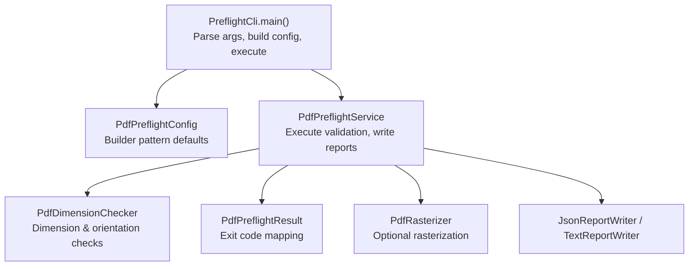
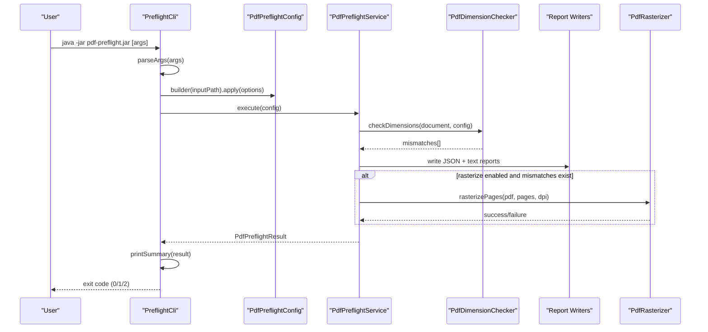
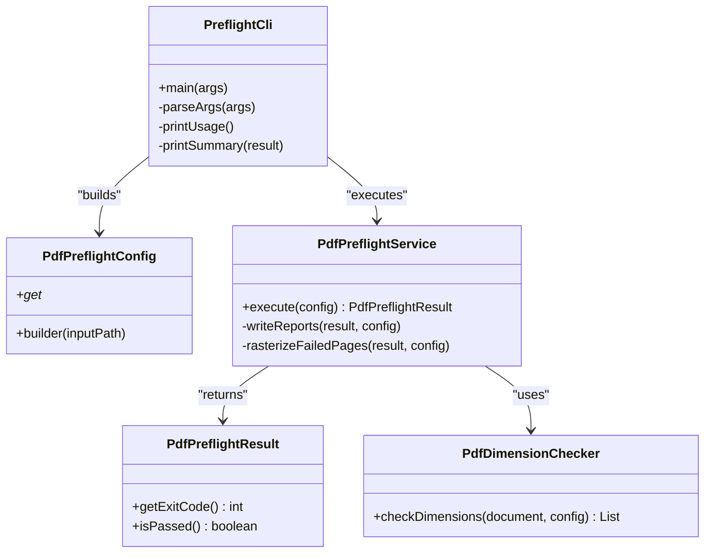

# Command-Line Interface Reference

<cite>
**Referenced Files in This Document**
- [PreflightCli.java](file://pdf-preflight/src/main/java/com/preflight/PreflightCli.java)
- [PdfPreflightConfig.java](file://pdf-preflight/src/main/java/com/preflight/config/PdfPreflightConfig.java)
- [PdfPreflightService.java](file://pdf-preflight/src/main/java/com/preflight/service/PdfPreflightService.java)
- [PdfPreflightResult.java](file://pdf-preflight/src/main/java/com/preflight/model/PdfPreflightResult.java)
- [PdfDimensionChecker.java](file://pdf-preflight/src/main/java/com/preflight/checker/PdfDimensionChecker.java)
- [CLI_EXAMPLES.md](file://pdf-preflight/CLI_EXAMPLES.md)
- [QUICKSTART.md](file://pdf-preflight/QUICKSTART.md)
- [README.md](file://pdf-preflight/README.md)
- [build.sh](file://pdf-preflight/build.sh)
</cite>

## Table of Contents
1. [Introduction](#introduction)
2. [Project Structure](#project-structure)
3. [Core Components](#core-components)
4. [Architecture Overview](#architecture-overview)
5. [Detailed Component Analysis](#detailed-component-analysis)
6. [Dependency Analysis](#dependency-analysis)
7. [Performance Considerations](#performance-considerations)
8. [Troubleshooting Guide](#troubleshooting-guide)
9. [Conclusion](#conclusion)
10. [Appendices](#appendices)

## Introduction
This document provides a comprehensive command-line interface reference for the PDF Preflight Module. It covers all command-line options, required arguments, default values, parameter types, usage examples, exit codes, and integration patterns for CI/CD environments. The CLI enables validation of PDF page dimensions and orientation consistency, with optional rasterization of mismatched pages using MuPDF.

## Project Structure
The CLI is implemented as a standalone Java application packaged as an executable JAR. The main entry point parses command-line arguments, constructs a configuration, executes validation, generates reports, and exits with appropriate codes.

**Diagram sources**
- [PreflightCli.java:20-62](file://pdf-preflight/src/main/java/com/preflight/PreflightCli.java#L20-L62)
- [PdfPreflightConfig.java:77-141](file://pdf-preflight/src/main/java/com/preflight/config/PdfPreflightConfig.java#L77-L141)
- [PdfPreflightService.java:48-125](file://pdf-preflight/src/main/java/com/preflight/service/PdfPreflightService.java#L48-L125)
- [PdfPreflightResult.java:20-42](file://pdf-preflight/src/main/java/com/preflight/model/PdfPreflightResult.java#L20-L42)

**Section sources**
- [PreflightCli.java:18-266](file://pdf-preflight/src/main/java/com/preflight/PreflightCli.java#L18-L266)
- [PdfPreflightConfig.java:7-143](file://pdf-preflight/src/main/java/com/preflight/config/PdfPreflightConfig.java#L7-L143)
- [PdfPreflightService.java:28-241](file://pdf-preflight/src/main/java/com/preflight/service/PdfPreflightService.java#L28-L241)

## Core Components
- PreflightCli: Parses CLI arguments, constructs configuration, executes service, prints summary, and sets exit code.
- PdfPreflightConfig: Immutable configuration with builder pattern defaults.
- PdfPreflightService: Orchestrates validation, report writing, and optional rasterization.
- PdfPreflightResult: Encapsulates pass/fail/error states and exit codes.
- PdfDimensionChecker: Performs dimension and orientation checks with configurable tolerance.

**Section sources**
- [PreflightCli.java:18-266](file://pdf-preflight/src/main/java/com/preflight/PreflightCli.java#L18-L266)
- [PdfPreflightConfig.java:7-143](file://pdf-preflight/src/main/java/com/preflight/config/PdfPreflightConfig.java#L7-L143)
- [PdfPreflightService.java:28-241](file://pdf-preflight/src/main/java/com/preflight/service/PdfPreflightService.java#L28-L241)
- [PdfPreflightResult.java:9-89](file://pdf-preflight/src/main/java/com/preflight/model/PdfPreflightResult.java#L9-L89)
- [PdfDimensionChecker.java:17-139](file://pdf-preflight/src/main/java/com/preflight/checker/PdfDimensionChecker.java#L17-L139)

## Architecture Overview
The CLI follows a layered architecture: argument parsing, configuration building, service orchestration, validation, reporting, and optional rasterization.

**Diagram sources**
- [PreflightCli.java:20-62](file://pdf-preflight/src/main/java/com/preflight/PreflightCli.java#L20-L62)
- [PdfPreflightService.java:48-125](file://pdf-preflight/src/main/java/com/preflight/service/PdfPreflightService.java#L48-L125)
- [PdfDimensionChecker.java:26-99](file://pdf-preflight/src/main/java/com/preflight/checker/PdfDimensionChecker.java#L26-L99)

## Detailed Component Analysis

### Command-Line Options Reference
All options are parsed by the CLI and mapped to configuration defaults. The following table summarizes each option, type, default, and behavior.

- Required
  - --input <path>: Path to the PDF file to validate. Required argument; missing triggers help and exit code 2.

- Optional
  - --output-json <path>: JSON report output path. Default: preflight-report.json.
  - --output-text <path>: Text report output path. Default: preflight-report.txt.
  - --use-mediabox: Use MediaBox instead of CropBox for measurements. Default: CropBox (true in builder).
  - --tolerance <float>: Tolerance for dimension comparison in points. Default: 0.01.
  - --rasterize: Enable rasterization of failed pages (requires MuPDF). Default: disabled.
  - --raster-dpi <int>: DPI for rasterization. Default: 150.
  - --mutool-path <path>: Path to mutool executable. Default: mutool.
  - --raster-pages <list>: Comma-separated page numbers to rasterize. Default: all mismatched pages.
  - --help, -h: Show help and exit with code 0.

Notes:
- Parameter types are validated; invalid numeric values cause immediate error and exit code 2.
- Unknown arguments trigger help and exit code 2.
- Rasterization is optional and does not change pass/fail; it affects exit code only on errors.

**Section sources**
- [PreflightCli.java:73-156](file://pdf-preflight/src/main/java/com/preflight/PreflightCli.java#L73-L156)
- [PreflightCli.java:184-213](file://pdf-preflight/src/main/java/com/preflight/PreflightCli.java#L184-L213)
- [PdfPreflightConfig.java:77-141](file://pdf-preflight/src/main/java/com/preflight/config/PdfPreflightConfig.java#L77-L141)

### Parameter Types and Defaults
- --input: String (required)
- --output-json: String (path)
- --output-text: String (path)
- --use-mediabox: Flag (boolean)
- --tolerance: Float (points)
- --rasterize: Flag (boolean)
- --raster-dpi: Integer (DPI)
- --mutool-path: String (path)
- --raster-pages: Integer list (comma-separated)
- --help/-h: Flag (no value)

Defaults:
- output-json: preflight-report.json
- output-text: preflight-report.txt
- use-mediabox: false (CropBox)
- tolerance: 0.01
- rasterize: false
- raster-dpi: 150
- mutool-path: mutool
- raster-pages: none (all mismatched)
- raster-output-dir: rasterized-pages

**Section sources**
- [PreflightCli.java:253-264](file://pdf-preflight/src/main/java/com/preflight/PreflightCli.java#L253-L264)
- [PdfPreflightConfig.java:77-141](file://pdf-preflight/src/main/java/com/preflight/config/PdfPreflightConfig.java#L77-L141)

### Usage Examples
Below are practical examples grouped by option combinations. See the CLI examples document for additional patterns.

- Basic validation
  - java -jar pdf-preflight-1.0.0.jar --input document.pdf

- Custom report paths
  - java -jar pdf-preflight-1.0.0.jar --input document.pdf --output-json report.json --output-text report.txt

- Use MediaBox with custom tolerance
  - java -jar pdf-preflight-1.0.0.jar --input document.pdf --use-mediabox --tolerance 0.1

- Enable rasterization with custom DPI
  - java -jar pdf-preflight-1.0.0.jar --input document.pdf --rasterize --raster-dpi 300

- Rasterize specific pages with custom mutool path
  - java -jar pdf-preflight-1.0.0.jar --input document.pdf --rasterize --raster-pages 25,87,102 --mutool-path /usr/local/bin/mutool

- Full configuration
  - java -jar pdf-preflight-1.0.0.jar --input document.pdf --output-json report.json --output-text report.txt --use-mediabox --tolerance 0.05 --rasterize --raster-dpi 200 --mutool-path /opt/mupdf/bin/mutool

- Show help
  - java -jar pdf-preflight-1.0.0.jar --help

**Section sources**
- [CLI_EXAMPLES.md:8-149](file://pdf-preflight/CLI_EXAMPLES.md#L8-L149)
- [README.md:88-148](file://pdf-preflight/README.md#L88-L148)

### Exit Code System
The CLI uses three distinct exit codes:

- 0: Pass
  - All pages match dimensions and orientation.
  - No mismatches found.
  - Reports are generated.

- 1: Fail
  - Mismatches found.
  - Reports are generated.
  - Rasterization (if enabled) does not alter pass/fail status.

- 2: Error
  - Invalid PDF, file not found, unreadable, or runtime exception.
  - Error message is printed to stderr/stdout summary.

Behavior mapping:
- PdfPreflightResult sets exitCode 0 when passed is true, otherwise 1.
- PdfPreflightResult sets exitCode 2 when an error message is present.
- PreflightCli.main reads result.getExitCode() and exits accordingly.
- Exceptions caught in main also result in exit code 2.

**Section sources**
- [PreflightCli.java:13-16](file://pdf-preflight/src/main/java/com/preflight/PreflightCli.java#L13-L16)
- [PreflightCli.java:54-61](file://pdf-preflight/src/main/java/com/preflight/PreflightCli.java#L54-L61)
- [PdfPreflightResult.java:30](file://pdf-preflight/src/main/java/com/preflight/model/PdfPreflightResult.java#L30)
- [PdfPreflightResult.java:41](file://pdf-preflight/src/main/java/com/preflight/model/PdfPreflightResult.java#L41)

### Practical Command Patterns
Common use cases and recommended patterns:

- CI/CD integration
  - Capture exit code and conditionally fail the job.
  - Upload reports as artifacts.
  - Example patterns are provided in the CLI examples document.

- Batch processing
  - Iterate over a directory of PDFs, generating per-file reports.
  - Log pass/fail/error outcomes.

- Performance testing
  - Use the time command to measure processing duration.
  - Monitor memory usage for large files.

- Troubleshooting
  - Verify Java availability and version.
  - Check MuPDF installation if rasterization is enabled.
  - Increase heap size if OutOfMemoryError occurs.

**Section sources**
- [CLI_EXAMPLES.md:154-319](file://pdf-preflight/CLI_EXAMPLES.md#L154-L319)
- [QUICKSTART.md:48-52](file://pdf-preflight/QUICKSTART.md#L48-L52)

### Integration Examples for CI/CD Pipelines
- Jenkins/GitLab CI
  - Run the CLI, capture exit code, and branch logic based on outcome.
  - Example shell script pattern is provided in the CLI examples document.

- GitHub Actions
  - Run the CLI as a step, then upload JSON and text reports as artifacts.
  - Example YAML pattern is provided in the CLI examples document.

**Section sources**
- [CLI_EXAMPLES.md:156-200](file://pdf-preflight/CLI_EXAMPLES.md#L156-L200)

## Dependency Analysis
The CLI depends on the service layer and configuration. The service orchestrates validation, report writing, and optional rasterization.

**Diagram sources**
- [PreflightCli.java:20-62](file://pdf-preflight/src/main/java/com/preflight/PreflightCli.java#L20-L62)
- [PdfPreflightConfig.java:77-141](file://pdf-preflight/src/main/java/com/preflight/config/PdfPreflightConfig.java#L77-L141)
- [PdfPreflightService.java:48-125](file://pdf-preflight/src/main/java/com/preflight/service/PdfPreflightService.java#L48-L125)
- [PdfPreflightResult.java:20-42](file://pdf-preflight/src/main/java/com/preflight/model/PdfPreflightResult.java#L20-L42)
- [PdfDimensionChecker.java:26-99](file://pdf-preflight/src/main/java/com/preflight/checker/PdfDimensionChecker.java#L26-L99)

**Section sources**
- [PreflightCli.java:18-266](file://pdf-preflight/src/main/java/com/preflight/PreflightCli.java#L18-L266)
- [PdfPreflightService.java:28-241](file://pdf-preflight/src/main/java/com/preflight/service/PdfPreflightService.java#L28-L241)

## Performance Considerations
- Memory usage: The service loads PDFs with temp-file-only mode to support large files without loading entire content into memory.
- Streaming: Pages are processed sequentially to minimize memory footprint.
- No rendering: Core validation does not render pages unless explicitly requested.
- Rasterization: Optional and performed separately; does not affect pass/fail.

**Section sources**
- [PdfPreflightService.java:66-73](file://pdf-preflight/src/main/java/com/preflight/service/PdfPreflightService.java#L66-L73)
- [README.md:273-283](file://pdf-preflight/README.md#L273-L283)

## Troubleshooting Guide
Common issues and resolutions:

- Command not found: java
  - Install Java 11 or higher.
  - Example installation commands are provided in the CLI examples document.

- OutOfMemoryError
  - Increase heap size using -Xmx JVM option.
  - Ensure sufficient disk space for temporary files.

- MuPDF not available
  - Install MuPDF tools or disable rasterization.
  - Specify custom mutool path if installed elsewhere.

- Corrupt or encrypted PDFs
  - Results in exit code 2 with descriptive error message.
  - Investigate PDF integrity or decryption requirements.

- Missing input file
  - Results in exit code 2 with “file not found” message.

**Section sources**
- [CLI_EXAMPLES.md:396-422](file://pdf-preflight/CLI_EXAMPLES.md#L396-L422)
- [README.md:347-369](file://pdf-preflight/README.md#L347-L369)
- [PdfPreflightService.java:55-80](file://pdf-preflight/src/main/java/com/preflight/service/PdfPreflightService.java#L55-L80)

## Conclusion
The PDF Preflight Module CLI provides a robust, configurable interface for validating PDF page dimensions and orientation consistency. With clear exit codes, dual report formats, optional rasterization, and strong CI/CD integration patterns, it fits seamlessly into automated workflows. Use the examples and troubleshooting guidance here to adopt the tool effectively.

## Appendices

### Appendix A: Complete Option Reference
- --input <path> (required)
- --output-json <path> (default: preflight-report.json)
- --output-text <path> (default: preflight-report.txt)
- --use-mediabox (default: CropBox)
- --tolerance <float> (default: 0.01)
- --rasterize (default: disabled)
- --raster-dpi <int> (default: 150)
- --mutool-path <path> (default: mutool)
- --raster-pages <list> (default: all mismatched)
- --help, -h

**Section sources**
- [PreflightCli.java:184-213](file://pdf-preflight/src/main/java/com/preflight/PreflightCli.java#L184-L213)
- [PdfPreflightConfig.java:77-141](file://pdf-preflight/src/main/java/com/preflight/config/PdfPreflightConfig.java#L77-L141)

### Appendix B: Build and Run Notes
- Build the project using Maven or Gradle; the build script automates this process.
- The executable JAR is produced with all dependencies included.

**Section sources**
- [build.sh:14-38](file://pdf-preflight/build.sh#L14-L38)
- [README.md:79-82](file://pdf-preflight/README.md#L79-L82)