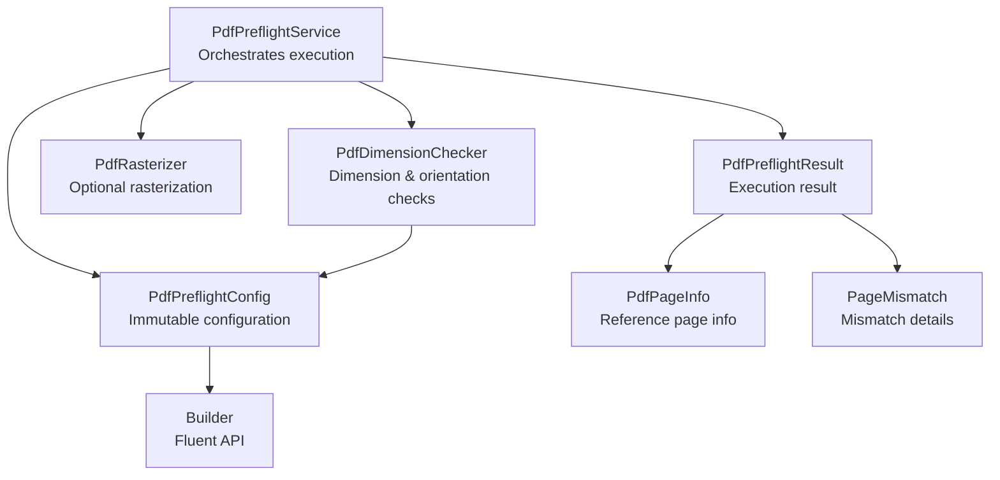
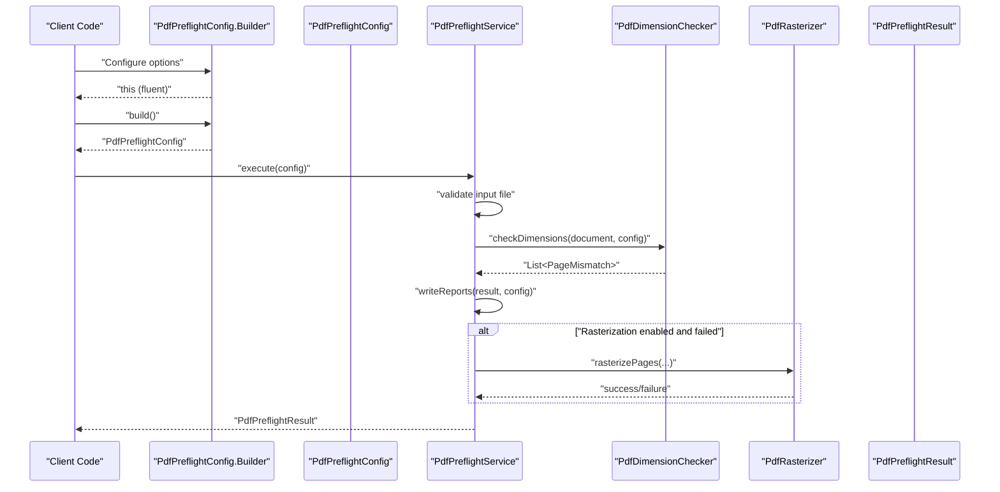
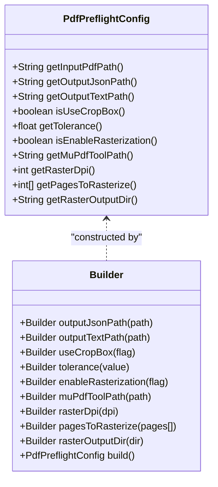
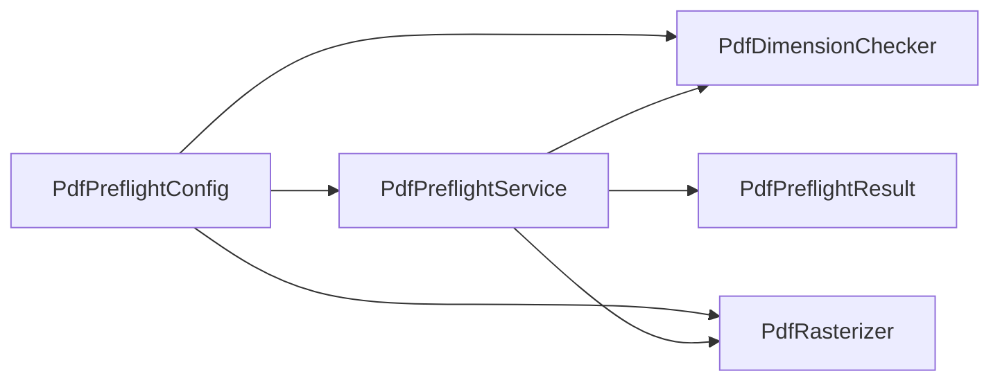

# Configuration Management

<cite>
**Referenced Files in This Document**
- [PdfPreflightConfig.java](file://pdf-preflight/src/main/java/com/preflight/config/PdfPreflightConfig.java)
- [PdfPreflightService.java](file://pdf-preflight/src/main/java/com/preflight/service/PdfPreflightService.java)
- [PdfDimensionChecker.java](file://pdf-preflight/src/main/java/com/preflight/checker/PdfDimensionChecker.java)
- [PdfRasterizer.java](file://pdf-preflight/src/main/java/com/preflight/rasterizer/PdfRasterizer.java)
- [PdfPreflightResult.java](file://pdf-preflight/src/main/java/com/preflight/model/PdfPreflightResult.java)
- [PdfPageInfo.java](file://pdf-preflight/src/main/java/com/preflight/model/PdfPageInfo.java)
- [PageMismatch.java](file://pdf-preflight/src/main/java/com/preflight/model/PageMismatch.java)
- [PreflightCli.java](file://pdf-preflight/src/main/java/com/preflight/PreflightCli.java)
- [README.md](file://pdf-preflight/README.md)
- [CLI_EXAMPLES.md](file://pdf-preflight/CLI_EXAMPLES.md)
- [QUICKSTART.md](file://pdf-preflight/QUICKSTART.md)
- [PdfPreflightServiceTest.java](file://pdf-preflight/src/test/java/com/preflight/PdfPreflightServiceTest.java)
</cite>

## Table of Contents
1. [Introduction](#introduction)
2. [Project Structure](#project-structure)
3. [Core Components](#core-components)
4. [Architecture Overview](#architecture-overview)
5. [Detailed Component Analysis](#detailed-component-analysis)
6. [Dependency Analysis](#dependency-analysis)
7. [Performance Considerations](#performance-considerations)
8. [Troubleshooting Guide](#troubleshooting-guide)
9. [Conclusion](#conclusion)
10. [Appendices](#appendices)

## Introduction
This document provides comprehensive configuration management guidance for the PdfPreflightConfig builder pattern. It explains the fluent configuration API, available configuration options (including tolerance settings, box selection preferences, and rasterization parameters), and demonstrates how to programmatically configure the preflight engine. It also covers best practices, default values, recommended settings for different use cases, configuration validation, error handling, and integration with the service layer. The content is designed to be accessible to developers implementing programmatic integrations while offering sufficient technical depth for advanced customization.

## Project Structure
The configuration system centers around a single immutable configuration class with a builder, consumed by the orchestration service and validators. Supporting components include the dimension checker, optional rasterizer, and result/report models.

**Diagram sources**
- [PdfPreflightConfig.java:73-141](file://pdf-preflight/src/main/java/com/preflight/config/PdfPreflightConfig.java#L73-L141)
- [PdfPreflightService.java:48-241](file://pdf-preflight/src/main/java/com/preflight/service/PdfPreflightService.java#L48-L241)
- [PdfDimensionChecker.java:26-139](file://pdf-preflight/src/main/java/com/preflight/checker/PdfDimensionChecker.java#L26-L139)
- [PdfRasterizer.java:39-137](file://pdf-preflight/src/main/java/com/preflight/rasterizer/PdfRasterizer.java#L39-L137)
- [PdfPreflightResult.java:20-89](file://pdf-preflight/src/main/java/com/preflight/model/PdfPreflightResult.java#L20-L89)
- [PdfPageInfo.java:15-67](file://pdf-preflight/src/main/java/com/preflight/model/PdfPageInfo.java#L15-L67)
- [PageMismatch.java:17-68](file://pdf-preflight/src/main/java/com/preflight/model/PageMismatch.java#L17-L68)

**Section sources**
- [README.md:240-261](file://pdf-preflight/README.md#L240-L261)

## Core Components
- PdfPreflightConfig: Immutable configuration with a builder for fluent construction.
- PdfPreflightService: Orchestrates preflight execution, integrates with checker and optional rasterizer, writes reports, and manages errors.
- PdfDimensionChecker: Performs dimension and orientation checks against a reference page.
- PdfRasterizer: Optional component that renders pages to images using MuPDF CLI.
- PdfPreflightResult, PdfPageInfo, PageMismatch: Result and model objects for reporting and inspection.

Key responsibilities:
- Configuration encapsulates all runtime options and defaults.
- Service consumes configuration to drive validation and optional rasterization.
- Models represent results and mismatches for inspection and reporting.

**Section sources**
- [PdfPreflightConfig.java:7-71](file://pdf-preflight/src/main/java/com/preflight/config/PdfPreflightConfig.java#L7-L71)
- [PdfPreflightService.java:28-241](file://pdf-preflight/src/main/java/com/preflight/service/PdfPreflightService.java#L28-L241)
- [PdfDimensionChecker.java:17-139](file://pdf-preflight/src/main/java/com/preflight/checker/PdfDimensionChecker.java#L17-L139)
- [PdfRasterizer.java:20-137](file://pdf-preflight/src/main/java/com/preflight/rasterizer/PdfRasterizer.java#L20-L137)
- [PdfPreflightResult.java:9-89](file://pdf-preflight/src/main/java/com/preflight/model/PdfPreflightResult.java#L9-L89)

## Architecture Overview
The configuration-driven flow begins with constructing a PdfPreflightConfig via the builder, passing it to PdfPreflightService.execute. The service loads the PDF, runs checks, writes reports, and optionally rasterizes failed pages. Results are returned as PdfPreflightResult for inspection and CI/CD integration.

**Diagram sources**
- [PdfPreflightConfig.java:73-141](file://pdf-preflight/src/main/java/com/preflight/config/PdfPreflightConfig.java#L73-L141)
- [PdfPreflightService.java:48-241](file://pdf-preflight/src/main/java/com/preflight/service/PdfPreflightService.java#L48-L241)
- [PdfDimensionChecker.java:26-99](file://pdf-preflight/src/main/java/com/preflight/checker/PdfDimensionChecker.java#L26-L99)
- [PdfRasterizer.java:39-98](file://pdf-preflight/src/main/java/com/preflight/rasterizer/PdfRasterizer.java#L39-L98)

## Detailed Component Analysis

### PdfPreflightConfig Builder Pattern
PdfPreflightConfig uses a classic builder pattern to construct an immutable configuration object. The builder exposes fluent setters for all options and a build() method that returns the immutable configuration.

Available configuration options and defaults:
- inputPdfPath: Required; no default.
- outputJsonPath: Default "preflight-report.json".
- outputTextPath: Default "preflight-report.txt".
- useCropBox: Default true.
- tolerance: Default 0.01f (points).
- enableRasterization: Default false.
- muPdfToolPath: Default "mutool".
- rasterDpi: Default 150.
- pagesToRasterize: Default null (all mismatched pages).
- rasterOutputDir: Default "rasterized-pages".

Fluent API usage examples (paths only):
- [Basic builder chain:31-45](file://pdf-preflight/src/main/java/com/preflight/PreflightCli.java#L31-L45)
- [Custom tolerance and box selection:205-219](file://pdf-preflight/src/test/java/com/preflight/PdfPreflightServiceTest.java#L205-L219)

Builder methods:
- outputJsonPath(path)
- outputTextPath(path)
- useCropBox(flag)
- tolerance(value)
- enableRasterization(flag)
- muPdfToolPath(path)
- rasterDpi(dpi)
- pagesToRasterize(pages[])
- rasterOutputDir(dir)
- build()

Immutable getters:
- getInputPdfPath()
- getOutputJsonPath()
- getOutputTextPath()
- isUseCropBox()
- getTolerance()
- isEnableRasterization()
- getMuPdfToolPath()
- getRasterDpi()
- getPagesToRasterize()
- getRasterOutputDir()

Validation and behavior:
- The builder sets sensible defaults for all options except the input path.
- The service validates the input file existence and readability before processing.
- The checker uses tolerance for floating-point comparisons and selects either CropBox or MediaBox based on configuration.

Best practices:
- Always set inputPdfPath when constructing the builder.
- Choose useCropBox based on whether your PDFs define CropBox reliably.
- Adjust tolerance according to your PDF generation workflow precision.
- Enable rasterization only when MuPDF is available and needed for visual inspection.

**Section sources**
- [PdfPreflightConfig.java:73-141](file://pdf-preflight/src/main/java/com/preflight/config/PdfPreflightConfig.java#L73-L141)
- [PdfPreflightService.java:54-63](file://pdf-preflight/src/main/java/com/preflight/service/PdfPreflightService.java#L54-L63)
- [PdfDimensionChecker.java:42-78](file://pdf-preflight/src/main/java/com/preflight/checker/PdfDimensionChecker.java#L42-L78)

### Fluent Configuration API and Method Chaining
Method chaining enables readable, declarative configuration. Typical patterns include:
- Minimal configuration: set input path and desired outputs.
- Advanced configuration: combine box selection, tolerance, and rasterization options.
- Conditional rasterization: enable rasterization and optionally restrict pages.

Examples (paths only):
- [CLI-to-builder mapping:31-45](file://pdf-preflight/src/main/java/com/preflight/PreflightCli.java#L31-L45)
- [Custom tolerance usage:205-219](file://pdf-preflight/src/test/java/com/preflight/PdfPreflightServiceTest.java#L205-L219)

**Diagram sources**
- [PdfPreflightConfig.java:73-141](file://pdf-preflight/src/main/java/com/preflight/config/PdfPreflightConfig.java#L73-L141)

**Section sources**
- [PreflightCli.java:31-45](file://pdf-preflight/src/main/java/com/preflight/PreflightCli.java#L31-L45)
- [PdfPreflightServiceTest.java:205-219](file://pdf-preflight/src/test/java/com/preflight/PdfPreflightServiceTest.java#L205-L219)

### Configuration Options Reference
- Box selection preferences
  - useCropBox: true (default) prefers CropBox; falls back to MediaBox if CropBox is invalid.
  - Related logic: [getPageBox:105-115](file://pdf-preflight/src/main/java/com/preflight/checker/PdfDimensionChecker.java#L105-L115), [getBoxName:120-128](file://pdf-preflight/src/main/java/com/preflight/checker/PdfDimensionChecker.java#L120-L128)
- Tolerance settings
  - tolerance: floating-point comparison threshold in points; default 0.01f.
  - Related logic: [checkDimensions:62-78](file://pdf-preflight/src/main/java/com/preflight/checker/PdfDimensionChecker.java#L62-L78)
- Rasterization parameters
  - enableRasterization: enables optional rasterization of failed pages.
  - muPdfToolPath: path to mutool executable; default "mutool".
  - rasterDpi: resolution for rasterization; default 150.
  - pagesToRasterize: array of page numbers to rasterize; default all mismatched.
  - rasterOutputDir: output directory for rasterized images; default "rasterized-pages".
  - Related logic: [PdfPreflightService.rasterizeFailedPages:188-230](file://pdf-preflight/src/main/java/com/preflight/service/PdfPreflightService.java#L188-L230), [PdfRasterizer.rasterizePages:39-98](file://pdf-preflight/src/main/java/com/preflight/rasterizer/PdfRasterizer.java#L39-L98)

**Section sources**
- [PdfPreflightConfig.java:77-141](file://pdf-preflight/src/main/java/com/preflight/config/PdfPreflightConfig.java#L77-L141)
- [PdfPreflightService.java:188-230](file://pdf-preflight/src/main/java/com/preflight/service/PdfPreflightService.java#L188-L230)
- [PdfRasterizer.java:26-137](file://pdf-preflight/src/main/java/com/preflight/rasterizer/PdfRasterizer.java#L26-L137)
- [PdfDimensionChecker.java:105-128](file://pdf-preflight/src/main/java/com/preflight/checker/PdfDimensionChecker.java#L105-L128)

### Programmatic Configuration and Integration
Programmatic usage involves constructing a configuration and invoking the service:
- Construct configuration: [PdfPreflightConfig.builder(...):73-75](file://pdf-preflight/src/main/java/com/preflight/config/PdfPreflightConfig.java#L73-L75)
- Execute preflight: [PdfPreflightService.execute(config):48-125](file://pdf-preflight/src/main/java/com/preflight/service/PdfPreflightService.java#L48-L125)
- Inspect results: [PdfPreflightResult:20-89](file://pdf-preflight/src/main/java/com/preflight/model/PdfPreflightResult.java#L20-L89)

Integration points:
- Service layer: [PdfPreflightService:28-241](file://pdf-preflight/src/main/java/com/preflight/service/PdfPreflightService.java#L28-L241)
- Checker integration: [PdfDimensionChecker.checkDimensions:26-99](file://pdf-preflight/src/main/java/com/preflight/checker/PdfDimensionChecker.java#L26-L99)
- Optional rasterization: [PdfPreflightService.rasterizeFailedPages:188-230](file://pdf-preflight/src/main/java/com/preflight/service/PdfPreflightService.java#L188-L230)

**Section sources**
- [PdfPreflightService.java:48-125](file://pdf-preflight/src/main/java/com/preflight/service/PdfPreflightService.java#L48-L125)
- [PdfPreflightConfig.java:73-141](file://pdf-preflight/src/main/java/com/preflight/config/PdfPreflightConfig.java#L73-L141)

### Configuration Validation and Error Handling
- Input file validation: existence and readability checks occur before processing.
- PDF validation: empty PDFs and load failures are handled with appropriate error results.
- Rasterization availability: MuPDF tool presence is verified before attempting rasterization.
- Error result creation: [PdfPreflightService.errorResult:235-239](file://pdf-preflight/src/main/java/com/preflight/service/PdfPreflightService.java#L235-L239)

Common error scenarios:
- Missing input file: [PdfPreflightServiceTest.testMissingInputFile:30-43](file://pdf-preflight/src/test/java/com/preflight/PdfPreflightServiceTest.java#L30-L43)
- Empty PDF: [PdfPreflightServiceTest.testEmptyPdf:46-64](file://pdf-preflight/src/test/java/com/preflight/PdfPreflightServiceTest.java#L46-L64)
- Corrupt PDF: [PdfPreflightServiceTest.testCorruptPdf:173-188](file://pdf-preflight/src/test/java/com/preflight/PdfPreflightServiceTest.java#L173-L188)

**Section sources**
- [PdfPreflightService.java:54-63](file://pdf-preflight/src/main/java/com/preflight/service/PdfPreflightService.java#L54-L63)
- [PdfPreflightService.java:235-239](file://pdf-preflight/src/main/java/com/preflight/service/PdfPreflightService.java#L235-L239)
- [PdfPreflightServiceTest.java:30-188](file://pdf-preflight/src/test/java/com/preflight/PdfPreflightServiceTest.java#L30-L188)

### Recommended Settings and Best Practices
- Default values: rely on defaults for typical workflows; adjust only when necessary.
- Tolerance tuning: increase for noisy PDFs; decrease for strict workflows.
- Box selection: prefer CropBox for trimmed pages; use MediaBox for raw page sizes.
- Rasterization: enable only when visual inspection is required; ensure MuPDF availability.
- CI/CD integration: use exit codes (0, 1, 2) for automation decisions.

References:
- Defaults and design decisions: [README.md:265-271](file://pdf-preflight/README.md#L265-L271)
- CLI examples and best practices: [CLI_EXAMPLES.md:382-391](file://pdf-preflight/CLI_EXAMPLES.md#L382-L391)

**Section sources**
- [README.md:265-271](file://pdf-preflight/README.md#L265-L271)
- [CLI_EXAMPLES.md:382-391](file://pdf-preflight/CLI_EXAMPLES.md#L382-L391)

### Configuration Object Inspection
After execution, inspect PdfPreflightResult for pass/fail status, mismatch counts, processing time, and exit codes. Reference page information and mismatch details are available for diagnostics.

Key inspection points:
- Status and counts: [PdfPreflightResult:20-89](file://pdf-preflight/src/main/java/com/preflight/model/PdfPreflightResult.java#L20-L89)
- Reference page info: [PdfPageInfo:15-67](file://pdf-preflight/src/main/java/com/preflight/model/PdfPageInfo.java#L15-L67)
- Mismatch details: [PageMismatch:17-68](file://pdf-preflight/src/main/java/com/preflight/model/PageMismatch.java#L17-L68)

**Section sources**
- [PdfPreflightResult.java:20-89](file://pdf-preflight/src/main/java/com/preflight/model/PdfPreflightResult.java#L20-L89)
- [PdfPageInfo.java:15-67](file://pdf-preflight/src/main/java/com/preflight/model/PdfPageInfo.java#L15-L67)
- [PageMismatch.java:17-68](file://pdf-preflight/src/main/java/com/preflight/model/PageMismatch.java#L17-L68)

## Dependency Analysis
The configuration influences multiple subsystems. The service depends on the configuration for input paths, box selection, tolerance, and rasterization options. The checker reads tolerance and box preference. The rasterizer reads MuPDF path, DPI, and page lists.

**Diagram sources**
- [PdfPreflightConfig.java:73-141](file://pdf-preflight/src/main/java/com/preflight/config/PdfPreflightConfig.java#L73-L141)
- [PdfPreflightService.java:48-241](file://pdf-preflight/src/main/java/com/preflight/service/PdfPreflightService.java#L48-L241)
- [PdfDimensionChecker.java:26-99](file://pdf-preflight/src/main/java/com/preflight/checker/PdfDimensionChecker.java#L26-L99)
- [PdfRasterizer.java:39-98](file://pdf-preflight/src/main/java/com/preflight/rasterizer/PdfRasterizer.java#L39-L98)

**Section sources**
- [PdfPreflightService.java:48-125](file://pdf-preflight/src/main/java/com/preflight/service/PdfPreflightService.java#L48-L125)
- [PdfDimensionChecker.java:26-99](file://pdf-preflight/src/main/java/com/preflight/checker/PdfDimensionChecker.java#L26-L99)
- [PdfRasterizer.java:39-98](file://pdf-preflight/src/main/java/com/preflight/rasterizer/PdfRasterizer.java#L39-L98)

## Performance Considerations
- Memory usage: The service uses temp-file-only mode for PDFBox to handle large files efficiently.
- Streaming: Pages are processed sequentially to minimize memory footprint.
- No rendering by default: Core validation avoids rendering unless explicitly requested.
- Efficient comparison: Single-pass algorithm checks dimensions and orientation together.

References:
- [README.md:273-282](file://pdf-preflight/README.md#L273-L282)

**Section sources**
- [README.md:273-282](file://pdf-preflight/README.md#L273-L282)

## Troubleshooting Guide
Common issues and resolutions:
- MuPDF not available: Install MuPDF or disable rasterization; the service logs a warning and skips rasterization.
- Corrupt or encrypted PDFs: The service returns an error result with exit code 2.
- Missing input file: The service returns an error result with exit code 2.
- Empty PDF: The service returns an error result indicating no pages.

References:
- [README.md:347-369](file://pdf-preflight/README.md#L347-L369)
- [PdfPreflightServiceTest.java:30-188](file://pdf-preflight/src/test/java/com/preflight/PdfPreflightServiceTest.java#L30-L188)

**Section sources**
- [README.md:347-369](file://pdf-preflight/README.md#L347-L369)
- [PdfPreflightServiceTest.java:30-188](file://pdf-preflight/src/test/java/com/preflight/PdfPreflightServiceTest.java#L30-L188)

## Conclusion
PdfPreflightConfig’s builder pattern provides a robust, fluent way to configure the preflight engine. With sensible defaults, clear separation of concerns, and optional rasterization, it supports diverse workflows from basic validation to advanced diagnostics. By following the recommended settings, leveraging configuration inspection, and integrating with the service layer, teams can build reliable, automated preflight pipelines.

## Appendices

### Appendix A: CLI-to-Builder Mapping
The CLI constructs the same configuration used by the service, demonstrating how all builder options map to command-line flags.

References:
- [PreflightCli.java:31-45](file://pdf-preflight/src/main/java/com/preflight/PreflightCli.java#L31-L45)
- [README.md:92-108](file://pdf-preflight/README.md#L92-L108)

**Section sources**
- [PreflightCli.java:31-45](file://pdf-preflight/src/main/java/com/preflight/PreflightCli.java#L31-L45)
- [README.md:92-108](file://pdf-preflight/README.md#L92-L108)

### Appendix B: Example Workflows
- Basic validation with defaults: [CLI_EXAMPLES.md:5-27](file://pdf-preflight/CLI_EXAMPLES.md#L5-L27)
- Custom tolerance and box selection: [CLI_EXAMPLES.md:60-77](file://pdf-preflight/CLI_EXAMPLES.md#L60-L77)
- Rasterization of failed pages: [CLI_EXAMPLES.md:81-96](file://pdf-preflight/CLI_EXAMPLES.md#L81-L96)
- CI/CD integration: [CLI_EXAMPLES.md:154-200](file://pdf-preflight/CLI_EXAMPLES.md#L154-L200)

**Section sources**
- [CLI_EXAMPLES.md:5-200](file://pdf-preflight/CLI_EXAMPLES.md#L5-L200)