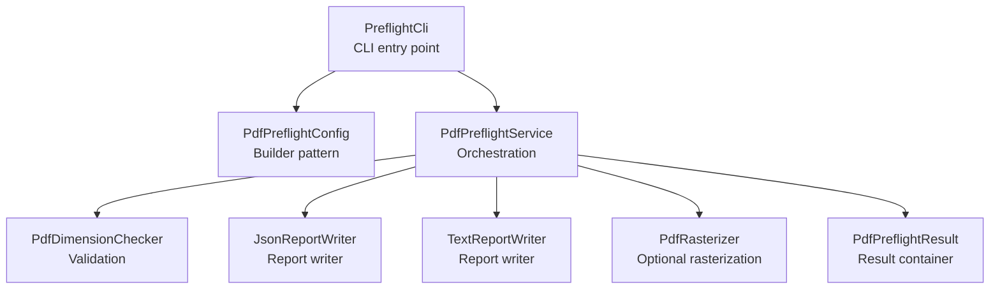
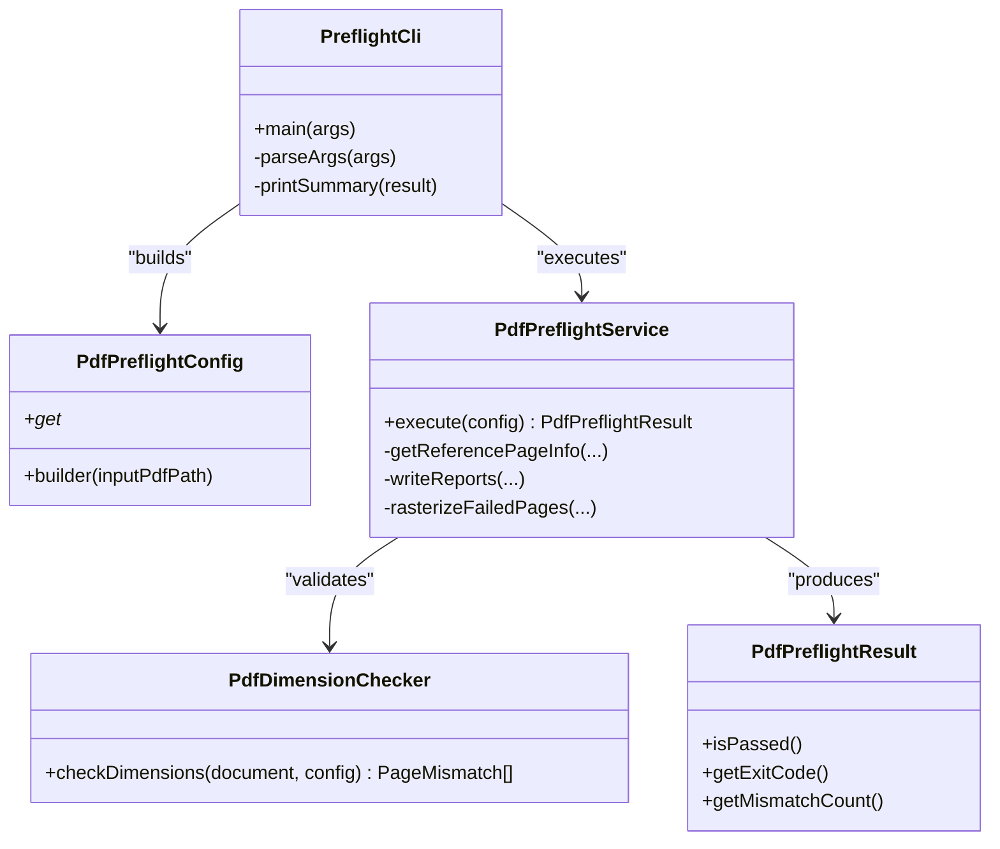

# Contributing Guidelines

<cite>
**Referenced Files in This Document**
- [README.md](file://pdf-preflight/README.md)
- [QUICKSTART.md](file://pdf-preflight/QUICKSTART.md)
- [build.gradle](file://pdf-preflight/build.gradle)
- [pom.xml](file://pdf-preflight/pom.xml)
- [PreflightCli.java](file://pdf-preflight/src/main/java/com/preflight/PreflightCli.java)
- [PdfPreflightConfig.java](file://pdf-preflight/src/main/java/com/preflight/config/PdfPreflightConfig.java)
- [PdfDimensionChecker.java](file://pdf-preflight/src/main/java/com/preflight/checker/PdfDimensionChecker.java)
- [PdfPreflightService.java](file://pdf-preflight/src/main/java/com/preflight/service/PdfPreflightService.java)
- [PdfPreflightResult.java](file://pdf-preflight/src/main/java/com/preflight/model/PdfPreflightResult.java)
- [PdfPreflightServiceTest.java](file://pdf-preflight/src/test/java/com/preflight/PdfPreflightServiceTest.java)
</cite>

## Table of Contents
1. [Introduction](#introduction)
2. [Project Structure](#project-structure)
3. [Core Components](#core-components)
4. [Architecture Overview](#architecture-overview)
5. [Development Environment Setup](#development-environment-setup)
6. [Building the Project](#building-the-project)
7. [Running Tests](#running-tests)
8. [Contribution Workflow](#contribution-workflow)
9. [Coding Standards and Style Conventions](#coding-standards-and-style-conventions)
10. [Extending the System](#extending-the-system)
11. [Pull Request Process](#pull-request-process)
12. [Quality Standards and Testing Requirements](#quality-standards-and-testing-requirements)
13. [Documentation Standards](#documentation-standards)
14. [Release Procedures](#release-procedures)
15. [Troubleshooting Guide](#troubleshooting-guide)
16. [Community Resources and Contact](#community-resources-and-contact)
17. [Appendix: Contribution Examples](#appendix-contribution-examples)

## Introduction
Thank you for contributing to the PDF Preflight Module. This guide explains how to set up the development environment, follow coding standards, run tests, build the project, and contribute enhancements such as new validation checks, report formats, and additional PDF features. It also covers the project’s architecture, design principles, and quality expectations.

## Project Structure
The project is organized around a modular Java architecture with clear separation of concerns:
- CLI entry point orchestrates configuration, execution, and output
- Configuration encapsulates runtime options
- A dedicated checker validates page dimensions and orientation
- A service orchestrates loading, validation, reporting, and optional rasterization
- Models represent domain data and results
- Report writers produce machine- and human-readable outputs
- Rasterizer integrates optional MuPDF-based rendering

**Diagram sources**
- [PreflightCli.java:18-62](file://pdf-preflight/src/main/java/com/preflight/PreflightCli.java#L18-L62)
- [PdfPreflightConfig.java:73-141](file://pdf-preflight/src/main/java/com/preflight/config/PdfPreflightConfig.java#L73-L141)
- [PdfPreflightService.java:28-125](file://pdf-preflight/src/main/java/com/preflight/service/PdfPreflightService.java#L28-L125)
- [PdfDimensionChecker.java:17-99](file://pdf-preflight/src/main/java/com/preflight/checker/PdfDimensionChecker.java#L17-L99)
- [PdfPreflightResult.java:9-42](file://pdf-preflight/src/main/java/com/preflight/model/PdfPreflightResult.java#L9-L42)

**Section sources**
- [README.md:238-261](file://pdf-preflight/README.md#L238-L261)
- [PreflightCli.java:18-62](file://pdf-preflight/src/main/java/com/preflight/PreflightCli.java#L18-L62)
- [PdfPreflightConfig.java:7-31](file://pdf-preflight/src/main/java/com/preflight/config/PdfPreflightConfig.java#L7-L31)
- [PdfPreflightService.java:28-125](file://pdf-preflight/src/main/java/com/preflight/service/PdfPreflightService.java#L28-L125)
- [PdfDimensionChecker.java:17-99](file://pdf-preflight/src/main/java/com/preflight/checker/PdfDimensionChecker.java#L17-L99)
- [PdfPreflightResult.java:9-42](file://pdf-preflight/src/main/java/com/preflight/model/PdfPreflightResult.java#L9-L42)

## Core Components
- PreflightCli: Parses CLI arguments, builds configuration, executes the service, prints summary, and exits with appropriate codes.
- PdfPreflightConfig: Immutable configuration built via a fluent builder supporting all runtime options.
- PdfPreflightService: Loads PDFs with low-memory settings, runs validations, writes reports, and optionally rasterizes failures.
- PdfDimensionChecker: Performs single-pass dimension and orientation checks against a reference page.
- PdfPreflightResult: Immutable result container with pass/fail, counts, timing, and exit codes.
- Report Writers: JSON and text report writers produce machine- and human-readable outputs.
- Rasterizer: Optional integration with MuPDF for rendering failed pages.

**Section sources**
- [PreflightCli.java:18-62](file://pdf-preflight/src/main/java/com/preflight/PreflightCli.java#L18-L62)
- [PdfPreflightConfig.java:7-31](file://pdf-preflight/src/main/java/com/preflight/config/PdfPreflightConfig.java#L7-L31)
- [PdfPreflightService.java:28-125](file://pdf-preflight/src/main/java/com/preflight/service/PdfPreflightService.java#L28-L125)
- [PdfDimensionChecker.java:17-99](file://pdf-preflight/src/main/java/com/preflight/checker/PdfDimensionChecker.java#L17-L99)
- [PdfPreflightResult.java:9-42](file://pdf-preflight/src/main/java/com/preflight/model/PdfPreflightResult.java#L9-L42)

## Architecture Overview
The system follows a layered, modular design:
- CLI layer parses inputs and delegates to the service
- Service layer coordinates validation, reporting, and optional rasterization
- Model layer defines immutable data structures
- Checker layer encapsulates validation logic
- Report and rasterizer modules are pluggable and optional

**Diagram sources**
- [PreflightCli.java:18-62](file://pdf-preflight/src/main/java/com/preflight/PreflightCli.java#L18-L62)
- [PdfPreflightConfig.java:73-141](file://pdf-preflight/src/main/java/com/preflight/config/PdfPreflightConfig.java#L73-L141)
- [PdfPreflightService.java:28-125](file://pdf-preflight/src/main/java/com/preflight/service/PdfPreflightService.java#L28-L125)
- [PdfDimensionChecker.java:26-99](file://pdf-preflight/src/main/java/com/preflight/checker/PdfDimensionChecker.java#L26-L99)
- [PdfPreflightResult.java:20-42](file://pdf-preflight/src/main/java/com/preflight/model/PdfPreflightResult.java#L20-L42)

## Development Environment Setup
- Prerequisites
  - Java 11 or higher
  - Maven or Gradle
  - MuPDF (optional, for rasterization)
- Installation steps
  - macOS: install Maven, Gradle, and MuPDF tools
  - Ubuntu/Debian: install Maven, Gradle, and MuPDF tools
- Verify installation by building the project using the provided scripts or Maven/Gradle commands

**Section sources**
- [README.md:21-51](file://pdf-preflight/README.md#L21-L51)
- [QUICKSTART.md:3-21](file://pdf-preflight/QUICKSTART.md#L3-L21)

## Building the Project
- Recommended: use the provided build script
- Alternative: Maven or Gradle commands
- The build produces an executable fat JAR with all dependencies shaded/included

**Section sources**
- [README.md:53-82](file://pdf-preflight/README.md#L53-L82)
- [QUICKSTART.md:8-21](file://pdf-preflight/QUICKSTART.md#L8-L21)
- [build.gradle:35-61](file://pdf-preflight/build.gradle#L35-L61)
- [pom.xml:91-121](file://pdf-preflight/pom.xml#L91-L121)

## Running Tests
- Maven: mvn test
- Gradle: gradle test
- Tests cover missing files, empty PDFs, single/multiple pages, matching/mismatched pages, mixed orientation, corrupt PDFs, and custom tolerance

**Section sources**
- [README.md:284-308](file://pdf-preflight/README.md#L284-L308)
- [PdfPreflightServiceTest.java:22-225](file://pdf-preflight/src/test/java/com/preflight/PdfPreflightServiceTest.java#L22-L225)

## Contribution Workflow
- Fork and branch from the repository
- Make focused, atomic commits with clear messages
- Add or update unit/integration tests
- Ensure the build and tests pass locally
- Open a pull request with a clear description of the change, rationale, and test coverage
- Respond to feedback promptly

[No sources needed since this section provides general guidance]

## Coding Standards and Style Conventions
- Language and toolchain
  - Java 11+ with modern language features
  - Maven or Gradle build systems
- Code style
  - Keep classes and methods focused and single-purpose
  - Favor immutability for configuration and results
  - Use builder pattern for configuration (already implemented)
  - Prefer clear, explicit variable and method names
  - Avoid magic numbers; define constants where appropriate
- Logging
  - Use SLF4J for logging; include meaningful log levels and messages
- Error handling
  - Fail fast with descriptive messages and appropriate exit codes
  - Return structured error results for integration tests
- Memory and performance
  - Leverage streaming and low-memory settings for large PDFs
  - Avoid unnecessary allocations during validation loops

**Section sources**
- [build.gradle:9-12](file://pdf-preflight/build.gradle#L9-L12)
- [pom.xml:16-24](file://pdf-preflight/pom.xml#L16-L24)
- [PdfPreflightConfig.java:7-31](file://pdf-preflight/src/main/java/com/preflight/config/PdfPreflightConfig.java#L7-L31)
- [PdfPreflightResult.java:20-42](file://pdf-preflight/src/main/java/com/preflight/model/PdfPreflightResult.java#L20-L42)
- [PdfPreflightService.java:66-73](file://pdf-preflight/src/main/java/com/preflight/service/PdfPreflightService.java#L66-L73)

## Extending the System
- Adding a new validation checker
  - Create a new checker class under the checker package
  - Implement validation logic and return structured issues
  - Integrate into PdfPreflightService alongside existing checks
  - Optionally add configuration options to PdfPreflightConfig
- Extending report formats
  - Implement a new report writer implementing the report interface
  - Wire it into PdfPreflightService for output generation
- Integrating additional PDF features
  - Keep optional features isolated (e.g., rasterization)
  - Respect the builder pattern and immutability of configuration
  - Ensure graceful degradation when optional tools are unavailable

**Section sources**
- [README.md:309-346](file://pdf-preflight/README.md#L309-L346)
- [PdfPreflightService.java:87-114](file://pdf-preflight/src/main/java/com/preflight/service/PdfPreflightService.java#L87-L114)

## Pull Request Process
- Before submitting
  - Run the full test suite
  - Verify the build succeeds and the JAR is produced
  - Confirm documentation updates if applicable
- PR checklist
  - Clear description of changes and motivation
  - Tests added or updated
  - No breaking changes to public APIs
  - Logging and error messages remain informative
- Review expectations
  - Clarity of intent and design
  - Adherence to style and architecture
  - Performance impact and memory usage considerations
  - Backward compatibility

[No sources needed since this section provides general guidance]

## Quality Standards and Testing Requirements
- Unit and integration tests
  - Cover normal, boundary, and failure cases
  - Validate exit codes and error messages
  - Validate report outputs are generated and contain expected content
- Performance
  - Maintain streaming and low-memory characteristics for large files
  - Avoid regressions in processing time and memory footprint
- Reliability
  - Graceful handling of corrupt or unreadable files
  - Clear error messages and consistent exit codes

**Section sources**
- [README.md:284-308](file://pdf-preflight/README.md#L284-L308)
- [PdfPreflightServiceTest.java:29-223](file://pdf-preflight/src/test/java/com/preflight/PdfPreflightServiceTest.java#L29-L223)

## Documentation Standards
- Inline comments
  - Explain non-obvious logic and design decisions
- Public APIs
  - Document behavior, preconditions, and side effects
- README updates
  - Reflect new features, options, or usage examples
- Examples
  - Provide runnable examples for new capabilities

[No sources needed since this section provides general guidance]

## Release Procedures
- Versioning
  - Increment patch/minor/major according to semantic versioning
- Build artifacts
  - Produce the fat JAR via Maven or Gradle
- Verification
  - Confirm CLI usage and exit codes
  - Validate sample reports are generated
- Distribution
  - Publish artifacts and update release notes

**Section sources**
- [build.gradle:6-8](file://pdf-preflight/build.gradle#L6-L8)
- [pom.xml:8-14](file://pdf-preflight/pom.xml#L8-L14)
- [README.md:79-82](file://pdf-preflight/README.md#L79-L82)

## Troubleshooting Guide
- Large PDFs causing OutOfMemoryError
  - Ensure Java 11+ is used
  - Increase heap size if necessary
  - Verify sufficient disk space for temporary files
- MuPDF not available
  - Install MuPDF tools or specify a custom path
  - Rasterization is optional and does not affect core validation
- Corrupt or encrypted PDFs
  - The tool returns an error exit code with a descriptive message

**Section sources**
- [README.md:347-369](file://pdf-preflight/README.md#L347-L369)

## Community Resources and Contact
- For issues, questions, or contributions, refer to the project repository.
- Engage with maintainers and other contributors through the repository’s issue tracker and pull requests.

**Section sources**
- [README.md:387-390](file://pdf-preflight/README.md#L387-L390)

## Appendix: Contribution Examples
- Good contributions
  - New validation checks that integrate cleanly with PdfPreflightService
  - Additional report formats with clear output semantics
  - Performance improvements that preserve streaming and memory constraints
  - Improved tests covering edge cases and error conditions
- Common pitfalls to avoid
  - Breaking the builder pattern for configuration
  - Introducing global mutable state
  - Adding mandatory dependencies for optional features
  - Omitting tests or failing to validate exit codes
- Best practices
  - Keep changes scoped and focused
  - Preserve backward compatibility for public APIs
  - Use immutability and defensive copying where appropriate
  - Log meaningful events and errors

[No sources needed since this section provides general guidance]