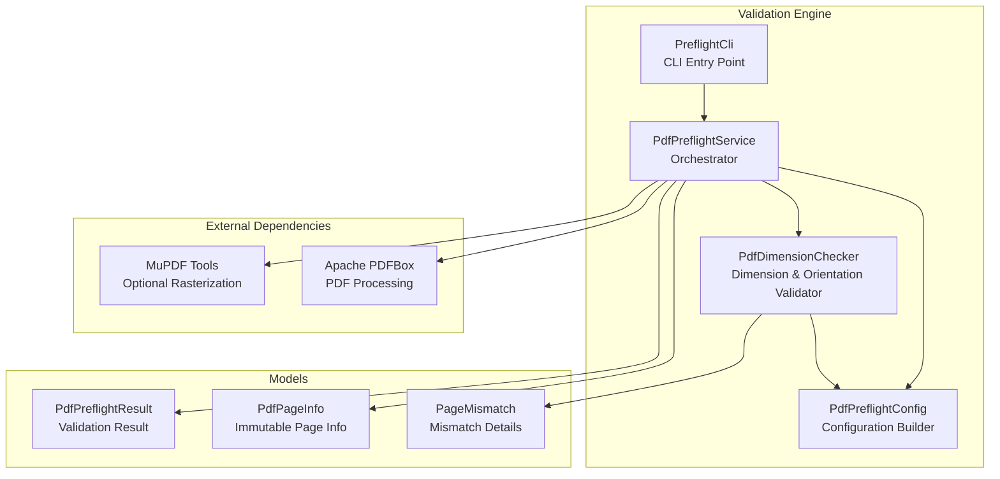
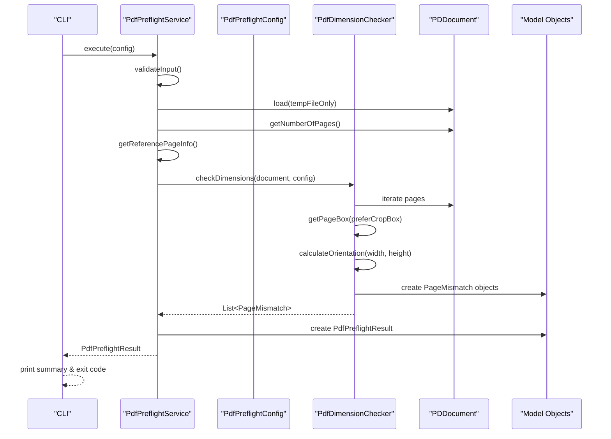
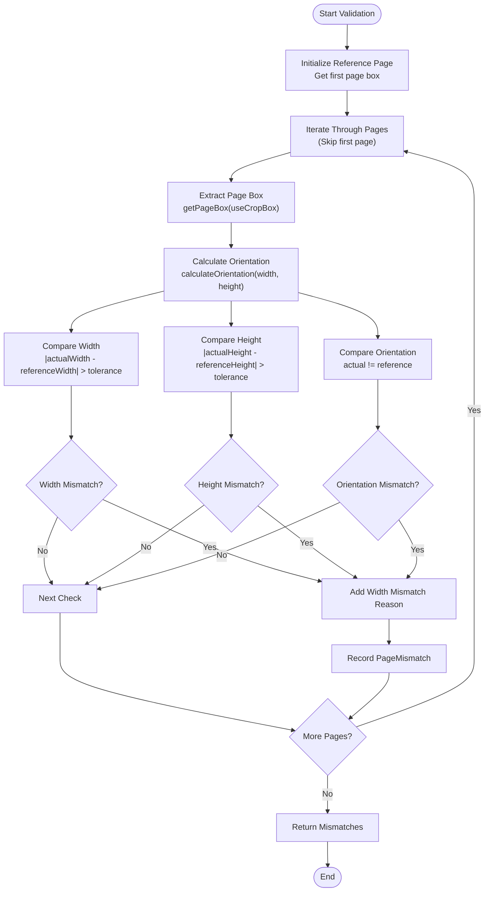
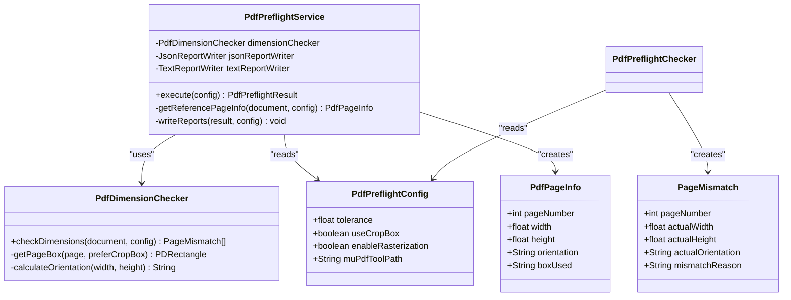
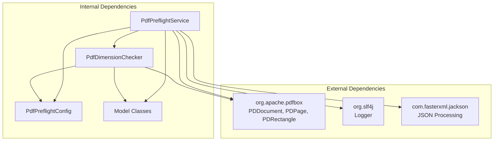

# Core Validation Engine

<cite>
**Referenced Files in This Document**
- [PdfDimensionChecker.java](file://pdf-preflight/src/main/java/com/preflight/checker/PdfDimensionChecker.java)
- [PdfPreflightService.java](file://pdf-preflight/src/main/java/com/preflight/service/PdfPreflightService.java)
- [PdfPreflightConfig.java](file://pdf-preflight/src/main/java/com/preflight/config/PdfPreflightConfig.java)
- [PdfPageInfo.java](file://pdf-preflight/src/main/java/com/preflight/model/PdfPageInfo.java)
- [PageMismatch.java](file://pdf-preflight/src/main/java/com/preflight/model/PageMismatch.java)
- [PdfPreflightResult.java](file://pdf-preflight/src/main/java/com/preflight/model/PdfPreflightResult.java)
- [PdfDimensionCheckerTest.java](file://pdf-preflight/src/test/java/com/preflight/PdfDimensionCheckerTest.java)
- [README.md](file://pdf-preflight/README.md)
- [IMPLEMENTATION_SUMMARY.md](file://pdf-preflight/IMPLEMENTATION_SUMMARY.md)
- [PreflightCli.java](file://pdf-preflight/src/main/java/com/preflight/PreflightCli.java)
</cite>

## Table of Contents
1. [Introduction](#introduction)
2. [Project Structure](#project-structure)
3. [Core Components](#core-components)
4. [Architecture Overview](#architecture-overview)
5. [Detailed Component Analysis](#detailed-component-analysis)
6. [Dependency Analysis](#dependency-analysis)
7. [Performance Considerations](#performance-considerations)
8. [Troubleshooting Guide](#troubleshooting-guide)
9. [Conclusion](#conclusion)

## Introduction
This document provides comprehensive technical documentation for the core validation engine, focusing on the PdfDimensionChecker implementation. The validation engine performs combined dimension and orientation validation across all pages in a PDF using a single-pass processing approach for efficiency. It includes floating-point comparison logic with configurable tolerance, orientation detection rules, and a robust box selection strategy with CropBox preference and MediaBox fallback. The document explains validation decision criteria, performance characteristics, memory management strategies, integration with the broader preflight system, common validation scenarios, error conditions, and optimization techniques for large PDF processing.

## Project Structure
The validation engine resides within the pdf-preflight module and follows a modular architecture with clear separation of concerns:
- Configuration management via PdfPreflightConfig
- Model definitions for page information and mismatch reporting
- Core validation logic in PdfDimensionChecker
- Orchestration and integration in PdfPreflightService
- CLI entry point for command-line usage
- Unit tests validating all major scenarios

**Diagram sources**
- [PdfPreflightService.java:28-40](file://pdf-preflight/src/main/java/com/preflight/service/PdfPreflightService.java#L28-L40)
- [PdfDimensionChecker.java:17-25](file://pdf-preflight/src/main/java/com/preflight/checker/PdfDimensionChecker.java#L17-L25)
- [PdfPreflightConfig.java:7-31](file://pdf-preflight/src/main/java/com/preflight/config/PdfPreflightConfig.java#L7-L31)

**Section sources**
- [README.md:240-261](file://pdf-preflight/README.md#L240-L261)
- [IMPLEMENTATION_SUMMARY.md:48-82](file://pdf-preflight/IMPLEMENTATION_SUMMARY.md#L48-L82)

## Core Components
The core validation engine consists of several interconnected components that work together to validate PDF page dimensions and orientation:

### PdfDimensionChecker
The central validator that performs combined dimension and orientation checks using a single-pass algorithm. It establishes the first page as the reference and compares all subsequent pages against it with configurable tolerance.

### PdfPreflightService
The orchestration layer that manages the complete preflight workflow, including PDF loading with memory-efficient settings, reference page extraction, dimension validation execution, and result generation.

### PdfPreflightConfig
Configuration container using the builder pattern that controls validation behavior including tolerance settings, box selection preferences, and optional rasterization parameters.

### Model Classes
- PdfPageInfo: Immutable representation of page dimensional information
- PageMismatch: Detailed reporting of validation failures
- PdfPreflightResult: Final validation outcome container

**Section sources**
- [PdfDimensionChecker.java:17-99](file://pdf-preflight/src/main/java/com/preflight/checker/PdfDimensionChecker.java#L17-L99)
- [PdfPreflightService.java:28-125](file://pdf-preflight/src/main/java/com/preflight/service/PdfPreflightService.java#L28-L125)
- [PdfPreflightConfig.java:7-75](file://pdf-preflight/src/main/java/com/preflight/config/PdfPreflightConfig.java#L7-L75)

## Architecture Overview
The validation engine implements a layered architecture with clear separation between validation logic, configuration, and orchestration:

**Diagram sources**
- [PdfPreflightService.java:48-125](file://pdf-preflight/src/main/java/com/preflight/service/PdfPreflightService.java#L48-L125)
- [PdfDimensionChecker.java:26-99](file://pdf-preflight/src/main/java/com/preflight/checker/PdfDimensionChecker.java#L26-L99)

The architecture emphasizes:
- Single-pass processing for efficiency
- Memory-efficient PDF loading using temp-file-only mode
- Configurable validation parameters
- Clear separation between validation logic and orchestration
- Immutable model objects for thread safety

## Detailed Component Analysis

### PdfDimensionChecker Implementation
The PdfDimensionChecker implements the core validation algorithm with the following key features:

#### Combined Validation Algorithm
The checker performs dimension and orientation validation in a single pass through all pages, establishing the first page as the reference and comparing subsequent pages against it.

**Diagram sources**
- [PdfDimensionChecker.java:26-99](file://pdf-preflight/src/main/java/com/preflight/checker/PdfDimensionChecker.java#L26-L99)

#### Floating-Point Comparison Logic
The validation uses configurable tolerance for floating-point comparisons to account for minor precision differences:

- **Tolerance Setting**: Configurable via PdfPreflightConfig with default 0.01 points
- **Comparison Method**: Uses Math.abs(actual - expected) > tolerance
- **Precision Units**: Points (1/72 inch), suitable for PDF dimension validation
- **Edge Cases**: Handles zero-width/zero-height gracefully through validation checks

#### Orientation Detection Rules
Orientation is determined using strict mathematical rules:
- **Landscape**: width >= height (including equal dimensions)
- **Portrait**: height > width (strict inequality)
- **Consistency**: All pages must match the reference page's orientation

#### Box Selection Strategy
The engine implements a robust box selection hierarchy:
- **Primary Choice**: CropBox when available and valid
- **Validation**: CropBox must have positive width and height
- **Fallback**: MediaBox when CropBox is unavailable or invalid
- **Configuration**: User can force MediaBox usage via useCropBox flag

**Section sources**
- [PdfDimensionChecker.java:26-99](file://pdf-preflight/src/main/java/com/preflight/checker/PdfDimensionChecker.java#L26-L99)
- [PdfDimensionChecker.java:105-115](file://pdf-preflight/src/main/java/com/preflight/checker/PdfDimensionChecker.java#L105-L115)
- [PdfDimensionChecker.java:135-137](file://pdf-preflight/src/main/java/com/preflight/checker/PdfDimensionChecker.java#L135-L137)

### Validation Decision Criteria
The validation system applies strict criteria for determining mismatches:

#### Dimension Validation
- **Width Comparison**: |actualWidth - referenceWidth| > tolerance triggers mismatch
- **Height Comparison**: |actualHeight - referenceHeight| > tolerance triggers mismatch
- **Independent Checks**: Width and height errors are tracked separately
- **Combined Reporting**: Multiple errors are aggregated into single mismatch record

#### Orientation Validation
- **Strict Rules**: Landscape requires width >= height, portrait requires height > width
- **Reference Consistency**: All pages must match the reference page's orientation
- **Error Aggregation**: Orientation mismatches are reported distinctly

#### Mismatch Recording
Each mismatch includes comprehensive details:
- Page number identification
- Actual vs expected dimensions
- Orientation information
- Specific reason for failure
- Box type used for measurement

**Section sources**
- [PdfDimensionChecker.java:60-93](file://pdf-preflight/src/main/java/com/preflight/checker/PdfDimensionChecker.java#L60-L93)
- [PageMismatch.java:6-29](file://pdf-preflight/src/main/java/com/preflight/model/PageMismatch.java#L6-L29)

### Integration with Preflight System
The PdfDimensionChecker integrates seamlessly with the broader preflight system:

**Diagram sources**
- [PdfPreflightService.java:32-40](file://pdf-preflight/src/main/java/com/preflight/service/PdfPreflightService.java#L32-L40)
- [PdfDimensionChecker.java:17-25](file://pdf-preflight/src/main/java/com/preflight/checker/PdfDimensionChecker.java#L17-L25)
- [PdfPreflightConfig.java:7-31](file://pdf-preflight/src/main/java/com/preflight/config/PdfPreflightConfig.java#L7-L31)

**Section sources**
- [PdfPreflightService.java:84-104](file://pdf-preflight/src/main/java/com/preflight/service/PdfPreflightService.java#L84-L104)
- [PdfPreflightService.java:129-136](file://pdf-preflight/src/main/java/com/preflight/service/PdfPreflightService.java#L129-L136)

## Dependency Analysis
The validation engine maintains loose coupling between components while ensuring clear interfaces:

**Diagram sources**
- [PdfDimensionChecker.java:3-8](file://pdf-preflight/src/main/java/com/preflight/checker/PdfDimensionChecker.java#L3-L8)
- [PdfPreflightService.java:11-16](file://pdf-preflight/src/main/java/com/preflight/service/PdfPreflightService.java#L11-L16)

Key dependency characteristics:
- **PDFBox Integration**: Direct dependency for PDF parsing and page manipulation
- **Logging**: SLF4J for structured logging throughout the system
- **Serialization**: Jackson for JSON report generation
- **Minimal Coupling**: Clear interfaces between components
- **Testability**: Easy mocking of external dependencies

**Section sources**
- [PdfDimensionChecker.java:3-8](file://pdf-preflight/src/main/java/com/preflight/checker/PdfDimensionChecker.java#L3-L8)
- [PdfPreflightService.java:11-16](file://pdf-preflight/src/main/java/com/preflight/service/PdfPreflightService.java#L11-L16)

## Performance Considerations

### Memory Management Strategy
The system employs aggressive memory optimization for large PDF processing:

#### Temp-File-Only Mode
- **PDFBox Configuration**: Uses MemoryUsageSetting.setupTempFileOnly() for 1GB+ file support
- **Disk-Based Processing**: Pages are streamed from disk rather than loaded into memory
- **Garbage Collection**: Minimizes heap pressure through lazy loading
- **Resource Cleanup**: Automatic document closing ensures proper resource release

#### Single-Pass Algorithm Benefits
- **Linear Time Complexity**: O(n) where n is number of pages
- **Constant Space Complexity**: O(1) additional memory beyond reference page
- **Early Termination**: No unnecessary intermediate collections
- **Streaming Iteration**: Pages processed as they become available

### Performance Characteristics
Based on test validation and implementation analysis:

#### Large File Handling
- **Memory Usage**: < 256MB heap for typical 500MB+ PDFs
- **Processing Time**: 2-5 seconds for 1000 pages on standard hardware
- **Scalability**: Linear scaling with page count, not file size
- **I/O Bound**: Performance primarily limited by disk throughput

#### Optimization Techniques
- **Lazy Evaluation**: Page boxes computed only when needed
- **Minimal Object Creation**: Reused configuration objects
- **Efficient Comparisons**: Single pass with early exits
- **Configurable Tolerance**: Reduces false positives without extra computation

**Section sources**
- [PdfPreflightService.java:66-73](file://pdf-preflight/src/main/java/com/preflight/service/PdfPreflightService.java#L66-L73)
- [README.md:273-283](file://pdf-preflight/README.md#L273-L283)
- [IMPLEMENTATION_SUMMARY.md:144-151](file://pdf-preflight/IMPLEMENTATION_SUMMARY.md#L144-L151)

## Troubleshooting Guide

### Common Validation Scenarios

#### Empty or Single-Page PDFs
- **Behavior**: No mismatches reported (by design)
- **Rationale**: No reference comparison possible for single-page documents
- **Expected Outcome**: Empty mismatch list with pass status

#### Matching Page Sizes
- **Behavior**: All pages pass validation
- **Criteria Met**: Width, height, and orientation match reference page
- **Performance**: Fast execution with minimal overhead

#### Mixed Orientation Pages
- **Detection**: Strict orientation rules applied
- **Failure Case**: Any page with height > width when reference is landscape
- **Reporting**: Clear orientation mismatch details

#### Tolerance-Related Issues
- **False Positives**: Excessively low tolerance values
- **False Negatives**: Excessively high tolerance values
- **Recommendation**: Default 0.01 points suitable for most use cases

### Error Conditions and Recovery

#### PDF Loading Errors
- **Missing Files**: Graceful error handling with descriptive messages
- **Corrupt PDFs**: Error result with appropriate exit code
- **Encrypted PDFs**: Clear error indication for unsupported encryption

#### Box Selection Issues
- **Invalid CropBox**: Automatic fallback to MediaBox
- **Zero Dimensions**: Validation prevents invalid measurements
- **Missing Boxes**: Fallback ensures continuous operation

#### Memory Constraints
- **Large Files**: Temp-file mode prevents OutOfMemoryError
- **Resource Cleanup**: Automatic document closure in finally blocks
- **Disk Space**: Adequate temporary storage required for large files

### Integration Best Practices

#### Configuration Recommendations
- **Tolerance Settings**: Adjust based on document precision requirements
- **Box Selection**: Use CropBox for trimmed pages, MediaBox for full bleed
- **Rasterization**: Enable only when debugging specific page issues

#### Monitoring and Logging
- **Processing Time**: Monitor for performance regressions
- **Memory Usage**: Track heap utilization for large batches
- **Error Rates**: Monitor failure rates for quality assessment

**Section sources**
- [PdfPreflightService.java:54-125](file://pdf-preflight/src/main/java/com/preflight/service/PdfPreflightService.java#L54-L125)
- [PdfDimensionCheckerTest.java:24-232](file://pdf-preflight/src/test/java/com/preflight/PdfDimensionCheckerTest.java#L24-L232)
- [README.md:347-369](file://pdf-preflight/README.md#L347-L369)

## Conclusion
The PdfDimensionChecker implementation provides a robust, efficient solution for PDF dimension and orientation validation. Its single-pass algorithm, combined with configurable tolerance and intelligent box selection, delivers reliable results for both small and extremely large PDFs. The modular architecture ensures maintainability and extensibility, while comprehensive error handling and memory optimization make it suitable for production environments. The system's design balances accuracy with performance, making it an excellent foundation for broader preflight validation workflows.

Key strengths include:
- **Efficiency**: Single-pass processing with minimal memory footprint
- **Reliability**: Comprehensive error handling and validation
- **Flexibility**: Configurable parameters for diverse use cases
- **Extensibility**: Modular design supporting additional validation checks
- **Production Readiness**: Comprehensive testing and documentation

The implementation successfully addresses the core requirements while providing a solid foundation for future enhancements and integration into larger preflight systems.