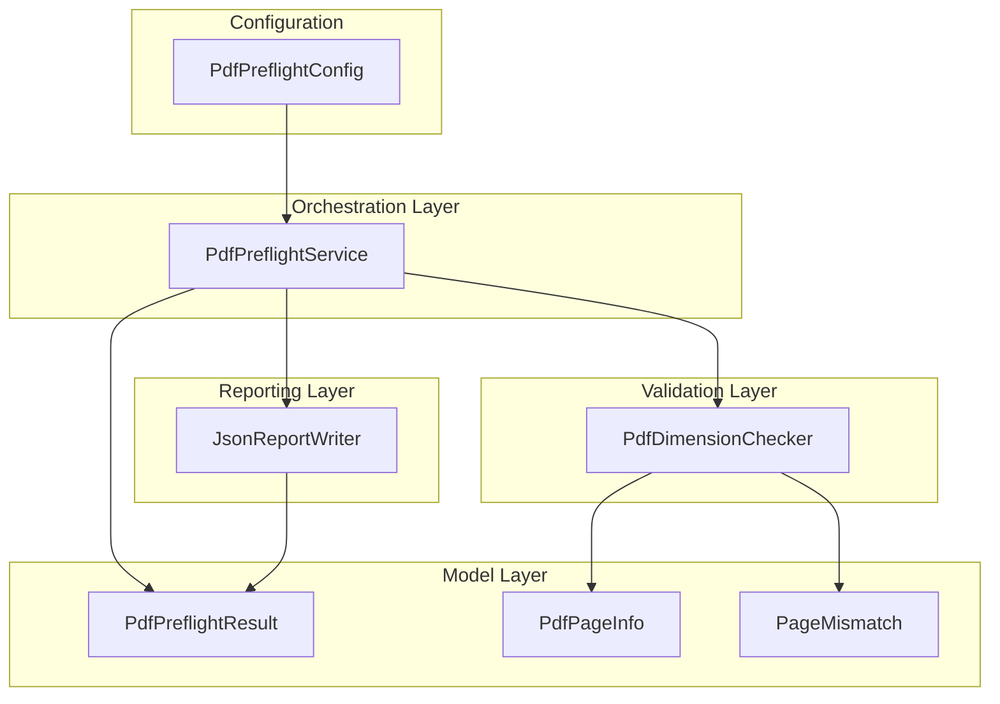
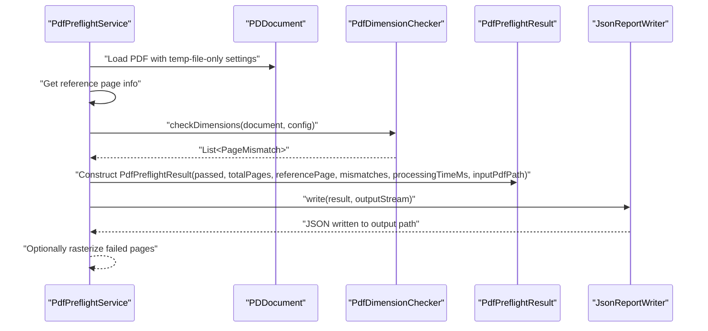
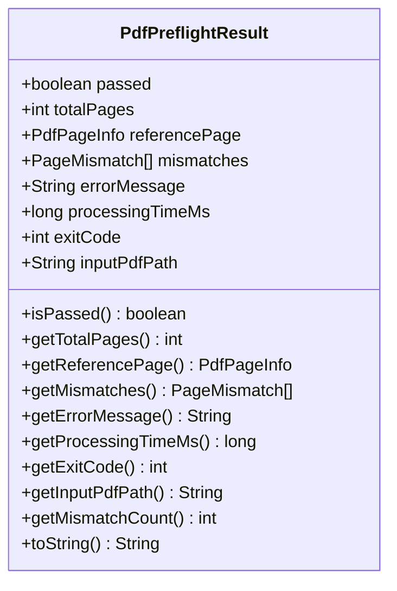
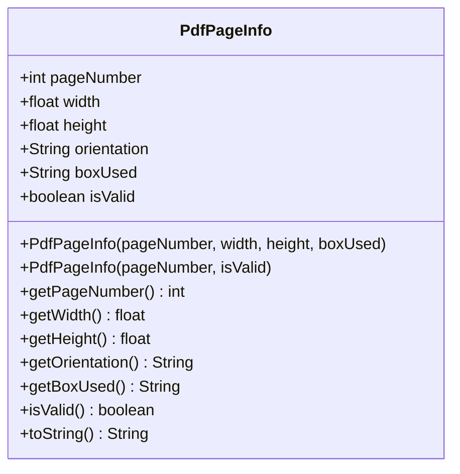
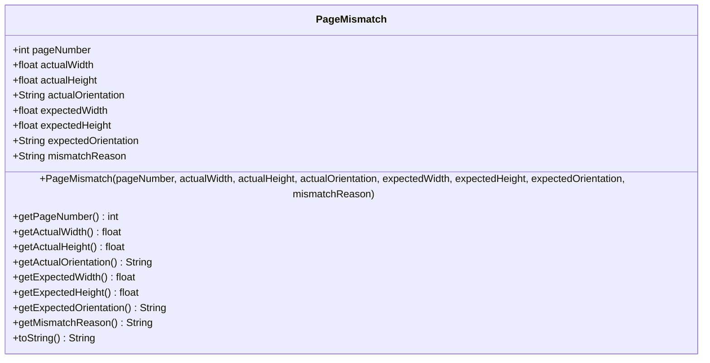
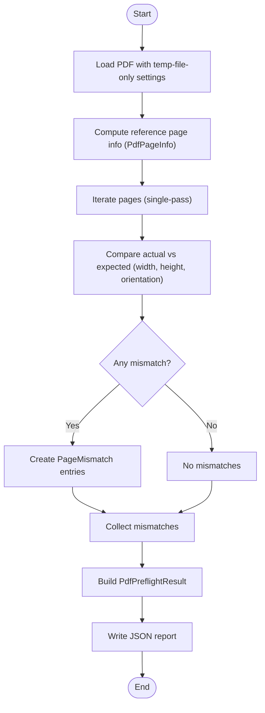
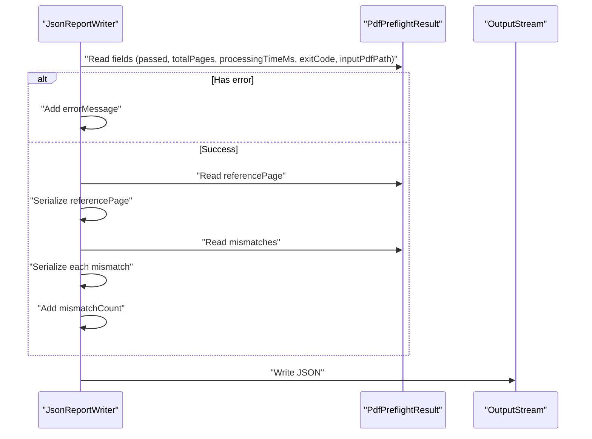
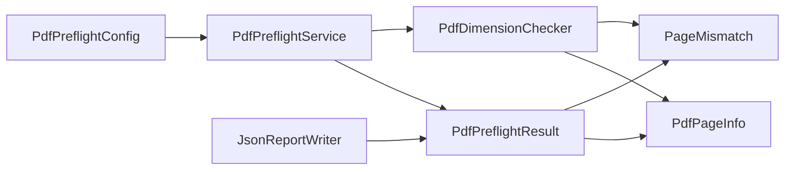

# Data Models and Structures

<cite>
**Referenced Files in This Document**
- [PdfPreflightResult.java](file://pdf-preflight/src/main/java/com/preflight/model/PdfPreflightResult.java)
- [PdfPageInfo.java](file://pdf-preflight/src/main/java/com/preflight/model/PdfPageInfo.java)
- [PageMismatch.java](file://pdf-preflight/src/main/java/com/preflight/model/PageMismatch.java)
- [PdfDimensionChecker.java](file://pdf-preflight/src/main/java/com/preflight/checker/PdfDimensionChecker.java)
- [PdfPreflightService.java](file://pdf-preflight/src/main/java/com/preflight/service/PdfPreflightService.java)
- [JsonReportWriter.java](file://pdf-preflight/src/main/java/com/preflight/report/JsonReportWriter.java)
- [PdfPreflightConfig.java](file://pdf-preflight/src/main/java/com/preflight/config/PdfPreflightConfig.java)
- [sample-report.json](file://pdf-preflight/sample-report.json)
- [PdfDimensionCheckerTest.java](file://pdf-preflight/src/test/java/com/preflight/PdfDimensionCheckerTest.java)
- [PdfPreflightServiceTest.java](file://pdf-preflight/src/test/java/com/preflight/PdfPreflightServiceTest.java)
</cite>

## Table of Contents
1. [Introduction](#introduction)
2. [Project Structure](#project-structure)
3. [Core Components](#core-components)
4. [Architecture Overview](#architecture-overview)
5. [Detailed Component Analysis](#detailed-component-analysis)
6. [Dependency Analysis](#dependency-analysis)
7. [Performance Considerations](#performance-considerations)
8. [Troubleshooting Guide](#troubleshooting-guide)
9. [Conclusion](#conclusion)
10. [Appendices](#appendices)

## Introduction
This document provides comprehensive data model documentation for the immutable object design used throughout the preflight engine. It focuses on three core model classes:
- PdfPreflightResult: the main result container for validation outcomes
- PdfPageInfo: immutable page dimension storage
- PageMismatch: detailed mismatch reporting

It explains the thread-safe immutable design choices, constructor parameters, getter methods, and data validation rules. It also covers relationships between these models, their role in the validation workflow, data flow patterns, performance benefits of immutability, and integration with report generation systems. Finally, it includes JSON representation examples for machine-readable output.

## Project Structure
The models reside in the model package and are consumed by the checker, service, and report writer components. The configuration class provides runtime settings that influence how the models are populated and validated.

**Diagram sources**
- [PdfPreflightResult.java:1-89](file://pdf-preflight/src/main/java/com/preflight/model/PdfPreflightResult.java#L1-L89)
- [PdfPageInfo.java:1-67](file://pdf-preflight/src/main/java/com/preflight/model/PdfPageInfo.java#L1-L67)
- [PageMismatch.java:1-68](file://pdf-preflight/src/main/java/com/preflight/model/PageMismatch.java#L1-L68)
- [PdfDimensionChecker.java:1-139](file://pdf-preflight/src/main/java/com/preflight/checker/PdfDimensionChecker.java#L1-L139)
- [PdfPreflightService.java:1-241](file://pdf-preflight/src/main/java/com/preflight/service/PdfPreflightService.java#L1-L241)
- [JsonReportWriter.java:1-85](file://pdf-preflight/src/main/java/com/preflight/report/JsonReportWriter.java#L1-L85)
- [PdfPreflightConfig.java:1-143](file://pdf-preflight/src/main/java/com/preflight/config/PdfPreflightConfig.java#L1-L143)

**Section sources**
- [PdfPreflightResult.java:1-89](file://pdf-preflight/src/main/java/com/preflight/model/PdfPreflightResult.java#L1-L89)
- [PdfPageInfo.java:1-67](file://pdf-preflight/src/main/java/com/preflight/model/PdfPageInfo.java#L1-L67)
- [PageMismatch.java:1-68](file://pdf-preflight/src/main/java/com/preflight/model/PageMismatch.java#L1-L68)
- [PdfDimensionChecker.java:1-139](file://pdf-preflight/src/main/java/com/preflight/checker/PdfDimensionChecker.java#L1-L139)
- [PdfPreflightService.java:1-241](file://pdf-preflight/src/main/java/com/preflight/service/PdfPreflightService.java#L1-L241)
- [JsonReportWriter.java:1-85](file://pdf-preflight/src/main/java/com/preflight/report/JsonReportWriter.java#L1-L85)
- [PdfPreflightConfig.java:1-143](file://pdf-preflight/src/main/java/com/preflight/config/PdfPreflightConfig.java#L1-L143)

## Core Components
This section documents the three immutable data models and their roles in the preflight workflow.

- PdfPreflightResult
  - Purpose: Aggregates the outcome of the preflight operation, including pass/fail status, total pages, reference page information, mismatch details, processing time, exit code, and input path.
  - Immutability: All fields are final; the mismatches list is wrapped with an unmodifiable collection.
  - Constructors:
    - Success constructor initializes passed, totalPages, referencePage, mismatches, processingTimeMs, inputPdfPath, and computes exitCode based on passed.
    - Error constructor initializes passed=false, totalPages=0, referencePage=null, mismatches as an empty list, sets errorMessage, and computes exitCode=2.
  - Getters: Provide read-only access to all fields, plus a convenience method to compute mismatch count.
  - Business rules:
    - exitCode is 0 when passed=true, 1 when passed=false, and 2 for errors.
    - toString formats either an error message or a summary of pass/fail, total pages, and mismatch count.

- PdfPageInfo
  - Purpose: Immutable representation of a page’s dimensional information (page number, width, height, orientation, box used, validity flag).
  - Immutability: All fields are final; orientation is derived from width and height.
  - Constructors:
    - Valid page constructor sets page number, width, height, and boxUsed; orientation is computed; isValid is true.
    - Invalid page constructor sets page number and isValid; other numeric fields default to zero; orientation defaults to “unknown”; boxUsed defaults to “none”.
  - Getters: Provide read-only access to page metadata.
  - Business rules:
    - Orientation is calculated as “landscape” if width >= height, otherwise “portrait”.
    - isValid indicates whether the page info is meaningful (e.g., constructed from a valid page).

- PageMismatch
  - Purpose: Captures a single mismatch between an actual page and the reference page, including page number, actual and expected dimensions/orientations, and a reason string.
  - Immutability: All fields are final.
  - Constructor: Initializes all fields from parameters.
  - Getters: Provide read-only access to mismatch details.
  - Business rules:
    - The mismatchReason is a human-readable summary of detected differences (width, height, orientation).

**Section sources**
- [PdfPreflightResult.java:1-89](file://pdf-preflight/src/main/java/com/preflight/model/PdfPreflightResult.java#L1-L89)
- [PdfPageInfo.java:1-67](file://pdf-preflight/src/main/java/com/preflight/model/PdfPageInfo.java#L1-L67)
- [PageMismatch.java:1-68](file://pdf-preflight/src/main/java/com/preflight/model/PageMismatch.java#L1-L68)

## Architecture Overview
The preflight engine orchestrates PDF validation through a clear separation of concerns:
- PdfPreflightService loads the PDF, constructs the reference page info, runs dimension checks, builds PdfPreflightResult, writes reports, and optionally rasterizes failing pages.
- PdfDimensionChecker performs a single-pass scan of pages, computing mismatches against the reference page.
- JsonReportWriter serializes PdfPreflightResult into a machine-readable JSON format.
- PdfPreflightConfig supplies runtime settings influencing validation behavior (tolerance, box selection, rasterization options).

**Diagram sources**
- [PdfPreflightService.java:48-125](file://pdf-preflight/src/main/java/com/preflight/service/PdfPreflightService.java#L48-L125)
- [PdfDimensionChecker.java:26-99](file://pdf-preflight/src/main/java/com/preflight/checker/PdfDimensionChecker.java#L26-L99)
- [JsonReportWriter.java:28-56](file://pdf-preflight/src/main/java/com/preflight/report/JsonReportWriter.java#L28-L56)

## Detailed Component Analysis

### PdfPreflightResult
PdfPreflightResult encapsulates the complete outcome of a preflight run. It is immutable, ensuring thread-safety and predictable consumption downstream.

- Fields and types:
  - passed: boolean
  - totalPages: int
  - referencePage: PdfPageInfo
  - mismatches: List<PageMismatch> (unmodifiable)
  - errorMessage: String
  - processingTimeMs: long
  - exitCode: int
  - inputPdfPath: String
- Validation and business rules:
  - exitCode is computed from passed (0/1) or set to 2 for error results.
  - mismatches are stored as an unmodifiable list to prevent external mutation.
  - toString formats either an error message or a concise pass/fail summary.
- Usage patterns:
  - Constructed by PdfPreflightService after validation and report writing.
  - Consumed by JsonReportWriter to produce machine-readable output.

**Diagram sources**
- [PdfPreflightResult.java:9-78](file://pdf-preflight/src/main/java/com/preflight/model/PdfPreflightResult.java#L9-L78)

**Section sources**
- [PdfPreflightResult.java:1-89](file://pdf-preflight/src/main/java/com/preflight/model/PdfPreflightResult.java#L1-L89)
- [PdfPreflightService.java:97-104](file://pdf-preflight/src/main/java/com/preflight/service/PdfPreflightService.java#L97-L104)
- [JsonReportWriter.java:30-53](file://pdf-preflight/src/main/java/com/preflight/report/JsonReportWriter.java#L30-L53)

### PdfPageInfo
PdfPageInfo stores immutable page metadata derived from a PDF page. It enforces immutability and calculates orientation from width and height.

- Fields and types:
  - pageNumber: int
  - width: float
  - height: float
  - orientation: String ("landscape" | "portrait" | "unknown")
  - boxUsed: String ("CropBox" | "MediaBox" | "none")
  - isValid: boolean
- Validation and business rules:
  - Orientation is derived from width and height; width >= height yields "landscape", otherwise "portrait".
  - isValid distinguishes between valid page info and placeholder invalid entries.
- Usage patterns:
  - Created from the first page as the reference; used to compare subsequent pages.
  - Consumed by PdfPreflightResult and JsonReportWriter.

**Diagram sources**
- [PdfPageInfo.java:6-59](file://pdf-preflight/src/main/java/com/preflight/model/PdfPageInfo.java#L6-L59)

**Section sources**
- [PdfPageInfo.java:1-67](file://pdf-preflight/src/main/java/com/preflight/model/PdfPageInfo.java#L1-L67)
- [PdfPreflightService.java:130-136](file://pdf-preflight/src/main/java/com/preflight/service/PdfPreflightService.java#L130-L136)
- [PdfDimensionChecker.java:105-128](file://pdf-preflight/src/main/java/com/preflight/checker/PdfDimensionChecker.java#L105-L128)

### PageMismatch
PageMismatch captures a single mismatch between an actual page and the reference page, enabling detailed reporting.

- Fields and types:
  - pageNumber: int
  - actualWidth: float
  - actualHeight: float
  - actualOrientation: String
  - expectedWidth: float
  - expectedHeight: float
  - expectedOrientation: String
  - mismatchReason: String
- Validation and business rules:
  - mismatchReason is a concatenated summary of detected differences (width, height, orientation).
- Usage patterns:
  - Produced by PdfDimensionChecker and aggregated into PdfPreflightResult.
  - Serialized by JsonReportWriter.

**Diagram sources**
- [PageMismatch.java:6-61](file://pdf-preflight/src/main/java/com/preflight/model/PageMismatch.java#L6-L61)

**Section sources**
- [PageMismatch.java:1-68](file://pdf-preflight/src/main/java/com/preflight/model/PageMismatch.java#L1-L68)
- [PdfDimensionChecker.java:83-93](file://pdf-preflight/src/main/java/com/preflight/checker/PdfDimensionChecker.java#L83-L93)
- [JsonReportWriter.java:68-79](file://pdf-preflight/src/main/java/com/preflight/report/JsonReportWriter.java#L68-L79)

### Data Flow and Validation Workflow
The workflow integrates the models with validation and reporting:

**Diagram sources**
- [PdfPreflightService.java:48-125](file://pdf-preflight/src/main/java/com/preflight/service/PdfPreflightService.java#L48-L125)
- [PdfDimensionChecker.java:26-99](file://pdf-preflight/src/main/java/com/preflight/checker/PdfDimensionChecker.java#L26-L99)
- [JsonReportWriter.java:28-56](file://pdf-preflight/src/main/java/com/preflight/report/JsonReportWriter.java#L28-L56)

**Section sources**
- [PdfPreflightService.java:48-125](file://pdf-preflight/src/main/java/com/preflight/service/PdfPreflightService.java#L48-L125)
- [PdfDimensionChecker.java:26-99](file://pdf-preflight/src/main/java/com/preflight/checker/PdfDimensionChecker.java#L26-L99)
- [JsonReportWriter.java:28-56](file://pdf-preflight/src/main/java/com/preflight/report/JsonReportWriter.java#L28-L56)

### Serialization and Machine-Readable Output
JsonReportWriter transforms PdfPreflightResult into a structured JSON document suitable for automation and CI/CD pipelines.

- Output structure:
  - Top-level keys: passed, totalPages, processingTimeMs, exitCode, inputPdf, referencePage, mismatchCount, mismatches.
  - referencePage: pageNumber, width, height, orientation, boxUsed.
  - mismatches: array of objects with page number, actual and expected dimensions/orientations, and mismatchReason.
- Precision handling:
  - Width, height, and mismatched values are rounded to two decimal places for readability and consistency.

**Diagram sources**
- [JsonReportWriter.java:28-56](file://pdf-preflight/src/main/java/com/preflight/report/JsonReportWriter.java#L28-L56)
- [PdfPreflightResult.java:32-42](file://pdf-preflight/src/main/java/com/preflight/model/PdfPreflightResult.java#L32-L42)

**Section sources**
- [JsonReportWriter.java:1-85](file://pdf-preflight/src/main/java/com/preflight/report/JsonReportWriter.java#L1-L85)
- [sample-report.json:1-35](file://pdf-preflight/sample-report.json#L1-L35)

## Dependency Analysis
The models are intentionally decoupled and used by higher-level components.

**Diagram sources**
- [PdfPreflightResult.java:11-18](file://pdf-preflight/src/main/java/com/preflight/model/PdfPreflightResult.java#L11-L18)
- [PdfPageInfo.java:8-13](file://pdf-preflight/src/main/java/com/preflight/model/PdfPageInfo.java#L8-L13)
- [PageMismatch.java:8-15](file://pdf-preflight/src/main/java/com/preflight/model/PageMismatch.java#L8-L15)
- [PdfDimensionChecker.java:26-99](file://pdf-preflight/src/main/java/com/preflight/checker/PdfDimensionChecker.java#L26-L99)
- [PdfPreflightService.java:48-125](file://pdf-preflight/src/main/java/com/preflight/service/PdfPreflightService.java#L48-L125)
- [JsonReportWriter.java:28-56](file://pdf-preflight/src/main/java/com/preflight/report/JsonReportWriter.java#L28-L56)
- [PdfPreflightConfig.java:7-31](file://pdf-preflight/src/main/java/com/preflight/config/PdfPreflightConfig.java#L7-L31)

**Section sources**
- [PdfPreflightResult.java:1-89](file://pdf-preflight/src/main/java/com/preflight/model/PdfPreflightResult.java#L1-L89)
- [PdfPageInfo.java:1-67](file://pdf-preflight/src/main/java/com/preflight/model/PdfPageInfo.java#L1-L67)
- [PageMismatch.java:1-68](file://pdf-preflight/src/main/java/com/preflight/model/PageMismatch.java#L1-L68)
- [PdfDimensionChecker.java:1-139](file://pdf-preflight/src/main/java/com/preflight/checker/PdfDimensionChecker.java#L1-L139)
- [PdfPreflightService.java:1-241](file://pdf-preflight/src/main/java/com/preflight/service/PdfPreflightService.java#L1-L241)
- [JsonReportWriter.java:1-85](file://pdf-preflight/src/main/java/com/preflight/report/JsonReportWriter.java#L1-L85)
- [PdfPreflightConfig.java:1-143](file://pdf-preflight/src/main/java/com/preflight/config/PdfPreflightConfig.java#L1-L143)

## Performance Considerations
- Immutability benefits:
  - Thread-safe sharing of PdfPreflightResult and its collections across components.
  - Eliminates defensive copying overhead; consumers can rely on unmodifiable lists.
- Streaming and memory efficiency:
  - PdfPreflightService uses temp-file-only PDFBox settings to process large PDFs without loading entire documents into memory.
  - PdfDimensionChecker performs a single-pass scan, minimizing I/O and CPU overhead.
- Precision and tolerance:
  - Floating-point comparisons use a configurable tolerance to avoid false positives from minor differences.

[No sources needed since this section provides general guidance]

## Troubleshooting Guide
Common issues and their indicators:
- Missing input file or unreadable file: PdfPreflightService returns an error result with exit code 2 and an error message.
- Empty PDF (0 pages): Same error path as missing file.
- Corrupted PDF: Loading fails, resulting in an error result with exit code 2.
- Mismatched pages: PdfPreflightResult.isPassed() is false, mismatches list contains PageMismatch entries.
- Mixed orientation: PageMismatch.reason includes orientation mismatch details.

**Section sources**
- [PdfPreflightService.java:54-83](file://pdf-preflight/src/main/java/com/preflight/service/PdfPreflightService.java#L54-L83)
- [PdfPreflightServiceTest.java:30-86](file://pdf-preflight/src/test/java/com/preflight/PdfPreflightServiceTest.java#L30-L86)
- [PdfDimensionCheckerTest.java:24-108](file://pdf-preflight/src/test/java/com/preflight/PdfDimensionCheckerTest.java#L24-L108)

## Conclusion
The immutable data model design ensures thread-safety, predictability, and ease of integration with report generation systems. PdfPreflightResult aggregates validation outcomes, PdfPageInfo provides immutable page metadata, and PageMismatch captures detailed discrepancies. Together, they support efficient, single-pass validation and produce machine-readable JSON reports suitable for automation.

[No sources needed since this section summarizes without analyzing specific files]

## Appendices

### Field Descriptions and Types
- PdfPreflightResult
  - passed: boolean
  - totalPages: int
  - referencePage: PdfPageInfo
  - mismatches: List<PageMismatch> (unmodifiable)
  - errorMessage: String
  - processingTimeMs: long
  - exitCode: int
  - inputPdfPath: String
- PdfPageInfo
  - pageNumber: int
  - width: float (points)
  - height: float (points)
  - orientation: String ("landscape" | "portrait" | "unknown")
  - boxUsed: String ("CropBox" | "MediaBox" | "none")
  - isValid: boolean
- PageMismatch
  - pageNumber: int
  - actualWidth: float (points)
  - actualHeight: float (points)
  - actualOrientation: String ("landscape" | "portrait")
  - expectedWidth: float (points)
  - expectedHeight: float (points)
  - expectedOrientation: String ("landscape" | "portrait")
  - mismatchReason: String

**Section sources**
- [PdfPreflightResult.java:11-18](file://pdf-preflight/src/main/java/com/preflight/model/PdfPreflightResult.java#L11-L18)
- [PdfPageInfo.java:8-13](file://pdf-preflight/src/main/java/com/preflight/model/PdfPageInfo.java#L8-L13)
- [PageMismatch.java:8-15](file://pdf-preflight/src/main/java/com/preflight/model/PageMismatch.java#L8-L15)

### Example Workflows and Usage Patterns
- Creating PdfPageInfo:
  - From a valid page: construct with page number, width, height, and boxUsed.
  - As a placeholder: construct with page number and isValid=false.
- Creating PageMismatch:
  - After detecting differences between actual and expected dimensions/orientations.
- Building PdfPreflightResult:
  - Success path: pass true, total pages, reference page info, mismatches list, processing time, input path.
  - Error path: pass false, mismatches empty, error message, processing time, input path.
- Serializing to JSON:
  - Use JsonReportWriter to convert PdfPreflightResult into a structured JSON document.

**Section sources**
- [PdfPageInfo.java:15-31](file://pdf-preflight/src/main/java/com/preflight/model/PdfPageInfo.java#L15-L31)
- [PageMismatch.java:17-29](file://pdf-preflight/src/main/java/com/preflight/model/PageMismatch.java#L17-L29)
- [PdfPreflightResult.java:20-42](file://pdf-preflight/src/main/java/com/preflight/model/PdfPreflightResult.java#L20-L42)
- [JsonReportWriter.java:28-56](file://pdf-preflight/src/main/java/com/preflight/report/JsonReportWriter.java#L28-L56)

### JSON Representation Examples
The machine-readable JSON output follows the structure below. See the sample report for a concrete example.

- Top-level fields:
  - passed: boolean
  - totalPages: integer
  - processingTimeMs: integer
  - exitCode: integer
  - inputPdf: string
  - referencePage: object (optional, present when no error)
  - mismatchCount: integer
  - mismatches: array of objects (optional, present when mismatches exist)
- referencePage fields:
  - pageNumber: integer
  - width: number (rounded to two decimals)
  - height: number (rounded to two decimals)
  - orientation: string
  - boxUsed: string
- mismatch fields:
  - pageNumber: integer
  - actualWidth: number (rounded to two decimals)
  - actualHeight: number (rounded to two decimals)
  - actualOrientation: string
  - expectedWidth: number (rounded to two decimals)
  - expectedHeight: number (rounded to two decimals)
  - expectedOrientation: string
  - mismatchReason: string

**Section sources**
- [JsonReportWriter.java:30-53](file://pdf-preflight/src/main/java/com/preflight/report/JsonReportWriter.java#L30-L53)
- [sample-report.json:1-35](file://pdf-preflight/sample-report.json#L1-L35)