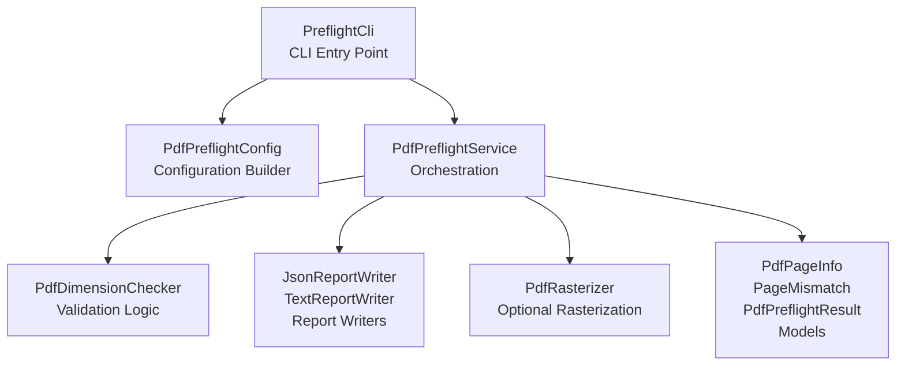
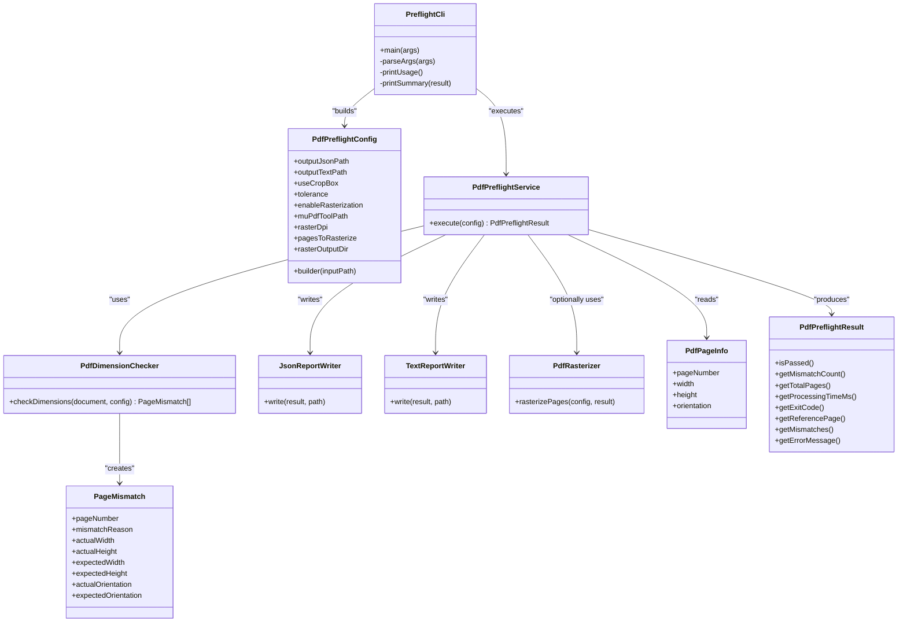

# Getting Started

<cite>
**Referenced Files in This Document**
- [README.md](file://pdf-preflight/README.md)
- [QUICKSTART.md](file://pdf-preflight/QUICKSTART.md)
- [DEPENDENCIES.md](file://pdf-preflight/DEPENDENCIES.md)
- [CLI_EXAMPLES.md](file://pdf-preflight/CLI_EXAMPLES.md)
- [build.gradle](file://pdf-preflight/build.gradle)
- [pom.xml](file://pdf-preflight/pom.xml)
- [build.sh](file://pdf-preflight/build.sh)
- [PreflightCli.java](file://pdf-preflight/src/main/java/com/preflight/PreflightCli.java)
- [PdfPreflightServiceTest.java](file://pdf-preflight/src/test/java/com/preflight/PdfPreflightServiceTest.java)
- [PdfDimensionCheckerTest.java](file://pdf-preflight/src/test/java/com/preflight/PdfDimensionCheckerTest.java)
- [sample-report.json](file://pdf-preflight/sample-report.json)
- [sample-report.txt](file://pdf-preflight/sample-report.txt)
</cite>

## Table of Contents
1. [Introduction](#introduction)
2. [Project Structure](#project-structure)
3. [Core Components](#core-components)
4. [Architecture Overview](#architecture-overview)
5. [Installation and Setup](#installation-and-setup)
6. [Build Options](#build-options)
7. [First-Time Usage](#first-time-usage)
8. [Advanced Configuration](#advanced-configuration)
9. [Verification and Validation](#verification-and-validation)
10. [Troubleshooting Guide](#troubleshooting-guide)
11. [Performance Considerations](#performance-considerations)
12. [Conclusion](#conclusion)

## Introduction
The PDF Preflight Module is a production-ready Java tool designed to validate page dimensions and orientation consistency in large PDF files (up to 1 GB). It ensures all pages in a PDF share identical dimensions and orientation, using low-memory, page-by-page processing to handle very large files efficiently. The module generates both machine-readable JSON and human-readable text reports, and optionally renders failing pages using MuPDF for visual inspection.

Key capabilities include:
- Dimension and orientation validation across large PDFs
- Configurable tolerance for floating-point comparisons
- Flexible box selection (CropBox or MediaBox)
- Dual report output (JSON and text)
- Optional rasterization of failed pages via MuPDF
- Clear exit codes suitable for CI/CD integration

**Section sources**
- [README.md:3-20](file://pdf-preflight/README.md#L3-L20)

## Project Structure
The project follows a layered architecture with clear separation of concerns:
- CLI entry point orchestrates argument parsing, configuration, and execution
- Service layer coordinates validation and reporting
- Model classes represent page information and validation results
- Checker component performs dimension and orientation validation
- Report writers produce JSON and text reports
- Rasterizer optionally renders failing pages using MuPDF
- Configuration encapsulates runtime settings



**Diagram sources**
- [PreflightCli.java:18-62](file://pdf-preflight/src/main/java/com/preflight/PreflightCli.java#L18-L62)

**Section sources**
- [README.md:238-272](file://pdf-preflight/README.md#L238-L272)

## Core Components
- PreflightCli: Command-line interface that parses arguments, constructs configuration, executes validation, prints summary, and exits with appropriate codes
- PdfPreflightConfig: Immutable configuration built via builder pattern with options for output paths, box selection, tolerance, rasterization settings, and page selection
- PdfPreflightService: Main orchestration service that runs validation, generates reports, and manages rasterization
- PdfDimensionChecker: Validates page dimensions and orientation using configured tolerance and box type
- Report Writers: Generate JSON and text reports with detailed mismatch information
- PdfRasterizer: Optional component that renders failing pages using MuPDF CLI utilities
- Models: Immutable data structures representing page information, mismatch details, and overall results

**Section sources**
- [PreflightCli.java:18-266](file://pdf-preflight/src/main/java/com/preflight/PreflightCli.java#L18-L266)
- [README.md:240-261](file://pdf-preflight/README.md#L240-L261)

## Architecture Overview
The tool employs a modular, layered architecture:
- Low-memory processing using PDFBox with temp-file-backed memory settings
- Single-pass validation combining dimension and orientation checks
- Optional rasterization isolated from core logic
- Clear separation between validation, reporting, and optional rendering



**Diagram sources**
- [PreflightCli.java:18-266](file://pdf-preflight/src/main/java/com/preflight/PreflightCli.java#L18-L266)
- [README.md:240-261](file://pdf-preflight/README.md#L240-L261)

**Section sources**
- [README.md:238-272](file://pdf-preflight/README.md#L238-L272)

## Installation and Setup
Before building or using the tool, ensure the following prerequisites are met:
- Java 11 or higher (OpenJDK or Oracle JDK)
- Maven or Gradle for building
- MuPDF (optional, for page rasterization)

### Platform-Specific Dependencies
- **macOS:**
  - Install Maven: `brew install maven`
  - Install Gradle: `brew install gradle`
  - Install MuPDF: `brew install mupdf-tools`
- **Ubuntu/Debian:**
  - Install Maven: `sudo apt-get install maven`
  - Install Gradle: `sudo apt-get install gradle`
  - Install MuPDF: `sudo apt-get install mupdf-tools`

These dependencies provide the necessary toolchain for building, testing, and optionally rasterizing PDFs.

**Section sources**
- [README.md:21-51](file://pdf-preflight/README.md#L21-L51)
- [DEPENDENCIES.md:3-42](file://pdf-preflight/DEPENDENCIES.md#L3-L42)

## Build Options
The project supports multiple build approaches, each producing an executable fat JAR with all dependencies included.

### Using the Build Script (Recommended)
The build script automatically detects Maven or Gradle and builds the project accordingly:
- Navigate to the pdf-preflight directory
- Run `./build.sh`
- The script will output the path to the generated JAR file

### Using Maven
- Navigate to the pdf-preflight directory
- Run `mvn clean package`
- The fat JAR is created at `target/pdf-preflight-1.0.0.jar`

### Using Gradle
- Navigate to the pdf-preflight directory
- Run `gradle clean build`
- The fat JAR is created at `build/libs/pdf-preflight-1.0.0.jar`

### Build Configuration Details
Both Maven and Gradle configurations:
- Target Java 11
- Include Apache PDFBox, Jackson, SLF4J, and JUnit dependencies
- Create an executable JAR with shaded dependencies
- Exclude signature files to prevent security exceptions

**Section sources**
- [README.md:53-82](file://pdf-preflight/README.md#L53-L82)
- [build.sh:14-38](file://pdf-preflight/build.sh#L14-L38)
- [pom.xml:71-124](file://pdf-preflight/pom.xml#L71-L124)
- [build.gradle:9-61](file://pdf-preflight/build.gradle#L9-L61)

## First-Time Usage
After building the project, you can validate PDFs using the generated executable JAR.

### Basic Validation
Validate a PDF with default settings:
```bash
java -jar pdf-preflight-1.0.0.jar --input document.pdf
```

This command:
- Processes the PDF using default settings
- Generates both JSON and text reports
- Prints a summary to the console
- Exits with code 0 (pass), 1 (fail), or 2 (error)

### Custom Report Paths
Specify custom output paths for reports:
```bash
java -jar pdf-preflight-1.0.0.jar \
  --input document.pdf \
  --output-json reports/preflight.json \
  --output-text reports/preflight.txt
```

### Using MediaBox Instead of CropBox
Some PDFs may not define CropBox. Use MediaBox for measurements:
```bash
java -jar pdf-preflight-1.0.0.jar \
  --input document.pdf \
  --use-mediabox
```

### Custom Tolerance
Adjust the tolerance for dimension comparison (in points):
```bash
# Loose tolerance (0.1 points)
java -jar pdf-preflight-1.0.0.jar \
  --input document.pdf \
  --tolerance 0.1

# Tight tolerance (0.001 points)
java -jar pdf-preflight-1.0.0.jar \
  --input document.pdf \
  --tolerance 0.001
```

### Enabling Rasterization
Render failed pages as images using MuPDF:
```bash
java -jar pdf-preflight-1.0.0.jar \
  --input document.pdf \
  --rasterize \
  --raster-dpi 300
```

Requirements:
- MuPDF must be installed (`mutool` command available)
- Creates `rasterized-pages/` directory with PNG images

**Section sources**
- [README.md:83-149](file://pdf-preflight/README.md#L83-L149)
- [CLI_EXAMPLES.md:5-151](file://pdf-preflight/CLI_EXAMPLES.md#L5-L151)

## Advanced Configuration
### Custom MuPDF Path
Specify a custom path to the mutool executable:
```bash
java -jar pdf-preflight-1.0.0.jar \
  --input document.pdf \
  --rasterize \
  --mutool-path /usr/local/bin/mutool
```

### Rasterize Specific Pages
Choose which pages to rasterize:
```bash
# Rasterize specific pages
java -jar pdf-preflight-1.0.0.jar \
  --input document.pdf \
  --rasterize \
  --raster-pages 25,87,102

# Rasterize with custom output directory
java -jar pdf-preflight-1.0.0.jar \
  --input document.pdf \
  --rasterize \
  --raster-pages 10,20,30 \
  --output-dir /tmp/rasterized
```

### Full Configuration Example
Combine multiple options for comprehensive validation:
```bash
java -jar pdf-preflight-1.0.0.jar \
  --input large-document.pdf \
  --output-json reports/preflight-report.json \
  --output-text reports/preflight-report.txt \
  --use-mediabox \
  --tolerance 0.05 \
  --rasterize \
  --raster-dpi 200 \
  --mutool-path /opt/mupdf/bin/mutool
```

### CI/CD Integration
Integrate into CI/CD pipelines using exit codes:
```bash
#!/bin/bash
java -jar pdf-preflight-1.0.0.jar \
  --input "${BUILD_DIR}/final-document.pdf" \
  --output-json "${WORKSPACE}/reports/preflight.json" \
  --output-text "${WORKSPACE}/reports/preflight.txt"

EXIT_CODE=$?

if [ $EXIT_CODE -eq 0 ]; then
    echo "✅ PDF validation passed"
elif [ $EXIT_CODE -eq 1 ]; then
    echo "❌ PDF validation failed - check reports"
    cat "${WORKSPACE}/reports/preflight.txt"
    exit 1
else
    echo "⚠️  PDF validation error"
    exit 2
fi
```

**Section sources**
- [CLI_EXAMPLES.md:81-200](file://pdf-preflight/CLI_EXAMPLES.md#L81-L200)
- [CLI_EXAMPLES.md:154-199](file://pdf-preflight/CLI_EXAMPLES.md#L154-L199)

## Verification and Validation
### Exit Codes
- **0**: PASS - All pages have matching dimensions and orientation
- **1**: FAIL - Mismatches found (reports generated)
- **2**: ERROR - Invalid PDF, file not found, or runtime error

### Sample Reports
Sample JSON and text reports demonstrate the structure and content of generated outputs. These files serve as reference for interpreting results and integrating with downstream systems.

**Section sources**
- [README.md:150-236](file://pdf-preflight/README.md#L150-L236)
- [sample-report.json:1-35](file://pdf-preflight/sample-report.json#L1-L35)
- [sample-report.txt:1-33](file://pdf-preflight/sample-report.txt#L1-L33)

### Running Tests
Verify your build and environment by running unit tests:
- **Using Maven**: `mvn test`
- **Using Gradle**: `gradle test`

The test suite covers:
- Empty PDF (0 pages)
- Single-page PDF
- Multiple pages with matching dimensions
- Multiple pages with mismatched dimensions
- Mixed orientation (portrait/landscape)
- CropBox to MediaBox fallback
- Custom tolerance settings
- Large number of pages (100+)
- Corrupt PDF handling
- Missing file handling

**Section sources**
- [README.md:284-308](file://pdf-preflight/README.md#L284-L308)
- [PdfPreflightServiceTest.java:29-223](file://pdf-preflight/src/test/java/com/preflight/PdfPreflightServiceTest.java#L29-L223)
- [PdfDimensionCheckerTest.java:24-230](file://pdf-preflight/src/test/java/com/preflight/PdfDimensionCheckerTest.java#L24-L230)

## Troubleshooting Guide
### Common Issues and Solutions
- **"Command not found: java"**: Install Java 11 or higher
  - macOS: `brew install openjdk@11`
  - Ubuntu: `sudo apt-get install openjdk-11-jdk`
- **"OutOfMemoryError"**: Increase heap size
  - Example: `java -Xmx512m -jar pdf-preflight-1.0.0.jar --input large.pdf`
- **"MuPDF not available"**: Install MuPDF or disable rasterization
  - macOS: `brew install mupdf-tools`
  - Ubuntu: `sudo apt-get install mupdf-tools`
  - Or simply omit the `--rasterize` flag

### Error Scenarios
- **Missing file**: Returns exit code 2 with "file not found" message
- **Corrupt PDF**: Returns exit code 2 with descriptive error message
- **Encrypted PDF**: Returns exit code 2 with "PDF is encrypted" message
- **Empty PDF**: Returns exit code 2 with "no pages" message

### Performance Tips
- Monitor memory usage for very large files (>1GB)
- Use absolute paths for input and output files
- Set appropriate tolerance based on your PDF generation workflow
- Enable rasterization for visual inspection of failed pages
- Archive reports for audit trails

**Section sources**
- [CLI_EXAMPLES.md:394-422](file://pdf-preflight/CLI_EXAMPLES.md#L394-L422)
- [README.md:347-369](file://pdf-preflight/README.md#L347-L369)

## Performance Considerations
- **Memory Usage**: Uses temp-file-only mode to avoid loading entire PDF into memory
- **Streaming**: Pages are processed sequentially using iterators
- **No Rendering**: Core validation does not render pages (unless explicitly requested)
- **Efficient Comparison**: Single-pass algorithm checks dimensions and orientation together

Typical performance characteristics for a 500MB PDF with 1000 pages:
- Memory usage: < 256MB heap
- Processing time: Typically 2-5 seconds (depending on disk I/O)

**Section sources**
- [README.md:273-283](file://pdf-preflight/README.md#L273-L283)

## Conclusion
The PDF Preflight Module provides a robust, scalable solution for validating PDF page dimensions and orientation consistency. Its modular architecture, low-memory design, and comprehensive reporting make it suitable for production environments handling large PDF files. By following the installation and usage guidelines, you can quickly integrate this tool into your workflow and CI/CD pipelines for reliable PDF quality assurance.