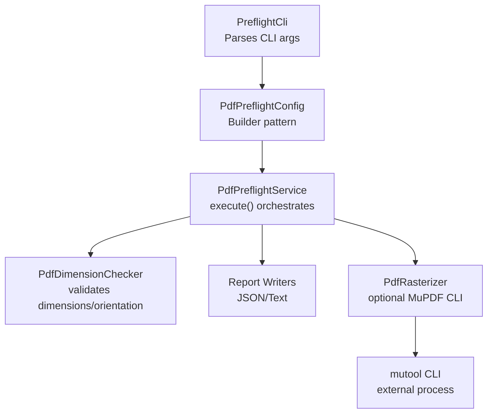
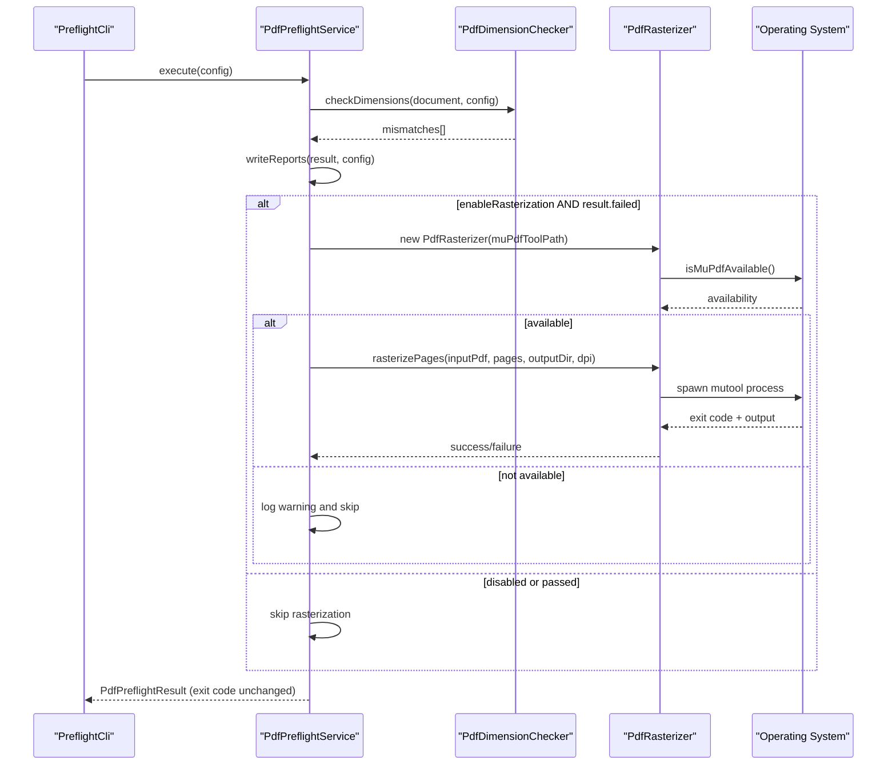
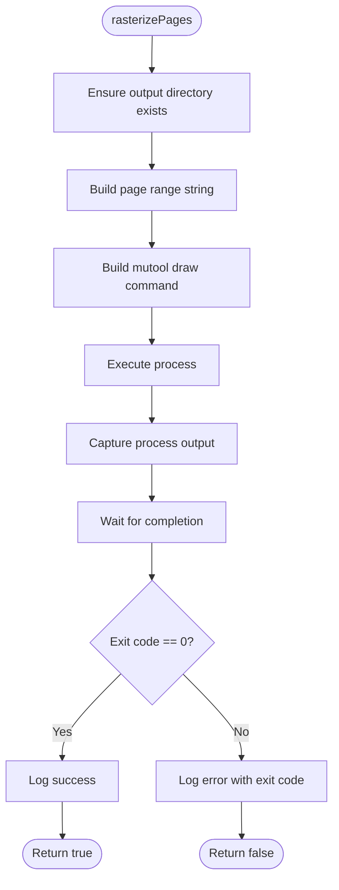
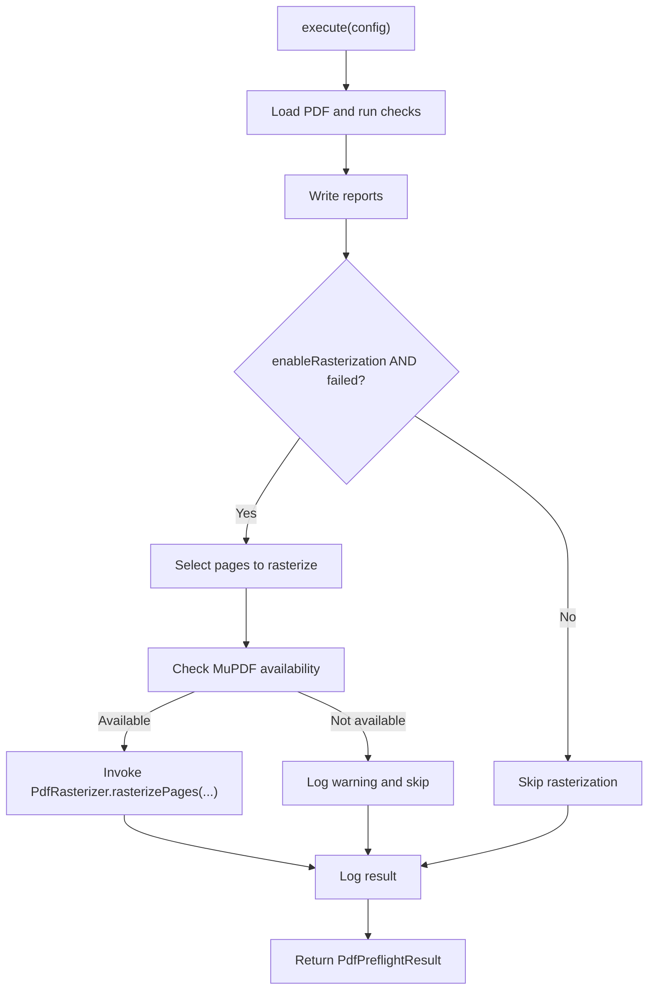
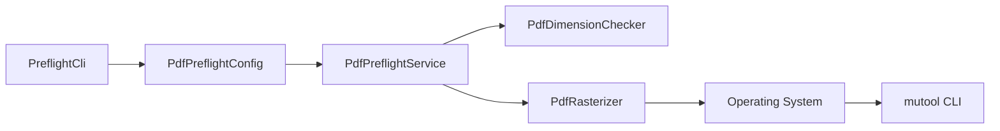

# Optional Rasterization

<cite>
**Referenced Files in This Document**
- [PdfRasterizer.java](file://pdf-preflight/src/main/java/com/preflight/rasterizer/PdfRasterizer.java)
- [PdfPreflightService.java](file://pdf-preflight/src/main/java/com/preflight/service/PdfPreflightService.java)
- [PdfPreflightConfig.java](file://pdf-preflight/src/main/java/com/preflight/config/PdfPreflightConfig.java)
- [PreflightCli.java](file://pdf-preflight/src/main/java/com/preflight/PreflightCli.java)
- [PdfDimensionChecker.java](file://pdf-preflight/src/main/java/com/preflight/checker/PdfDimensionChecker.java)
- [PdfPreflightResult.java](file://pdf-preflight/src/main/java/com/preflight/model/PdfPreflightResult.java)
- [PageMismatch.java](file://pdf-preflight/src/main/java/com/preflight/model/PageMismatch.java)
- [README.md](file://pdf-preflight/README.md)
- [CLI_EXAMPLES.md](file://pdf-preflight/CLI_EXAMPLES.md)
</cite>

## Table of Contents
1. [Introduction](#introduction)
2. [Project Structure](#project-structure)
3. [Core Components](#core-components)
4. [Architecture Overview](#architecture-overview)
5. [Detailed Component Analysis](#detailed-component-analysis)
6. [Dependency Analysis](#dependency-analysis)
7. [Performance Considerations](#performance-considerations)
8. [Troubleshooting Guide](#troubleshooting-guide)
9. [Conclusion](#conclusion)
10. [Appendices](#appendices)

## Introduction
This document explains the optional rasterization functionality powered by MuPDF integration. It covers the rasterization workflow, configuration options (including DPI and page selection), isolation from core validation logic, installation and platform considerations, execution examples, output formats, quality settings, performance implications, and integration with the validation workflow. It also provides troubleshooting guidance and best practices for visual verification.

## Project Structure
The rasterization feature is implemented as a separate module that is intentionally isolated from the core validation logic. The CLI parses arguments, constructs a configuration, runs validation, writes reports, and conditionally triggers rasterization only when validation fails and the feature is enabled.

**Diagram sources**
- [PreflightCli.java:31-45](file://pdf-preflight/src/main/java/com/preflight/PreflightCli.java#L31-L45)
- [PdfPreflightService.java:48-125](file://pdf-preflight/src/main/java/com/preflight/service/PdfPreflightService.java#L48-L125)
- [PdfPreflightService.java:188-230](file://pdf-preflight/src/main/java/com/preflight/service/PdfPreflightService.java#L188-L230)
- [PdfRasterizer.java:20-28](file://pdf-preflight/src/main/java/com/preflight/rasterizer/PdfRasterizer.java#L20-L28)

**Section sources**
- [README.md:21-26](file://pdf-preflight/README.md#L21-L26)
- [README.md:103-108](file://pdf-preflight/README.md#L103-L108)
- [CLI_EXAMPLES.md:81-108](file://pdf-preflight/CLI_EXAMPLES.md#L81-L108)

## Core Components
- PdfRasterizer: Executes MuPDF’s mutool to render PDF pages as PNG images. It is completely isolated from validation logic and does not affect pass/fail results.
- PdfPreflightService: Orchestrates validation, report writing, and optional rasterization. Rasterization runs only when validation fails and the feature is enabled.
- PdfPreflightConfig: Holds all configuration, including rasterization toggles, DPI, page selection, and MuPDF path.
- PreflightCli: Parses CLI flags and passes them to the service.

Key configuration options:
- enableRasterization: Enables optional rasterization.
- rasterDpi: Rendering resolution (default 150).
- pagesToRasterize: Comma-separated page numbers (default all mismatched).
- muPdfToolPath: Path to mutool (default “mutool”).
- rasterOutputDir: Output directory for rasterized images (default “rasterized-pages”).

**Section sources**
- [PdfPreflightConfig.java:14-31](file://pdf-preflight/src/main/java/com/preflight/config/PdfPreflightConfig.java#L14-L31)
- [PdfPreflightConfig.java:113-136](file://pdf-preflight/src/main/java/com/preflight/config/PdfPreflightConfig.java#L113-L136)
- [PdfPreflightService.java:188-230](file://pdf-preflight/src/main/java/com/preflight/service/PdfPreflightService.java#L188-L230)
- [PdfRasterizer.java:39-98](file://pdf-preflight/src/main/java/com/preflight/rasterizer/PdfRasterizer.java#L39-L98)

## Architecture Overview
The rasterization workflow is optional and triggered post-validation. The service decides whether to run rasterization based on configuration and validation outcome.

**Diagram sources**
- [PdfPreflightService.java:109-112](file://pdf-preflight/src/main/java/com/preflight/service/PdfPreflightService.java#L109-L112)
- [PdfPreflightService.java:188-230](file://pdf-preflight/src/main/java/com/preflight/service/PdfPreflightService.java#L188-L230)
- [PdfRasterizer.java:122-135](file://pdf-preflight/src/main/java/com/preflight/rasterizer/PdfRasterizer.java#L122-L135)
- [PdfRasterizer.java:41-98](file://pdf-preflight/src/main/java/com/preflight/rasterizer/PdfRasterizer.java#L41-L98)

## Detailed Component Analysis

### PdfRasterizer
Responsibilities:
- Validate MuPDF availability via mutool -v.
- Build and execute a mutool draw command to render pages as PNG images.
- Manage output directory creation and page range formatting.
- Capture process output and translate exit codes into success/failure.

Behavior highlights:
- Output format: PNG images named page_1.png, page_2.png, etc., placed under the configured rasterOutputDir.
- Page selection: Accepts a list of 1-based page numbers; defaults to page 1 if none provided.
- Isolation: Exceptions and failures are logged and do not influence validation results.

**Diagram sources**
- [PdfRasterizer.java:41-98](file://pdf-preflight/src/main/java/com/preflight/rasterizer/PdfRasterizer.java#L41-L98)

**Section sources**
- [PdfRasterizer.java:16-19](file://pdf-preflight/src/main/java/com/preflight/rasterizer/PdfRasterizer.java#L16-L19)
- [PdfRasterizer.java:39-98](file://pdf-preflight/src/main/java/com/preflight/rasterizer/PdfRasterizer.java#L39-L98)
- [PdfRasterizer.java:104-117](file://pdf-preflight/src/main/java/com/preflight/rasterizer/PdfRasterizer.java#L104-L117)
- [PdfRasterizer.java:122-135](file://pdf-preflight/src/main/java/com/preflight/rasterizer/PdfRasterizer.java#L122-L135)

### PdfPreflightService
Responsibilities:
- Run validation and produce PdfPreflightResult.
- Write JSON and text reports.
- Optionally rasterize failed pages based on configuration and validation outcome.

Rasterization trigger logic:
- Enabled only when isEnableRasterization() is true AND the result indicates failure.
- Determines pages to rasterize: either the explicit pagesToRasterize list or all mismatched pages from the result.
- Uses configured muPdfToolPath, rasterOutputDir, and rasterDpi.

**Diagram sources**
- [PdfPreflightService.java:109-112](file://pdf-preflight/src/main/java/com/preflight/service/PdfPreflightService.java#L109-L112)
- [PdfPreflightService.java:188-230](file://pdf-preflight/src/main/java/com/preflight/service/PdfPreflightService.java#L188-L230)

**Section sources**
- [PdfPreflightService.java:188-230](file://pdf-preflight/src/main/java/com/preflight/service/PdfPreflightService.java#L188-L230)
- [PdfPreflightService.java:48-125](file://pdf-preflight/src/main/java/com/preflight/service/PdfPreflightService.java#L48-L125)

### PdfPreflightConfig
Responsibilities:
- Centralized configuration for validation and rasterization.
- Provides sensible defaults for all rasterization-related options.

Defaults:
- enableRasterization: false
- rasterDpi: 150
- pagesToRasterize: null (defaults to mismatched pages)
- muPdfToolPath: "mutool"
- rasterOutputDir: "rasterized-pages"

**Section sources**
- [PdfPreflightConfig.java:77-141](file://pdf-preflight/src/main/java/com/preflight/config/PdfPreflightConfig.java#L77-L141)

### PreflightCli
Responsibilities:
- Parse CLI flags and populate PdfPreflightConfig.Builder.
- Trigger execution and print a human-friendly summary.
- Exit with appropriate code (0/1/2).

Rasterization-related CLI flags:
- --rasterize: enableRasterization=true
- --raster-dpi: rasterDpi
- --mutool-path: muPdfToolPath
- --raster-pages: pagesToRasterize (comma-separated)
- --raster-output-dir: rasterOutputDir

**Section sources**
- [PreflightCli.java:67-156](file://pdf-preflight/src/main/java/com/preflight/PreflightCli.java#L67-L156)
- [PreflightCli.java:184-213](file://pdf-preflight/src/main/java/com/preflight/PreflightCli.java#L184-L213)
- [README.md:103-108](file://pdf-preflight/README.md#L103-L108)

### Validation Failure and Rasterization Trigger
- Validation failures are represented by PdfPreflightResult.isPassed() returning false and mismatches being present.
- Rasterization is invoked only when both isEnableRasterization() is true AND the result indicates failure.
- If no pages are selected for rasterization, the service falls back to rasterizing all mismatched pages.

**Section sources**
- [PdfPreflightService.java:109-112](file://pdf-preflight/src/main/java/com/preflight/service/PdfPreflightService.java#L109-L112)
- [PdfPreflightService.java:200-207](file://pdf-preflight/src/main/java/com/preflight/service/PdfPreflightService.java#L200-L207)
- [PdfPreflightResult.java:20-42](file://pdf-preflight/src/main/java/com/preflight/model/PdfPreflightResult.java#L20-L42)

## Dependency Analysis
- PdfPreflightService depends on PdfRasterizer only when rasterization is enabled and validation fails.
- PdfRasterizer depends on external mutool and the operating system to spawn processes.
- PdfPreflightConfig centralizes all configuration, including rasterization options.

**Diagram sources**
- [PdfPreflightService.java:188-230](file://pdf-preflight/src/main/java/com/preflight/service/PdfPreflightService.java#L188-L230)
- [PdfRasterizer.java:20-28](file://pdf-preflight/src/main/java/com/preflight/rasterizer/PdfRasterizer.java#L20-L28)

**Section sources**
- [PdfPreflightService.java:188-230](file://pdf-preflight/src/main/java/com/preflight/service/PdfPreflightService.java#L188-L230)
- [PdfRasterizer.java:20-28](file://pdf-preflight/src/main/java/com/preflight/rasterizer/PdfRasterizer.java#L20-L28)

## Performance Considerations
- Rasterization adds CPU, disk I/O, and process overhead. It is off by default and only runs when validation fails.
- Higher DPI increases output file sizes and processing time.
- Selecting fewer pages reduces workload.
- MuPDF rendering performance varies by platform and hardware.

[No sources needed since this section provides general guidance]

## Troubleshooting Guide
Common issues and resolutions:
- MuPDF not available
  - Symptom: Warning that MuPDF tool is not available at the configured path.
  - Resolution: Install MuPDF (mupdf-tools) and/or set --mutool-path to the correct path.
- Permission denied or command not found
  - Ensure mutool is executable and discoverable in PATH.
- Rasterization skipped despite enabling
  - Ensure validation actually failed; rasterization runs only on failure.
- Unexpectedly rasterized pages
  - Confirm pagesToRasterize list or rely on default behavior (all mismatched pages).
- Large output files
  - Lower rasterDpi or limit pagesToRasterize.

Platform-specific notes:
- macOS: brew install mupdf-tools
- Ubuntu/Debian: sudo apt-get install mupdf-tools

**Section sources**
- [README.md:356-361](file://pdf-preflight/README.md#L356-L361)
- [README.md:29-51](file://pdf-preflight/README.md#L29-L51)
- [CLI_EXAMPLES.md:412-422](file://pdf-preflight/CLI_EXAMPLES.md#L412-L422)

## Conclusion
The optional rasterization feature integrates seamlessly with the validation workflow. It is isolated from core logic, configurable, and only activates when validation fails and the feature is enabled. Proper configuration of MuPDF path, DPI, and page selection allows efficient visual verification of problematic pages.

[No sources needed since this section summarizes without analyzing specific files]

## Appendices

### Configuration Reference
- enableRasterization: boolean (default false)
- rasterDpi: integer (default 150)
- pagesToRasterize: comma-separated integers (default all mismatched)
- muPdfToolPath: string (default "mutool")
- rasterOutputDir: string (default "rasterized-pages")

**Section sources**
- [PdfPreflightConfig.java:113-136](file://pdf-preflight/src/main/java/com/preflight/config/PdfPreflightConfig.java#L113-L136)
- [PreflightCli.java:197-200](file://pdf-preflight/src/main/java/com/preflight/PreflightCli.java#L197-L200)

### Execution Examples
- Enable rasterization with default DPI and output directory:
  - java -jar pdf-preflight.jar --input document.pdf --rasterize
- Set custom DPI and MuPDF path:
  - java -jar pdf-preflight.jar --input document.pdf --rasterize --raster-dpi 300 --mutool-path /usr/local/bin/mutool
- Rasterize specific pages:
  - java -jar pdf-preflight.jar --input document.pdf --rasterize --raster-pages 25,87,102

**Section sources**
- [README.md:133-148](file://pdf-preflight/README.md#L133-L148)
- [CLI_EXAMPLES.md:81-129](file://pdf-preflight/CLI_EXAMPLES.md#L81-L129)

### Output Format Specifications
- Format: PNG images
- Naming: page_1.png, page_2.png, etc.
- Location: rasterOutputDir (default "rasterized-pages")

**Section sources**
- [PdfPreflightService.java:213-218](file://pdf-preflight/src/main/java/com/preflight/service/PdfPreflightService.java#L213-L218)
- [PdfRasterizer.java:56](file://pdf-preflight/src/main/java/com/preflight/rasterizer/PdfRasterizer.java#L56)

### Quality Settings
- DPI: Controls rendering resolution. Higher DPI improves clarity but increases file size and processing time.
- Page selection: Limit to failing pages or a subset to reduce overhead.

**Section sources**
- [PdfPreflightConfig.java:123-126](file://pdf-preflight/src/main/java/com/preflight/config/PdfPreflightConfig.java#L123-L126)
- [PdfPreflightService.java:200-207](file://pdf-preflight/src/main/java/com/preflight/service/PdfPreflightService.java#L200-L207)

### Integration with Validation Workflow
- Rasterization is invoked post-validation and post-report generation.
- It does not alter the pass/fail outcome; it only produces visual artifacts for failed pages.

**Section sources**
- [PdfPreflightService.java:107-114](file://pdf-preflight/src/main/java/com/preflight/service/PdfPreflightService.java#L107-L114)
- [PdfPreflightService.java:188-230](file://pdf-preflight/src/main/java/com/preflight/service/PdfPreflightService.java#L188-L230)

### Alternative Rasterization Approaches
- Use a different PDF rendering library by implementing a new rasterizer class and wiring it into the service.
- For batch processing, consider limiting pagesToRasterize and adjusting rasterDpi to balance quality and speed.

[No sources needed since this section provides general guidance]