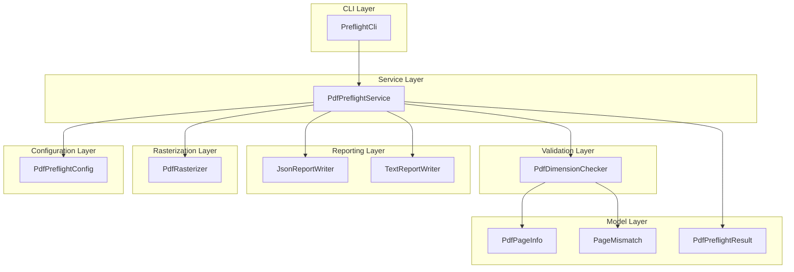
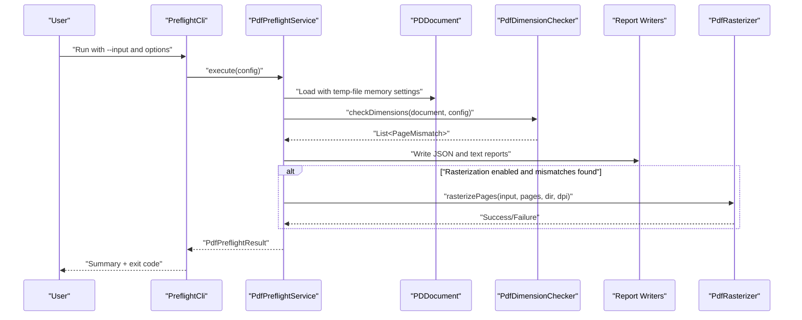
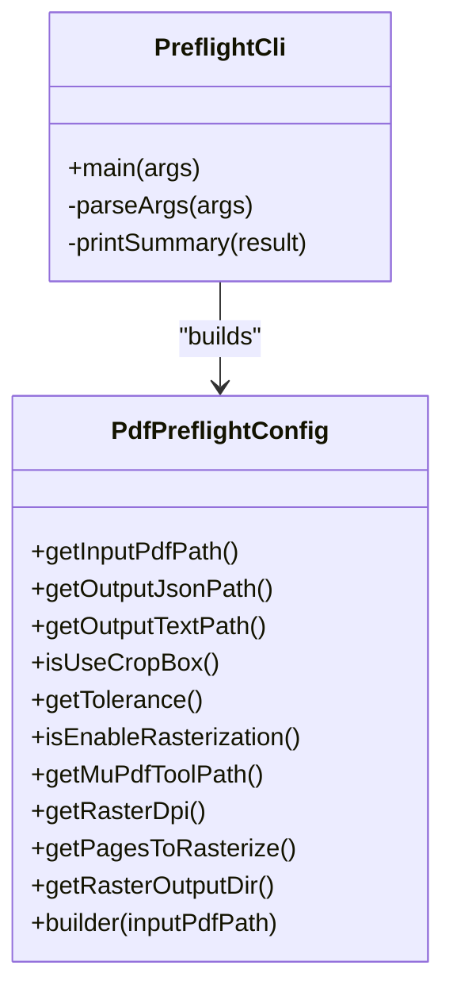
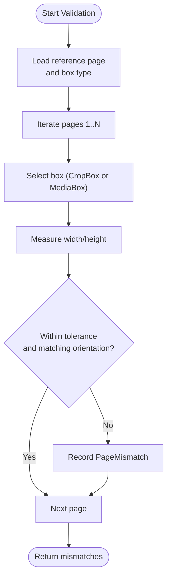
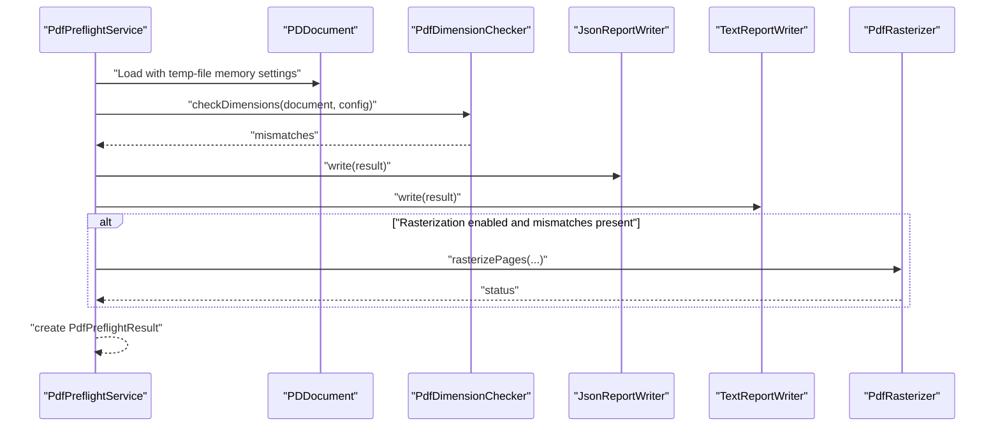
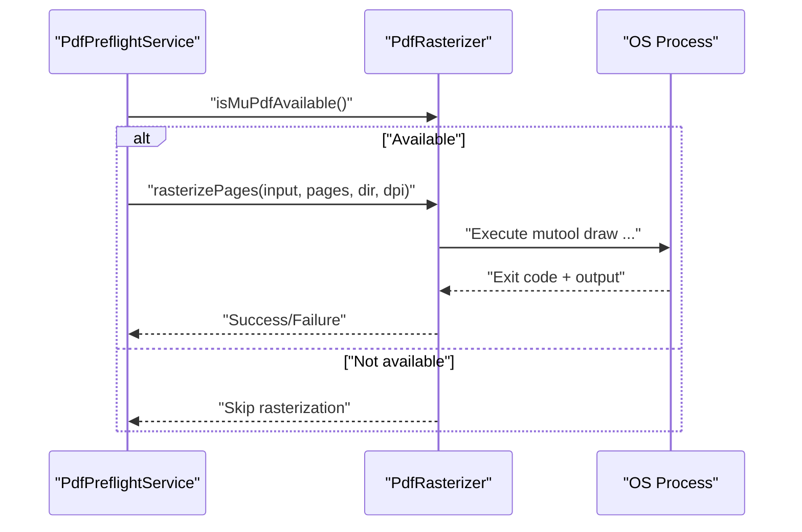
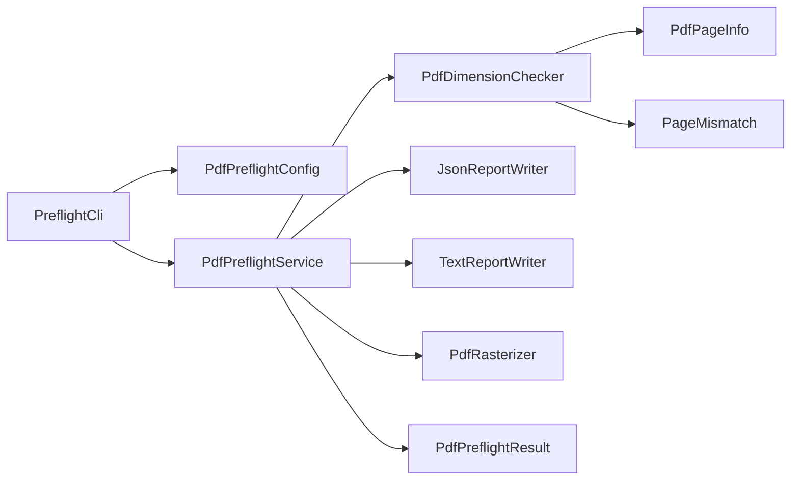

# Project Overview

<cite>
**Referenced Files in This Document**
- [README.md](file://README.md)
- [QUICKSTART.md](file://QUICKSTART.md)
- [CLI_EXAMPLES.md](file://CLI_EXAMPLES.md)
- [PreflightCli.java](file://src/main/java/com/preflight/PreflightCli.java)
- [PdfPreflightService.java](file://src/main/java/com/preflight/service/PdfPreflightService.java)
- [PdfDimensionChecker.java](file://src/main/java/com/preflight/checker/PdfDimensionChecker.java)
- [PdfPreflightConfig.java](file://src/main/java/com/preflight/config/PdfPreflightConfig.java)
- [PdfPageInfo.java](file://src/main/java/com/preflight/model/PdfPageInfo.java)
- [PageMismatch.java](file://src/main/java/com/preflight/model/PageMismatch.java)
- [PdfPreflightResult.java](file://src/main/java/com/preflight/model/PdfPreflightResult.java)
- [JsonReportWriter.java](file://src/main/java/com/preflight/report/JsonReportWriter.java)
- [TextReportWriter.java](file://src/main/java/com/preflight/report/TextReportWriter.java)
- [PdfRasterizer.java](file://src/main/java/com/preflight/rasterizer/PdfRasterizer.java)
- [PdfDimensionCheckerTest.java](file://src/test/java/com/preflight/PdfDimensionCheckerTest.java)
- [PdfPreflightServiceTest.java](file://src/test/java/com/preflight/PdfPreflightServiceTest.java)
</cite>

## Table of Contents
1. [Introduction](#introduction)
2. [Project Structure](#project-structure)
3. [Core Components](#core-components)
4. [Architecture Overview](#architecture-overview)
5. [Detailed Component Analysis](#detailed-component-analysis)
6. [Dependency Analysis](#dependency-analysis)
7. [Performance Considerations](#performance-considerations)
8. [Troubleshooting Guide](#troubleshooting-guide)
9. [Conclusion](#conclusion)

## Introduction
The PDF Preflight Module is a production-minded Java-based preflight engine designed to validate page dimensions and orientation consistency in large PDF files (up to 1 GB). It provides fast, low-memory validation suitable for automated workflows and CI/CD pipelines. The tool focuses on ensuring uniform page sizes and orientations across all pages, generating both machine-readable JSON and human-friendly text reports, and optionally rasterizing problematic pages for visual verification.

Key value proposition:
- Validates page dimensions and orientation in a single pass for efficiency
- Handles very large PDFs with minimal memory footprint
- Offers configurable tolerance and flexible box selection (CropBox or MediaBox)
- Produces dual reports for automation and human review
- Optional rasterization via MuPDF for visual inspection
- Modular architecture enabling easy extension with additional checks

Target audience:
- Production systems requiring reliable, repeatable PDF preflight validation
- CI/CD pipelines needing deterministic pass/fail outcomes
- Content creators and operators who need quick diagnostics and visual verification of page inconsistencies

Differentiators compared to similar tools like callas pdfToolbox:
- Built-in, focused preflight for dimensions and orientation with a streamlined CLI
- Low-memory, streaming processing optimized for very large files
- Dual-report output with clear exit codes for automation
- Optional rasterization integrated but decoupled from core validation logic
- Modular design that encourages adding domain-specific checks

## Project Structure
The project follows a layered, feature-oriented structure with clear separation of concerns:
- config: Centralized configuration with a builder pattern
- model: Immutable data carriers for page info, mismatches, and results
- checker: Domain-specific validation logic (dimension and orientation)
- service: Orchestration of loading, validation, reporting, and optional rasterization
- report: Pluggable report writers for JSON and text formats
- rasterizer: Optional integration with MuPDF for page rasterization
- CLI: Command-line entry point with argument parsing and exit code handling

**Diagram sources**
- [PreflightCli.java:18-62](file://src/main/java/com/preflight/PreflightCli.java#L18-L62)
- [PdfPreflightService.java:28-40](file://src/main/java/com/preflight/service/PdfPreflightService.java#L28-L40)
- [PdfDimensionChecker.java:17-25](file://src/main/java/com/preflight/checker/PdfDimensionChecker.java#L17-L25)
- [PdfPreflightConfig.java:7-31](file://src/main/java/com/preflight/config/PdfPreflightConfig.java#L7-L31)
- [PdfPageInfo.java:6-22](file://src/main/java/com/preflight/model/PdfPageInfo.java#L6-L22)
- [PageMismatch.java:6-21](file://src/main/java/com/preflight/model/PageMismatch.java#L6-L21)
- [PdfPreflightResult.java:9-31](file://src/main/java/com/preflight/model/PdfPreflightResult.java#L9-L31)
- [JsonReportWriter.java:19-26](file://src/main/java/com/preflight/report/JsonReportWriter.java#L19-L26)
- [TextReportWriter.java:16-16](file://src/main/java/com/preflight/report/TextReportWriter.java#L16-L16)
- [PdfRasterizer.java:20-28](file://src/main/java/com/preflight/rasterizer/PdfRasterizer.java#L20-L28)

**Section sources**
- [README.md:238-261](file://README.md#L238-L261)

## Core Components
- PdfPreflightConfig: Central configuration built via a fluent builder supporting input path, output paths, box preference (CropBox/MediaBox), tolerance, rasterization flags, and MuPDF tool path.
- PdfPreflightService: Orchestrates loading with low-memory settings, runs validations, writes reports, and optionally rasterizes failed pages. It also manages error handling and exit codes.
- PdfDimensionChecker: Performs a single-pass validation against the first page’s dimensions and orientation, with configurable tolerance and box selection.
- Model classes: PdfPageInfo (immutable page metadata), PageMismatch (details of deviations), and PdfPreflightResult (aggregated outcome and metrics).
- Report writers: JsonReportWriter and TextReportWriter produce structured JSON and human-readable text reports respectively.
- PdfRasterizer: Optional component that invokes MuPDF CLI to render failing pages as images, isolated from core logic.

Practical examples:
- Basic validation: [CLI usage:87-90](file://README.md#L87-L90)
- Custom report paths: [CLI usage:117-123](file://README.md#L117-L123)
- Using MediaBox with custom tolerance: [CLI usage:125-131](file://README.md#L125-L131)
- Enabling rasterization: [CLI usage:133-140](file://README.md#L133-L140)
- Rasterizing specific pages: [CLI usage:142-148](file://README.md#L142-L148)

**Section sources**
- [PdfPreflightConfig.java:73-141](file://src/main/java/com/preflight/config/PdfPreflightConfig.java#L73-L141)
- [PdfPreflightService.java:48-125](file://src/main/java/com/preflight/service/PdfPreflightService.java#L48-L125)
- [PdfDimensionChecker.java:26-99](file://src/main/java/com/preflight/checker/PdfDimensionChecker.java#L26-L99)
- [PdfPageInfo.java:15-35](file://src/main/java/com/preflight/model/PdfPageInfo.java#L15-L35)
- [PageMismatch.java:17-29](file://src/main/java/com/preflight/model/PageMismatch.java#L17-L29)
- [PdfPreflightResult.java:20-42](file://src/main/java/com/preflight/model/PdfPreflightResult.java#L20-L42)
- [JsonReportWriter.java:29-56](file://src/main/java/com/preflight/report/JsonReportWriter.java#L29-L56)
- [TextReportWriter.java:19-50](file://src/main/java/com/preflight/report/TextReportWriter.java#L19-L50)
- [PdfRasterizer.java:39-98](file://src/main/java/com/preflight/rasterizer/PdfRasterizer.java#L39-L98)
- [README.md:83-154](file://README.md#L83-L154)

## Architecture Overview
The system is designed around a clear separation of responsibilities:
- CLI parses arguments and constructs configuration, then delegates to the service.
- Service loads the PDF with memory-aware settings, executes validation, writes reports, and optionally rasterizes.
- Validation logic is encapsulated in a dedicated checker that uses a single-pass algorithm.
- Reporting is pluggable and produces both machine- and human-readable outputs.
- Rasterization is optional and isolated, ensuring failures there do not impact pass/fail results.

**Diagram sources**
- [PreflightCli.java:20-62](file://src/main/java/com/preflight/PreflightCli.java#L20-L62)
- [PdfPreflightService.java:48-125](file://src/main/java/com/preflight/service/PdfPreflightService.java#L48-L125)
- [PdfDimensionChecker.java:26-99](file://src/main/java/com/preflight/checker/PdfDimensionChecker.java#L26-L99)
- [JsonReportWriter.java:29-56](file://src/main/java/com/preflight/report/JsonReportWriter.java#L29-L56)
- [TextReportWriter.java:19-50](file://src/main/java/com/preflight/report/TextReportWriter.java#L19-L50)
- [PdfRasterizer.java:39-98](file://src/main/java/com/preflight/rasterizer/PdfRasterizer.java#L39-L98)

## Detailed Component Analysis

### CLI and Configuration
- Argument parsing supports required input path and numerous optional flags for output paths, box selection, tolerance, rasterization, and page targeting.
- Configuration is immutable and constructed via a builder, enabling safe reuse and clear defaults.

**Diagram sources**
- [PreflightCli.java:20-62](file://src/main/java/com/preflight/PreflightCli.java#L20-L62)
- [PdfPreflightConfig.java:33-71](file://src/main/java/com/preflight/config/PdfPreflightConfig.java#L33-L71)

**Section sources**
- [PreflightCli.java:67-156](file://src/main/java/com/preflight/PreflightCli.java#L67-L156)
- [PdfPreflightConfig.java:77-141](file://src/main/java/com/preflight/config/PdfPreflightConfig.java#L77-L141)
- [README.md:92-108](file://README.md#L92-L108)

### Validation Logic: Dimension and Orientation
- Single-pass algorithm compares each page to the reference (first page) using either CropBox or MediaBox, depending on configuration.
- Floating-point comparisons use a configurable tolerance; orientation is determined by width vs height thresholds.
- Mismatches capture actual vs expected dimensions and reasons for failure.

**Diagram sources**
- [PdfDimensionChecker.java:26-99](file://src/main/java/com/preflight/checker/PdfDimensionChecker.java#L26-L99)

**Section sources**
- [PdfDimensionChecker.java:26-99](file://src/main/java/com/preflight/checker/PdfDimensionChecker.java#L26-L99)
- [PdfPageInfo.java:15-35](file://src/main/java/com/preflight/model/PdfPageInfo.java#L15-L35)
- [PageMismatch.java:17-29](file://src/main/java/com/preflight/model/PageMismatch.java#L17-L29)

### Service Orchestration and Reporting
- Service loads PDFs with memory-aware settings to support large files.
- Writes both JSON and text reports, then optionally rasterizes failed pages using MuPDF.
- Provides clear exit codes for automation: 0 (pass), 1 (fail), 2 (error).

**Diagram sources**
- [PdfPreflightService.java:48-125](file://src/main/java/com/preflight/service/PdfPreflightService.java#L48-L125)
- [JsonReportWriter.java:29-56](file://src/main/java/com/preflight/report/JsonReportWriter.java#L29-L56)
- [TextReportWriter.java:19-50](file://src/main/java/com/preflight/report/TextReportWriter.java#L19-L50)
- [PdfRasterizer.java:39-98](file://src/main/java/com/preflight/rasterizer/PdfRasterizer.java#L39-L98)

**Section sources**
- [PdfPreflightService.java:48-125](file://src/main/java/com/preflight/service/PdfPreflightService.java#L48-L125)
- [PdfPreflightResult.java:20-42](file://src/main/java/com/preflight/model/PdfPreflightResult.java#L20-L42)
- [README.md:150-154](file://README.md#L150-L154)

### Rasterization Workflow
- Optional and isolated from core logic; MuPDF CLI is invoked to render specified pages at a given DPI into an output directory.
- Pages to rasterize can be explicitly provided or defaulted to all mismatched pages.

**Diagram sources**
- [PdfPreflightService.java:188-230](file://src/main/java/com/preflight/service/PdfPreflightService.java#L188-L230)
- [PdfRasterizer.java:39-98](file://src/main/java/com/preflight/rasterizer/PdfRasterizer.java#L39-L98)

**Section sources**
- [PdfRasterizer.java:20-98](file://src/main/java/com/preflight/rasterizer/PdfRasterizer.java#L20-L98)
- [README.md:101-107](file://README.md#L101-L107)

## Dependency Analysis
- Internal dependencies are intentionally minimal and layered:
  - CLI depends on Config and delegates to Service.
  - Service depends on Checker, Report Writers, and optionally Rasterizer.
  - Checker depends on Config and model classes.
  - Report Writers depend on model classes.
- External dependencies include Apache PDFBox for PDF processing, Jackson for JSON serialization, and MuPDF CLI for optional rasterization.

**Diagram sources**
- [PreflightCli.java:3-6](file://src/main/java/com/preflight/PreflightCli.java#L3-L6)
- [PdfPreflightService.java:3-11](file://src/main/java/com/preflight/service/PdfPreflightService.java#L3-L11)
- [PdfDimensionChecker.java:3-8](file://src/main/java/com/preflight/checker/PdfDimensionChecker.java#L3-L8)
- [JsonReportWriter.java:3-8](file://src/main/java/com/preflight/report/JsonReportWriter.java#L3-L8)
- [TextReportWriter.java:3-6](file://src/main/java/com/preflight/report/TextReportWriter.java#L3-L6)
- [PdfRasterizer.java:3-5](file://src/main/java/com/preflight/rasterizer/PdfRasterizer.java#L3-L5)
- [PdfPageInfo.java:3-5](file://src/main/java/com/preflight/model/PdfPageInfo.java#L3-L5)
- [PageMismatch.java:3-5](file://src/main/java/com/preflight/model/PageMismatch.java#L3-L5)
- [PdfPreflightResult.java:3-5](file://src/main/java/com/preflight/model/PdfPreflightResult.java#L3-L5)

**Section sources**
- [README.md:372-376](file://README.md#L372-L376)

## Performance Considerations
- Memory usage is constrained using temp-file-backed memory settings to process files larger than typical heap sizes.
- Streaming iteration over pages avoids loading the entire document into memory.
- No rendering occurs during core validation unless explicitly requested.
- Single-pass algorithm reduces overhead for large page counts.

Typical performance characteristics for large files:
- Memory usage remains below a fixed threshold regardless of file size.
- Processing time scales linearly with page count; tests demonstrate efficient handling of hundreds of pages.

**Section sources**
- [README.md:273-283](file://README.md#L273-L283)
- [PdfPreflightService.java:65-73](file://src/main/java/com/preflight/service/PdfPreflightService.java#L65-L73)
- [PdfDimensionCheckerTest.java:213-230](file://src/test/java/com/preflight/PdfDimensionCheckerTest.java#L213-L230)

## Troubleshooting Guide
Common scenarios and resolutions:
- OutOfMemoryError with very large PDFs: The tool is designed to avoid loading entire PDFs into memory. If issues persist, increase heap size or ensure adequate disk space for temporary files.
- MuPDF not available: Rasterization is optional; install MuPDF or disable rasterization. The tool continues to operate without it.
- Corrupt or encrypted PDFs: These are handled gracefully with appropriate error messages and exit code 2.
- Missing input files: Detected early with descriptive error messages and exit code 2.

Best practices:
- Always check exit codes in scripts and CI/CD pipelines.
- Use absolute paths for input and output files.
- Set tolerance appropriate to your PDF generation workflow.
- Enable rasterization for visual inspection of failed pages.
- Archive reports for audit trails.

**Section sources**
- [README.md:347-369](file://README.md#L347-L369)
- [PdfPreflightServiceTest.java:30-43](file://src/test/java/com/preflight/PdfPreflightServiceTest.java#L30-L43)
- [PdfPreflightServiceTest.java:173-188](file://src/test/java/com/preflight/PdfPreflightServiceTest.java#L173-L188)

## Conclusion
The PDF Preflight Module delivers a focused, production-ready solution for validating page dimensions and orientation consistency in large PDFs. Its modular architecture, low-memory design, dual-report output, and optional rasterization make it suitable for automated workflows and CI/CD pipelines. By combining a single-pass validation algorithm with configurable tolerance and flexible box selection, it provides both reliability and flexibility for real-world PDF processing needs.