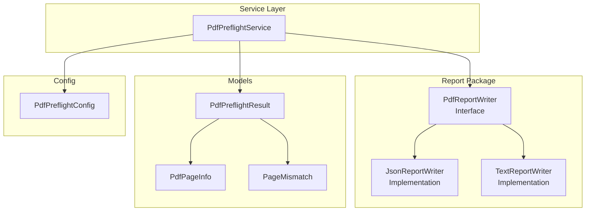
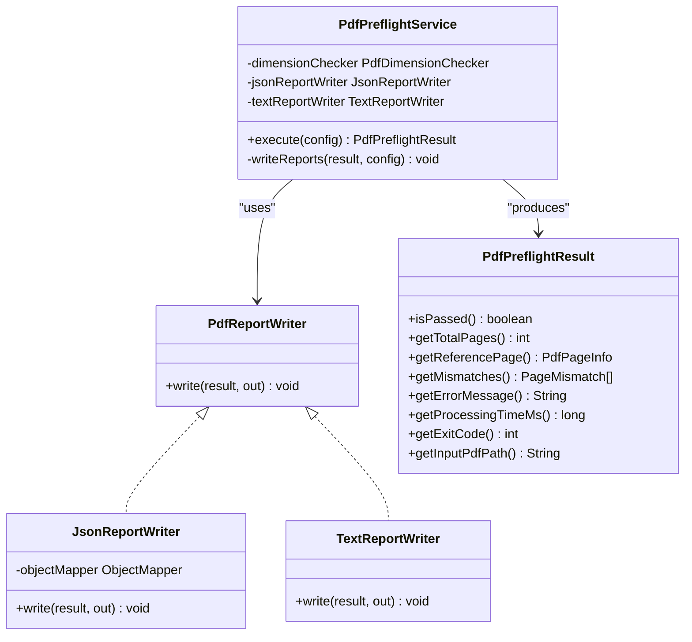
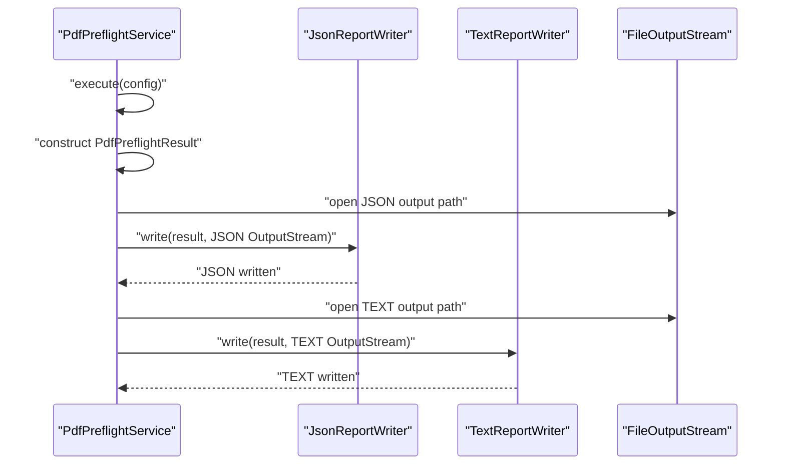
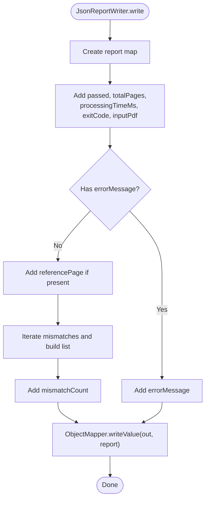
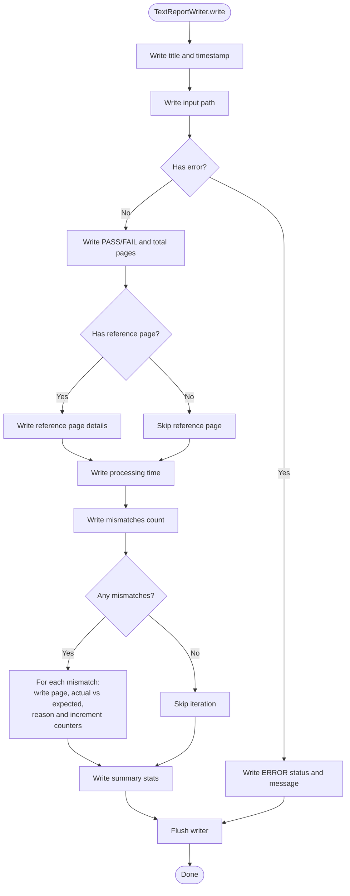
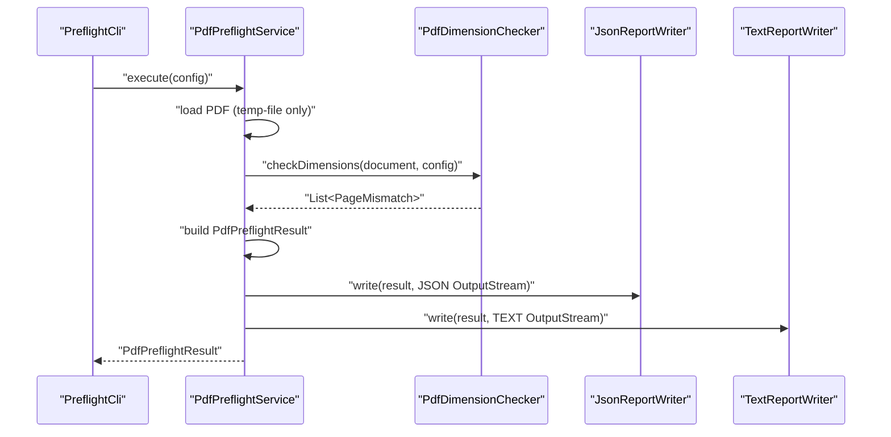
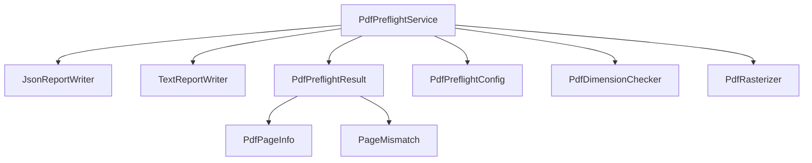

# Report Generation System

<cite>
**Referenced Files in This Document**
- [PdfReportWriter.java](file://pdf-preflight/src/main/java/com/preflight/report/PdfReportWriter.java)
- [JsonReportWriter.java](file://pdf-preflight/src/main/java/com/preflight/report/JsonReportWriter.java)
- [TextReportWriter.java](file://pdf-preflight/src/main/java/com/preflight/report/TextReportWriter.java)
- [PdfPreflightService.java](file://pdf-preflight/src/main/java/com/preflight/service/PdfPreflightService.java)
- [PdfPreflightResult.java](file://pdf-preflight/src/main/java/com/preflight/model/PdfPreflightResult.java)
- [PdfPageInfo.java](file://pdf-preflight/src/main/java/com/preflight/model/PdfPageInfo.java)
- [PageMismatch.java](file://pdf-preflight/src/main/java/com/preflight/model/PageMismatch.java)
- [PdfPreflightConfig.java](file://pdf-preflight/src/main/java/com/preflight/config/PdfPreflightConfig.java)
- [PdfDimensionChecker.java](file://pdf-preflight/src/main/java/com/preflight/checker/PdfDimensionChecker.java)
- [PdfRasterizer.java](file://pdf-preflight/src/main/java/com/preflight/rasterizer/PdfRasterizer.java)
- [PreflightCli.java](file://pdf-preflight/src/main/java/com/preflight/PreflightCli.java)
- [sample-report.json](file://pdf-preflight/sample-report.json)
- [sample-report.txt](file://pdf-preflight/sample-report.txt)
- [README.md](file://pdf-preflight/README.md)
- [CLI_EXAMPLES.md](file://pdf-preflight/CLI_EXAMPLES.md)
</cite>

## Table of Contents
1. [Introduction](#introduction)
2. [Project Structure](#project-structure)
3. [Core Components](#core-components)
4. [Architecture Overview](#architecture-overview)
5. [Detailed Component Analysis](#detailed-component-analysis)
6. [Dependency Analysis](#dependency-analysis)
7. [Performance Considerations](#performance-considerations)
8. [Troubleshooting Guide](#troubleshooting-guide)
9. [Conclusion](#conclusion)
10. [Appendices](#appendices)

## Introduction
This document describes the report generation system for the PDF preflight validation tool. It explains the strategy pattern used to support multiple output formats (JSON and text), the JSON report schema, the human-readable text report structure, and the end-to-end workflow from validation to output file creation. It also covers performance characteristics, memory management, and practical guidance for integrating the tool into automated workflows.

## Project Structure
The report generation system resides under the report package and integrates with the broader preflight service. Supporting model classes encapsulate validation results and mismatches, while configuration controls output destinations and behavior. The CLI orchestrates execution and prints a concise summary.

**Diagram sources**
- [PdfReportWriter.java:11-21](file://pdf-preflight/src/main/java/com/preflight/report/PdfReportWriter.java#L11-L21)
- [JsonReportWriter.java:19-84](file://pdf-preflight/src/main/java/com/preflight/report/JsonReportWriter.java#L19-L84)
- [TextReportWriter.java:16-95](file://pdf-preflight/src/main/java/com/preflight/report/TextReportWriter.java#L16-L95)
- [PdfPreflightService.java:28-241](file://pdf-preflight/src/main/java/com/preflight/service/PdfPreflightService.java#L28-L241)
- [PdfPreflightResult.java:9-89](file://pdf-preflight/src/main/java/com/preflight/model/PdfPreflightResult.java#L9-L89)
- [PdfPageInfo.java:6-67](file://pdf-preflight/src/main/java/com/preflight/model/PdfPageInfo.java#L6-L67)
- [PageMismatch.java:6-68](file://pdf-preflight/src/main/java/com/preflight/model/PageMismatch.java#L6-L68)
- [PdfPreflightConfig.java:7-143](file://pdf-preflight/src/main/java/com/preflight/config/PdfPreflightConfig.java#L7-L143)

**Section sources**
- [README.md:238-261](file://pdf-preflight/README.md#L238-L261)
- [PdfPreflightService.java:164-183](file://pdf-preflight/src/main/java/com/preflight/service/PdfPreflightService.java#L164-L183)

## Core Components
- PdfReportWriter: Defines the contract for writing preflight reports to an OutputStream.
- JsonReportWriter: Implements machine-readable JSON output with structured fields and formatted page dimensions.
- TextReportWriter: Implements human-readable text output with a standardized header, status, reference page details, processing time, mismatch listings, and summary statistics.
- PdfPreflightService: Orchestrates validation, constructs PdfPreflightResult, and writes both JSON and text reports to configured output paths.
- PdfPreflightResult: Immutable container for validation outcome, metadata, and mismatch details.
- PdfPageInfo: Immutable representation of a page's dimensions, orientation, and box used.
- PageMismatch: Immutable record of a single page's deviation from the reference page.
- PdfPreflightConfig: Builder-pattern configuration controlling input/output paths, measurement boxes, tolerance, and rasterization options.

**Section sources**
- [PdfReportWriter.java:11-21](file://pdf-preflight/src/main/java/com/preflight/report/PdfReportWriter.java#L11-L21)
- [JsonReportWriter.java:19-84](file://pdf-preflight/src/main/java/com/preflight/report/JsonReportWriter.java#L19-L84)
- [TextReportWriter.java:16-95](file://pdf-preflight/src/main/java/com/preflight/report/TextReportWriter.java#L16-L95)
- [PdfPreflightService.java:164-183](file://pdf-preflight/src/main/java/com/preflight/service/PdfPreflightService.java#L164-L183)
- [PdfPreflightResult.java:9-89](file://pdf-preflight/src/main/java/com/preflight/model/PdfPreflightResult.java#L9-L89)
- [PdfPageInfo.java:6-67](file://pdf-preflight/src/main/java/com/preflight/model/PdfPageInfo.java#L6-L67)
- [PageMismatch.java:6-68](file://pdf-preflight/src/main/java/com/preflight/model/PageMismatch.java#L6-L68)
- [PdfPreflightConfig.java:7-143](file://pdf-preflight/src/main/java/com/preflight/config/PdfPreflightConfig.java#L7-L143)

## Architecture Overview
The report generation follows a strategy pattern: PdfReportWriter defines the interface, and concrete writers (JsonReportWriter, TextReportWriter) implement the write method. PdfPreflightService holds references to both writers and delegates report writing after validation completes. Output files are written to paths configured via PdfPreflightConfig.

**Diagram sources**
- [PdfReportWriter.java:11-21](file://pdf-preflight/src/main/java/com/preflight/report/PdfReportWriter.java#L11-L21)
- [JsonReportWriter.java:19-84](file://pdf-preflight/src/main/java/com/preflight/report/JsonReportWriter.java#L19-L84)
- [TextReportWriter.java:16-95](file://pdf-preflight/src/main/java/com/preflight/report/TextReportWriter.java#L16-L95)
- [PdfPreflightService.java:28-241](file://pdf-preflight/src/main/java/com/preflight/service/PdfPreflightService.java#L28-L241)
- [PdfPreflightResult.java:9-89](file://pdf-preflight/src/main/java/com/preflight/model/PdfPreflightResult.java#L9-L89)

## Detailed Component Analysis

### PdfReportWriter Interface Design
- Purpose: Provides a uniform write method signature for all report writers.
- Contract: Accepts a PdfPreflightResult and an OutputStream; may throw IOException.
- Strategy Pattern: Enables plugging in new output formats without changing service logic.

**Diagram sources**
- [PdfPreflightService.java:164-183](file://pdf-preflight/src/main/java/com/preflight/service/PdfPreflightService.java#L164-L183)
- [JsonReportWriter.java:29-56](file://pdf-preflight/src/main/java/com/preflight/report/JsonReportWriter.java#L29-L56)
- [TextReportWriter.java:19-94](file://pdf-preflight/src/main/java/com/preflight/report/TextReportWriter.java#L19-L94)

**Section sources**
- [PdfReportWriter.java:11-21](file://pdf-preflight/src/main/java/com/preflight/report/PdfReportWriter.java#L11-L21)

### JsonReportWriter Implementation
- Output format: JSON with human-friendly indentation.
- Fields:
  - passed: boolean indicating pass/fail.
  - totalPages: integer count of pages checked.
  - processingTimeMs: long processing duration in milliseconds.
  - exitCode: integer exit code (0 pass, 1 fail, 2 error).
  - inputPdf: string path to the input PDF.
  - referencePage: object containing pageNumber, width, height, orientation, boxUsed.
  - mismatchCount: integer number of mismatches.
  - mismatches: array of mismatch objects with page number, actual and expected dimensions/orientations, and mismatchReason.
- Data transformations:
  - Rounds numeric dimensions to two decimal places.
  - Builds nested maps for referencePage and each mismatch.
  - Uses ObjectMapper to serialize the report map to OutputStream.

**Diagram sources**
- [JsonReportWriter.java:29-56](file://pdf-preflight/src/main/java/com/preflight/report/JsonReportWriter.java#L29-L56)
- [JsonReportWriter.java:58-83](file://pdf-preflight/src/main/java/com/preflight/report/JsonReportWriter.java#L58-L83)

**Section sources**
- [JsonReportWriter.java:19-84](file://pdf-preflight/src/main/java/com/preflight/report/JsonReportWriter.java#L19-L84)
- [sample-report.json:1-35](file://pdf-preflight/sample-report.json#L1-L35)

### TextReportWriter Implementation
- Output format: Human-readable text with standardized sections.
- Structure:
  - Header with title and timestamp.
  - Input path.
  - Status: ERROR or PASS/FAIL.
  - Reference page details: page number, width/height in points and inches, orientation, box used.
  - Processing time.
  - Mismatches count.
  - Per-page mismatch details with actual vs expected dimensions/orientations and reason.
  - Summary: counts for dimension mismatches, orientation mismatches, pages checked, pages failed.
- Formatting:
  - Uses current UTC instant for generation timestamp.
  - Formats numeric values to two decimals.
  - Computes derived statistics from mismatch list.

**Diagram sources**
- [TextReportWriter.java:19-94](file://pdf-preflight/src/main/java/com/preflight/report/TextReportWriter.java#L19-L94)

**Section sources**
- [TextReportWriter.java:16-95](file://pdf-preflight/src/main/java/com/preflight/report/TextReportWriter.java#L16-L95)
- [sample-report.txt:1-33](file://pdf-preflight/sample-report.txt#L1-L33)

### Report Generation Workflow and Data Transformation
- Execution path:
  - PdfPreflightService.execute loads the PDF with memory-conscious settings, validates existence/readability, and runs dimension/ orientation checks.
  - Constructs PdfPreflightResult with pass/fail, totals, reference page, mismatches, processing time, and exit code.
  - Calls writeReports to serialize both JSON and text reports to configured paths.
  - Optionally rasterizes failed pages using PdfRasterizer if enabled.
- Data transformation:
  - PdfPreflightService builds PdfPreflightResult from PdfDimensionChecker output and reference page info.
  - Writers transform immutable models into report maps/strings, rounding numeric values and aggregating counts.

**Diagram sources**
- [PreflightCli.java:48-55](file://pdf-preflight/src/main/java/com/preflight/PreflightCli.java#L48-L55)
- [PdfPreflightService.java:48-125](file://pdf-preflight/src/main/java/com/preflight/service/PdfPreflightService.java#L48-L125)
- [PdfDimensionChecker.java:26-99](file://pdf-preflight/src/main/java/com/preflight/checker/PdfDimensionChecker.java#L26-L99)
- [JsonReportWriter.java:29-56](file://pdf-preflight/src/main/java/com/preflight/report/JsonReportWriter.java#L29-L56)
- [TextReportWriter.java:19-94](file://pdf-preflight/src/main/java/com/preflight/report/TextReportWriter.java#L19-L94)

**Section sources**
- [PdfPreflightService.java:164-183](file://pdf-preflight/src/main/java/com/preflight/service/PdfPreflightService.java#L164-L183)
- [PdfPreflightService.java:48-125](file://pdf-preflight/src/main/java/com/preflight/service/PdfPreflightService.java#L48-L125)

### JSON Report Schema Specification
- Top-level fields:
  - passed: boolean
  - totalPages: integer
  - processingTimeMs: long
  - exitCode: integer
  - inputPdf: string
  - referencePage: object (optional)
  - mismatchCount: integer
  - mismatches: array of objects (optional)
- referencePage fields:
  - pageNumber: integer
  - width: number (two decimals)
  - height: number (two decimals)
  - orientation: string ("portrait" or "landscape")
  - boxUsed: string ("CropBox" or "MediaBox")
- mismatches items:
  - pageNumber: integer
  - actualWidth: number (two decimals)
  - actualHeight: number (two decimals)
  - actualOrientation: string
  - expectedWidth: number (two decimals)
  - expectedHeight: number (two decimals)
  - expectedOrientation: string
  - mismatchReason: string describing detected differences

Example reference: [sample-report.json:1-35](file://pdf-preflight/sample-report.json#L1-L35)

**Section sources**
- [JsonReportWriter.java:30-55](file://pdf-preflight/src/main/java/com/preflight/report/JsonReportWriter.java#L30-L55)
- [JsonReportWriter.java:58-83](file://pdf-preflight/src/main/java/com/preflight/report/JsonReportWriter.java#L58-L83)
- [sample-report.json:1-35](file://pdf-preflight/sample-report.json#L1-L35)

### Text Report Format Specification
- Header: centered title and ISO instant timestamp.
- Input: path to input PDF.
- Status: "ERROR" with message or "PASS"/"FAIL" with total pages.
- Reference page: page number, width and height in points and inches, orientation, box used.
- Processing time: milliseconds.
- Mismatches: count and per-page details with actual vs expected dimensions/orientations and reason.
- Summary: counts for dimension mismatches, orientation mismatches, pages checked, pages failed.

Example reference: [sample-report.txt:1-33](file://pdf-preflight/sample-report.txt#L1-L33)

**Section sources**
- [TextReportWriter.java:19-94](file://pdf-preflight/src/main/java/com/preflight/report/TextReportWriter.java#L19-L94)
- [sample-report.txt:1-33](file://pdf-preflight/sample-report.txt#L1-L33)

### Output File Management
- PdfPreflightService.writeReports opens separate FileOutputStream instances for JSON and text outputs, writes each report, and logs completion paths.
- Output paths are configurable via PdfPreflightConfig and default to preflight-report.json and preflight-report.txt respectively.

**Section sources**
- [PdfPreflightService.java:164-183](file://pdf-preflight/src/main/java/com/preflight/service/PdfPreflightService.java#L164-L183)
- [PdfPreflightConfig.java:77-141](file://pdf-preflight/src/main/java/com/preflight/config/PdfPreflightConfig.java#L77-L141)

### Extension and Integration Possibilities
- Adding new report formats:
  - Implement PdfReportWriter and override write to produce the desired output.
  - Register the new writer in PdfPreflightService and wire it into writeReports.
- Integrating with external systems:
  - Use JSON output for programmatic consumption and CI/CD pipelines.
  - Use text output for quick human review and logs.
  - Exit codes (0, 1, 2) enable straightforward automation decisions.

**Section sources**
- [PdfReportWriter.java:11-21](file://pdf-preflight/src/main/java/com/preflight/report/PdfReportWriter.java#L11-L21)
- [PdfPreflightService.java:164-183](file://pdf-preflight/src/main/java/com/preflight/service/PdfPreflightService.java#L164-L183)
- [README.md:150-155](file://pdf-preflight/README.md#L150-L155)

## Dependency Analysis
- PdfPreflightService depends on PdfReportWriter implementations, PdfPreflightResult, PdfPageInfo, PageMismatch, and PdfPreflightConfig.
- JsonReportWriter and TextReportWriter depend on PdfPreflightResult and related model classes.
- PdfPreflightService coordinates PdfDimensionChecker and optionally PdfRasterizer.

**Diagram sources**
- [PdfPreflightService.java:28-241](file://pdf-preflight/src/main/java/com/preflight/service/PdfPreflightService.java#L28-L241)
- [PdfPreflightResult.java:9-89](file://pdf-preflight/src/main/java/com/preflight/model/PdfPreflightResult.java#L9-L89)
- [PdfDimensionChecker.java:17-139](file://pdf-preflight/src/main/java/com/preflight/checker/PdfDimensionChecker.java#L17-L139)
- [PdfRasterizer.java:20-137](file://pdf-preflight/src/main/java/com/preflight/rasterizer/PdfRasterizer.java#L20-L137)

**Section sources**
- [PdfPreflightService.java:28-241](file://pdf-preflight/src/main/java/com/preflight/service/PdfPreflightService.java#L28-L241)

## Performance Considerations
- Memory usage: The service uses PDFBox temp-file-only memory settings to process large PDFs without loading entire content into heap memory.
- Streaming: Pages are iterated sequentially; no full in-memory collection is built.
- No rendering: Core validation avoids page rendering, reducing CPU and memory overhead.
- Efficient comparison: Single-pass algorithm computes mismatches for dimensions and orientation together.
- Output serialization: Jackson is used for efficient JSON serialization.

Practical guidance:
- For very large files (>1GB), ensure sufficient disk space for temporary files and monitor I/O performance.
- Adjust tolerance to minimize false positives caused by minor variations.
- Use exit codes in CI/CD to short-circuit pipelines on failure or error conditions.

**Section sources**
- [README.md:273-283](file://pdf-preflight/README.md#L273-L283)
- [PdfPreflightService.java:66-73](file://pdf-preflight/src/main/java/com/preflight/service/PdfPreflightService.java#L66-L73)

## Troubleshooting Guide
Common scenarios and resolutions:
- Input file not found or not readable: Returns error result with exit code 2.
- Corrupt or encrypted PDF: Graceful error handling with descriptive messages and exit code 2.
- Empty PDF (0 pages): Error result with exit code 2.
- MuPDF not available: Warning logged; rasterization skipped; preflight continues unaffected.
- OutOfMemoryError: The tool is designed to avoid this with temp-file-only mode; increase heap if necessary and verify disk space.

Operational tips:
- Always check exit codes in scripts and CI/CD pipelines.
- Use absolute paths for input and output files.
- Archive reports for audit trails.
- Monitor processing time and memory usage for very large batches.

**Section sources**
- [PdfPreflightService.java:54-63](file://pdf-preflight/src/main/java/com/preflight/service/PdfPreflightService.java#L54-L63)
- [PdfPreflightService.java:235-239](file://pdf-preflight/src/main/java/com/preflight/service/PdfPreflightService.java#L235-L239)
- [PdfPreflightService.java:188-230](file://pdf-preflight/src/main/java/com/preflight/service/PdfPreflightService.java#L188-L230)
- [README.md:347-369](file://pdf-preflight/README.md#L347-L369)

## Conclusion
The report generation system employs a clean strategy pattern to support multiple output formats while keeping the core validation logic focused and efficient. JSON and text reports provide complementary value—machine-readable and human-readable respectively—enabling both automated workflows and quick manual reviews. The system’s design, combined with robust error handling and memory-conscious processing, makes it suitable for large-scale, production-grade PDF preflight validation.

## Appendices

### JSON Report Schema Reference
- Top-level keys: passed, totalPages, processingTimeMs, exitCode, inputPdf, referencePage (optional), mismatchCount, mismatches (optional)
- referencePage keys: pageNumber, width, height, orientation, boxUsed
- mismatches items: pageNumber, actualWidth, actualHeight, actualOrientation, expectedWidth, expectedHeight, expectedOrientation, mismatchReason

**Section sources**
- [JsonReportWriter.java:30-55](file://pdf-preflight/src/main/java/com/preflight/report/JsonReportWriter.java#L30-L55)
- [sample-report.json:1-35](file://pdf-preflight/sample-report.json#L1-L35)

### Text Report Sections Reference
- Header: title and timestamp
- Input: input path
- Status: ERROR or PASS/FAIL with totals
- Reference page: page number, width/height in points and inches, orientation, box used
- Processing time: milliseconds
- Mismatches: count and per-page details
- Summary: dimension mismatches, orientation mismatches, pages checked, pages failed

**Section sources**
- [TextReportWriter.java:19-94](file://pdf-preflight/src/main/java/com/preflight/report/TextReportWriter.java#L19-L94)
- [sample-report.txt:1-33](file://pdf-preflight/sample-report.txt#L1-L33)

### CLI Usage and Exit Codes
- Exit codes: 0 (pass), 1 (fail), 2 (error)
- Typical usage patterns and examples are documented in the project documentation and examples.

**Section sources**
- [README.md:150-155](file://pdf-preflight/README.md#L150-L155)
- [CLI_EXAMPLES.md:154-200](file://pdf-preflight/CLI_EXAMPLES.md#L154-L200)