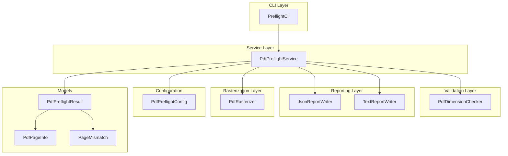
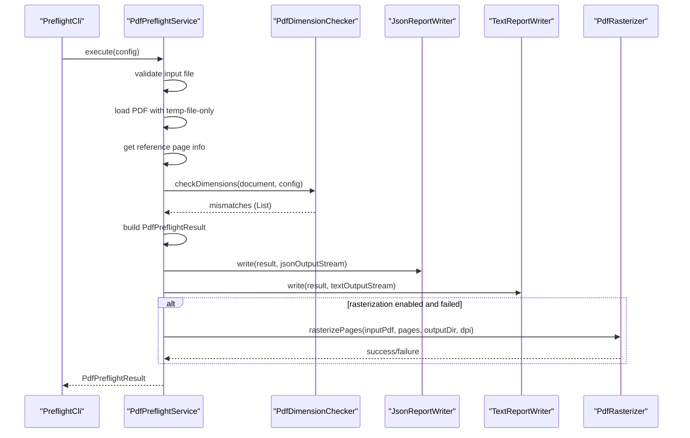
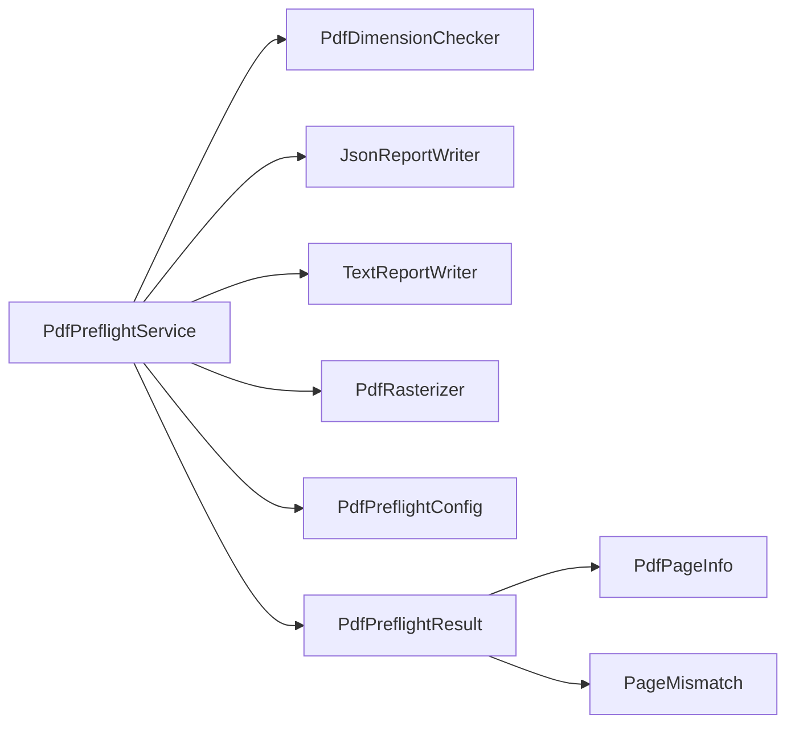

# Service Layer Architecture

<cite>
**Referenced Files in This Document**
- [PdfPreflightService.java](file://pdf-preflight/src/main/java/com/preflight/service/PdfPreflightService.java)
- [PreflightCli.java](file://pdf-preflight/src/main/java/com/preflight/PreflightCli.java)
- [PdfDimensionChecker.java](file://pdf-preflight/src/main/java/com/preflight/checker/PdfDimensionChecker.java)
- [PdfRasterizer.java](file://pdf-preflight/src/main/java/com/preflight/rasterizer/PdfRasterizer.java)
- [JsonReportWriter.java](file://pdf-preflight/src/main/java/com/preflight/report/JsonReportWriter.java)
- [TextReportWriter.java](file://pdf-preflight/src/main/java/com/preflight/report/TextReportWriter.java)
- [PdfPreflightConfig.java](file://pdf-preflight/src/main/java/com/preflight/config/PdfPreflightConfig.java)
- [PdfPreflightResult.java](file://pdf-preflight/src/main/java/com/preflight/model/PdfPreflightResult.java)
- [PdfPageInfo.java](file://pdf-preflight/src/main/java/com/preflight/model/PdfPageInfo.java)
- [PageMismatch.java](file://pdf-preflight/src/main/java/com/preflight/model/PageMismatch.java)
- [PdfPreflightServiceTest.java](file://pdf-preflight/src/test/java/com/preflight/PdfPreflightServiceTest.java)
- [README.md](file://pdf-preflight/README.md)
- [CLI_EXAMPLES.md](file://pdf-preflight/CLI_EXAMPLES.md)
</cite>

## Table of Contents
1. [Introduction](#introduction)
2. [Project Structure](#project-structure)
3. [Core Components](#core-components)
4. [Architecture Overview](#architecture-overview)
5. [Detailed Component Analysis](#detailed-component-analysis)
6. [Dependency Analysis](#dependency-analysis)
7. [Performance Considerations](#performance-considerations)
8. [Troubleshooting Guide](#troubleshooting-guide)
9. [Conclusion](#conclusion)
10. [Appendices](#appendices)

## Introduction
This document describes the architectural design and operational behavior of the PdfPreflightService orchestration layer. The service acts as the central coordinator among the CLI, validation logic, report generation, and optional rasterization subsystems. It orchestrates a complete preflight workflow: loading PDFs safely, validating page dimensions and orientation, aggregating results, writing machine- and human-readable reports, and conditionally rasterizing failed pages using external tools.

The service emphasizes:
- Low-memory processing for large PDFs
- Clear separation of concerns across validation, reporting, and rasterization
- Configurable behavior through a builder-based configuration
- Robust error handling and deterministic exit codes suitable for automation

## Project Structure
The project follows a layered, feature-based organization:
- service: Orchestration and workflow coordination
- checker: Domain-specific validation logic
- report: Report generation (JSON and text)
- rasterizer: Optional external tool integration
- config: Centralized configuration
- model: Immutable data transfer objects
- CLI entry point for command-line usage

**Diagram sources**
- [PdfPreflightService.java:48-125](file://pdf-preflight/src/main/java/com/preflight/service/PdfPreflightService.java#L48-L125)
- [PreflightCli.java:47-56](file://pdf-preflight/src/main/java/com/preflight/PreflightCli.java#L47-L56)
- [PdfDimensionChecker.java:26-99](file://pdf-preflight/src/main/java/com/preflight/checker/PdfDimensionChecker.java#L26-L99)
- [JsonReportWriter.java:29-56](file://pdf-preflight/src/main/java/com/preflight/report/JsonReportWriter.java#L29-L56)
- [TextReportWriter.java:19-94](file://pdf-preflight/src/main/java/com/preflight/report/TextReportWriter.java#L19-L94)
- [PdfRasterizer.java:39-98](file://pdf-preflight/src/main/java/com/preflight/rasterizer/PdfRasterizer.java#L39-L98)
- [PdfPreflightConfig.java:73-141](file://pdf-preflight/src/main/java/com/preflight/config/PdfPreflightConfig.java#L73-L141)
- [PdfPreflightResult.java:20-42](file://pdf-preflight/src/main/java/com/preflight/model/PdfPreflightResult.java#L20-L42)

**Section sources**
- [README.md:238-261](file://pdf-preflight/README.md#L238-L261)

## Core Components
- PdfPreflightService: Orchestrates the entire workflow, coordinates validation, reporting, and optional rasterization, and manages resource cleanup.
- PdfDimensionChecker: Performs single-pass validation of page dimensions and orientation against a reference page.
- PdfRasterizer: Optional integration with MuPDF for rendering failed pages to images.
- JsonReportWriter and TextReportWriter: Produce structured JSON and human-readable text reports.
- PdfPreflightConfig: Builder-pattern configuration for input/output paths, measurement boxes, tolerance, rasterization options, and MuPDF tool path.
- Model classes: Immutable containers for page information, mismatch details, and final results.

Key responsibilities:
- Resource safety: Uses temporary-file-only PDFBox loading and ensures document closure.
- Deterministic outcomes: Produces exit codes suitable for CI/CD pipelines.
- Extensibility: Modular design allows adding new validations and report formats.

**Section sources**
- [PdfPreflightService.java:28-125](file://pdf-preflight/src/main/java/com/preflight/service/PdfPreflightService.java#L28-L125)
- [PdfDimensionChecker.java:17-99](file://pdf-preflight/src/main/java/com/preflight/checker/PdfDimensionChecker.java#L17-L99)
- [PdfRasterizer.java:20-98](file://pdf-preflight/src/main/java/com/preflight/rasterizer/PdfRasterizer.java#L20-L98)
- [JsonReportWriter.java:19-56](file://pdf-preflight/src/main/java/com/preflight/report/JsonReportWriter.java#L19-L56)
- [TextReportWriter.java:16-94](file://pdf-preflight/src/main/java/com/preflight/report/TextReportWriter.java#L16-L94)
- [PdfPreflightConfig.java:7-31](file://pdf-preflight/src/main/java/com/preflight/config/PdfPreflightConfig.java#L7-L31)

## Architecture Overview
The service layer sits between the CLI and the internal processing modules. The CLI constructs a configuration and invokes the service, which executes the workflow and returns a result. The service delegates to specialized components for validation, reporting, and optional rasterization.

**Diagram sources**
- [PreflightCli.java:47-56](file://pdf-preflight/src/main/java/com/preflight/PreflightCli.java#L47-L56)
- [PdfPreflightService.java:48-125](file://pdf-preflight/src/main/java/com/preflight/service/PdfPreflightService.java#L48-L125)
- [PdfDimensionChecker.java:26-99](file://pdf-preflight/src/main/java/com/preflight/checker/PdfDimensionChecker.java#L26-L99)
- [JsonReportWriter.java:29-56](file://pdf-preflight/src/main/java/com/preflight/report/JsonReportWriter.java#L29-L56)
- [TextReportWriter.java:19-94](file://pdf-preflight/src/main/java/com/preflight/report/TextReportWriter.java#L19-L94)
- [PdfRasterizer.java:39-98](file://pdf-preflight/src/main/java/com/preflight/rasterizer/PdfRasterizer.java#L39-L98)

## Detailed Component Analysis

### PdfPreflightService
Responsibilities:
- Validate input file existence and readability
- Load PDF using memory-efficient settings for large files
- Extract reference page information (width, height, orientation)
- Delegate dimension and orientation checks to PdfDimensionChecker
- Aggregate results into PdfPreflightResult
- Write JSON and text reports
- Optionally rasterize failed pages via PdfRasterizer

Method documentation:
- execute(config): Orchestrates the entire workflow. Parameters: PdfPreflightConfig. Returns: PdfPreflightResult. Exit codes: 0 (pass), 1 (fail), 2 (error).
- getReferencePageInfo(document, config): Extracts reference page info from the first page. Parameters: PDDocument, PdfPreflightConfig. Returns: PdfPageInfo.
- getPageBox(page, preferCropBox): Chooses CropBox or MediaBox based on configuration. Parameters: PDPage, boolean. Returns: PDRectangle.
- writeReports(result, config): Writes JSON and text reports to configured paths. Parameters: PdfPreflightResult, PdfPreflightConfig.
- rasterizeFailedPages(result, config): Conditionally rasterizes mismatched pages. Parameters: PdfPreflightResult, PdfPreflightConfig.
- errorResult(message, startTime, inputPath): Constructs an error result with processing time. Parameters: String, long, String. Returns: PdfPreflightResult.

Error handling:
- Early exits for missing/unreadable files
- Graceful handling of empty PDFs
- Exception wrapping with descriptive messages
- Logging at multiple stages for observability

Threading and resource management:
- Uses try-finally to close PDDocument
- Temporary-file-only PDFBox loading avoids heap pressure
- Report writers use try-with-resources for streams

Extensibility:
- New validations can be integrated alongside PdfDimensionChecker
- Additional report formats can be added by implementing PdfReportWriter
- Rasterization is isolated and optional

**Section sources**
- [PdfPreflightService.java:48-125](file://pdf-preflight/src/main/java/com/preflight/service/PdfPreflightService.java#L48-L125)
- [PdfPreflightService.java:164-183](file://pdf-preflight/src/main/java/com/preflight/service/PdfPreflightService.java#L164-L183)
- [PdfPreflightService.java:188-230](file://pdf-preflight/src/main/java/com/preflight/service/PdfPreflightService.java#L188-L230)
- [PdfPreflightService.java:235-239](file://pdf-preflight/src/main/java/com/preflight/service/PdfPreflightService.java#L235-L239)

### PdfDimensionChecker
Responsibilities:
- Single-pass validation of all pages against a reference page
- Compares width, height, and orientation with configurable tolerance
- Selects measurement box (CropBox or MediaBox) with fallback logic

Method documentation:
- checkDimensions(document, config): Validates all pages. Parameters: PDDocument, PdfPreflightConfig. Returns: List<PageMismatch>.

Algorithm highlights:
- Skips the reference page (page 1)
- Streams through pages using document.getPages()
- Applies tolerance threshold for floating-point comparisons
- Records reasons for each mismatch type

**Section sources**
- [PdfDimensionChecker.java:26-99](file://pdf-preflight/src/main/java/com/preflight/checker/PdfDimensionChecker.java#L26-L99)
- [PdfDimensionChecker.java:105-115](file://pdf-preflight/src/main/java/com/preflight/checker/PdfDimensionChecker.java#L105-L115)

### PdfRasterizer
Responsibilities:
- Optional rasterization of PDF pages to images using MuPDF CLI
- Isolated from core preflight logic; failures do not affect pass/fail status

Method documentation:
- rasterizePages(inputPdfPath, pageNumbers, outputDir, dpi): Renders pages to PNG images. Parameters: String, int[], String, int. Returns: boolean.
- isMuPdfAvailable(): Checks availability of mutool. Returns: boolean.

Process:
- Creates output directory if needed
- Builds page range string for MuPDF
- Executes mutool draw with specified DPI
- Captures process output and exit code

**Section sources**
- [PdfRasterizer.java:39-98](file://pdf-preflight/src/main/java/com/preflight/rasterizer/PdfRasterizer.java#L39-L98)
- [PdfRasterizer.java:122-135](file://pdf-preflight/src/main/java/com/preflight/rasterizer/PdfRasterizer.java#L122-L135)

### Report Writers
JsonReportWriter:
- Produces structured JSON with pass/fail, totals, processing time, input path, reference page info, and mismatches.
- Rounds numeric values to two decimals for readability.

TextReportWriter:
- Produces human-readable text with formatted dimensions, orientation, and mismatch summaries.

**Section sources**
- [JsonReportWriter.java:29-56](file://pdf-preflight/src/main/java/com/preflight/report/JsonReportWriter.java#L29-L56)
- [TextReportWriter.java:19-94](file://pdf-preflight/src/main/java/com/preflight/report/TextReportWriter.java#L19-L94)

### Configuration and Models
PdfPreflightConfig:
- Builder pattern for constructing configurations with defaults and overrides.
- Exposes options for input/output paths, box selection, tolerance, rasterization flags, MuPDF path, DPI, and page ranges.

PdfPreflightResult:
- Immutable container for final results with pass/fail, counts, timing, exit code, and input path.
- Provides convenience getters for mismatch count and string representation.

PdfPageInfo and PageMismatch:
- Immutable DTOs representing page metrics and mismatch details respectively.

**Section sources**
- [PdfPreflightConfig.java:73-141](file://pdf-preflight/src/main/java/com/preflight/config/PdfPreflightConfig.java#L73-L141)
- [PdfPreflightResult.java:20-79](file://pdf-preflight/src/main/java/com/preflight/model/PdfPreflightResult.java#L20-L79)
- [PdfPageInfo.java:15-65](file://pdf-preflight/src/main/java/com/preflight/model/PdfPageInfo.java#L15-L65)
- [PageMismatch.java:17-66](file://pdf-preflight/src/main/java/com/preflight/model/PageMismatch.java#L17-L66)

### CLI Integration
PreflightCli:
- Parses command-line arguments into a configuration
- Invokes PdfPreflightService and prints a summary
- Exits with appropriate codes: 0 (pass), 1 (fail), 2 (error)

Usage patterns:
- Basic validation, custom report paths, MediaBox/CropBox selection, tolerance tuning, rasterization options, and CI/CD integration.

**Section sources**
- [PreflightCli.java:47-56](file://pdf-preflight/src/main/java/com/preflight/PreflightCli.java#L47-L56)
- [PreflightCli.java:67-156](file://pdf-preflight/src/main/java/com/preflight/PreflightCli.java#L67-L156)
- [PreflightCli.java:184-248](file://pdf-preflight/src/main/java/com/preflight/PreflightCli.java#L184-L248)

## Dependency Analysis
The service layer exhibits low coupling and high cohesion:
- PdfPreflightService depends on PdfDimensionChecker, JsonReportWriter, TextReportWriter, and PdfRasterizer
- PdfRasterizer is optional and isolated from core logic
- Configuration and models are shared across components

**Diagram sources**
- [PdfPreflightService.java:32-40](file://pdf-preflight/src/main/java/com/preflight/service/PdfPreflightService.java#L32-L40)
- [PdfPreflightService.java:97-104](file://pdf-preflight/src/main/java/com/preflight/service/PdfPreflightService.java#L97-L104)
- [PdfPreflightResult.java:20-42](file://pdf-preflight/src/main/java/com/preflight/model/PdfPreflightResult.java#L20-L42)

**Section sources**
- [PdfPreflightService.java:32-40](file://pdf-preflight/src/main/java/com/preflight/service/PdfPreflightService.java#L32-L40)
- [PdfPreflightResult.java:20-42](file://pdf-preflight/src/main/java/com/preflight/model/PdfPreflightResult.java#L20-L42)

## Performance Considerations
- Memory management: Uses PDFBox temp-file-only mode to process large PDFs without loading entire content into heap memory.
- Streaming: Iterates pages sequentially to minimize memory footprint.
- Single-pass validation: Combines dimension and orientation checks to reduce traversal overhead.
- Optional rasterization: Offloads heavy rendering to external MuPDF tool, keeping core logic lightweight.
- Exit codes: Enables fast CI/CD decisions without parsing reports.

Best practices:
- Use absolute paths for input/output to avoid I/O errors
- Tune tolerance based on expected generator variance
- Monitor disk space for rasterization output
- Increase JVM heap if encountering memory issues with very large files

**Section sources**
- [PdfPreflightService.java:66-73](file://pdf-preflight/src/main/java/com/preflight/service/PdfPreflightService.java#L66-L73)
- [README.md:273-283](file://pdf-preflight/README.md#L273-L283)

## Troubleshooting Guide
Common scenarios and resolutions:
- Missing input file: Returns exit code 2 with descriptive error message
- Corrupt or encrypted PDF: Returns exit code 2 with error details
- Empty PDF: Returns exit code 2 indicating zero pages
- MuPDF not available: Warning logged; rasterization skipped; preflight continues unaffected
- OutOfMemoryError: Indicates need for larger heap or disk space issues; confirm temp-file-only mode is active

Operational tips:
- Check exit codes in scripts and CI/CD pipelines
- Review JSON and text reports for detailed mismatch information
- Enable rasterization for visual inspection of failed pages
- Use MediaBox fallback when CropBox is unavailable

**Section sources**
- [PdfPreflightServiceTest.java:30-64](file://pdf-preflight/src/test/java/com/preflight/PdfPreflightServiceTest.java#L30-L64)
- [PdfPreflightServiceTest.java:172-188](file://pdf-preflight/src/test/java/com/preflight/PdfPreflightServiceTest.java#L172-L188)
- [README.md:347-368](file://pdf-preflight/README.md#L347-L368)

## Conclusion
PdfPreflightService provides a robust, modular orchestration layer that cleanly separates concerns across validation, reporting, and optional rasterization. Its design emphasizes reliability, configurability, and performance, making it suitable for automated workflows and large-scale PDF processing. The service’s clear error handling, deterministic exit codes, and isolation of optional components enable safe integration into diverse environments.

## Appendices

### Method Reference: PdfPreflightService.execute
- Purpose: Execute the complete preflight workflow
- Parameters: PdfPreflightConfig
- Returns: PdfPreflightResult
- Side effects: Writes reports, optionally rasterizes pages, logs progress and errors
- Exit codes: 0 (pass), 1 (fail), 2 (error)

**Section sources**
- [PdfPreflightService.java:48-125](file://pdf-preflight/src/main/java/com/preflight/service/PdfPreflightService.java#L48-L125)

### Usage Examples
- CLI usage patterns and CI/CD integration are documented in CLI_EXAMPLES.md
- Typical commands include basic validation, custom report paths, tolerance tuning, and rasterization

**Section sources**
- [CLI_EXAMPLES.md:8-151](file://pdf-preflight/CLI_EXAMPLES.md#L8-L151)