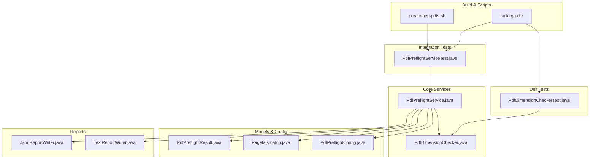
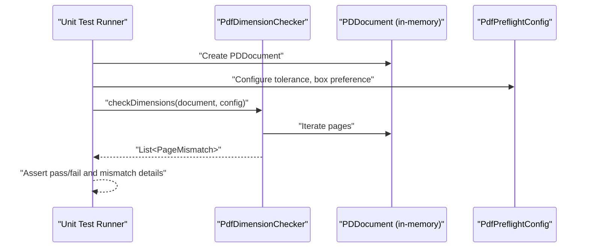
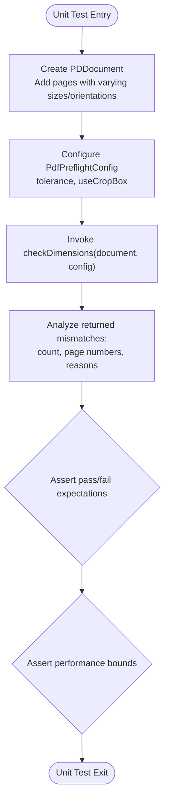
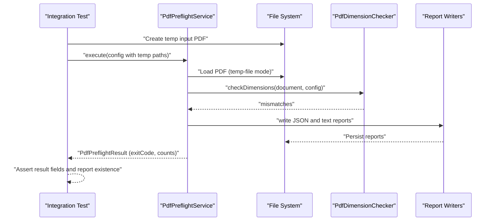
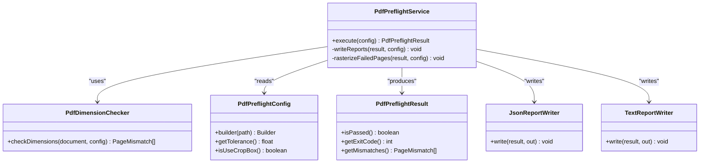

# Testing Strategy

<cite>
**Referenced Files in This Document**
- [PdfDimensionCheckerTest.java](file://pdf-preflight/src/test/java/com/preflight/PdfDimensionCheckerTest.java)
- [PdfPreflightServiceTest.java](file://pdf-preflight/src/test/java/com/preflight/PdfPreflightServiceTest.java)
- [PdfDimensionChecker.java](file://pdf-preflight/src/main/java/com/preflight/checker/PdfDimensionChecker.java)
- [PdfPreflightService.java](file://pdf-preflight/src/main/java/com/preflight/service/PdfPreflightService.java)
- [PdfPreflightConfig.java](file://pdf-preflight/src/main/java/com/preflight/config/PdfPreflightConfig.java)
- [PdfPreflightResult.java](file://pdf-preflight/src/main/java/com/preflight/model/PdfPreflightResult.java)
- [PageMismatch.java](file://pdf-preflight/src/main/java/com/preflight/model/PageMismatch.java)
- [JsonReportWriter.java](file://pdf-preflight/src/main/java/com/preflight/report/JsonReportWriter.java)
- [TextReportWriter.java](file://pdf-preflight/src/main/java/com/preflight/report/TextReportWriter.java)
- [build.gradle](file://pdf-preflight/build.gradle)
- [README.md](file://pdf-preflight/README.md)
- [create-test-pdfs.sh](file://pdf-preflight/create-test-pdfs.sh)
</cite>

## Table of Contents
1. [Introduction](#introduction)
2. [Project Structure](#project-structure)
3. [Core Components](#core-components)
4. [Architecture Overview](#architecture-overview)
5. [Detailed Component Analysis](#detailed-component-analysis)
6. [Dependency Analysis](#dependency-analysis)
7. [Performance Considerations](#performance-considerations)
8. [Troubleshooting Guide](#troubleshooting-guide)
9. [Conclusion](#conclusion)
10. [Appendices](#appendices)

## Introduction
This document defines a comprehensive testing strategy for the PDF Preflight Module. It covers unit testing with JUnit 5, integration testing methodology, test data management, and the role of test PDFs in validation workflows. It also provides implementation patterns for mocking, assertions, framework setup, execution procedures, continuous integration practices, performance considerations, and guidance for extending test coverage.

## Project Structure
The testing strategy targets the following areas:
- Unit tests for the dimension and orientation checker
- Integration tests for the orchestration service and end-to-end workflow
- Configuration and model classes supporting validation
- Report writers for JSON and text outputs
- Build configuration enabling JUnit 5 and test execution

**Diagram sources**
- [PdfDimensionCheckerTest.java:1-232](file://pdf-preflight/src/test/java/com/preflight/PdfDimensionCheckerTest.java#L1-L232)
- [PdfPreflightServiceTest.java:1-225](file://pdf-preflight/src/test/java/com/preflight/PdfPreflightServiceTest.java#L1-L225)
- [PdfPreflightService.java:1-241](file://pdf-preflight/src/main/java/com/preflight/service/PdfPreflightService.java#L1-L241)
- [PdfDimensionChecker.java:1-139](file://pdf-preflight/src/main/java/com/preflight/checker/PdfDimensionChecker.java#L1-L139)
- [PdfPreflightResult.java:1-89](file://pdf-preflight/src/main/java/com/preflight/model/PdfPreflightResult.java#L1-L89)
- [PageMismatch.java:1-68](file://pdf-preflight/src/main/java/com/preflight/model/PageMismatch.java#L1-L68)
- [PdfPreflightConfig.java:1-143](file://pdf-preflight/src/main/java/com/preflight/config/PdfPreflightConfig.java#L1-L143)
- [JsonReportWriter.java:1-85](file://pdf-preflight/src/main/java/com/preflight/report/JsonReportWriter.java#L1-L85)
- [TextReportWriter.java:1-96](file://pdf-preflight/src/main/java/com/preflight/report/TextReportWriter.java#L1-L96)
- [build.gradle:1-62](file://pdf-preflight/build.gradle#L1-L62)
- [create-test-pdfs.sh:1-63](file://pdf-preflight/create-test-pdfs.sh#L1-L63)

**Section sources**
- [build.gradle:1-62](file://pdf-preflight/build.gradle#L1-L62)
- [README.md:284-295](file://pdf-preflight/README.md#L284-L295)

## Core Components
- PdfDimensionChecker: Validates page dimensions and orientation in a single pass, using configurable tolerance and box selection (CropBox or MediaBox).
- PdfPreflightService: Orchestrates loading, validation, reporting, and optional rasterization, with robust error handling and exit codes.
- PdfPreflightConfig: Builder-pattern configuration for input/output paths, tolerance, box preference, rasterization options.
- PdfPreflightResult and PageMismatch: Immutable models capturing pass/fail status, counts, mismatch details, and timing metrics.
- Report Writers: JSON and text report generation for machine and human readability.

Key testing responsibilities:
- Unit tests validate checker logic across empty PDFs, single pages, matching and mismatched pages, orientation differences, tolerance thresholds, and large page counts.
- Integration tests validate end-to-end workflows including file I/O, report generation, error conditions, and optional rasterization.

**Section sources**
- [PdfDimensionChecker.java:1-139](file://pdf-preflight/src/main/java/com/preflight/checker/PdfDimensionChecker.java#L1-L139)
- [PdfPreflightService.java:1-241](file://pdf-preflight/src/main/java/com/preflight/service/PdfPreflightService.java#L1-L241)
- [PdfPreflightConfig.java:1-143](file://pdf-preflight/src/main/java/com/preflight/config/PdfPreflightConfig.java#L1-L143)
- [PdfPreflightResult.java:1-89](file://pdf-preflight/src/main/java/com/preflight/model/PdfPreflightResult.java#L1-L89)
- [PageMismatch.java:1-68](file://pdf-preflight/src/main/java/com/preflight/model/PageMismatch.java#L1-L68)
- [JsonReportWriter.java:1-85](file://pdf-preflight/src/main/java/com/preflight/report/JsonReportWriter.java#L1-L85)
- [TextReportWriter.java:1-96](file://pdf-preflight/src/main/java/com/preflight/report/TextReportWriter.java#L1-L96)

## Architecture Overview
The testing architecture separates unit and integration concerns:
- Unit tests focus on the checker’s deterministic logic using in-memory PDFBox documents.
- Integration tests exercise the service layer with temporary files and validate end-to-end behavior including report generation and optional rasterization.

**Diagram sources**
- [PdfDimensionCheckerTest.java:24-82](file://pdf-preflight/src/test/java/com/preflight/PdfDimensionCheckerTest.java#L24-L82)
- [PdfDimensionChecker.java:26-99](file://pdf-preflight/src/main/java/com/preflight/checker/PdfDimensionChecker.java#L26-L99)
- [PdfPreflightConfig.java:73-141](file://pdf-preflight/src/main/java/com/preflight/config/PdfPreflightConfig.java#L73-L141)

**Section sources**
- [PdfDimensionCheckerTest.java:1-232](file://pdf-preflight/src/test/java/com/preflight/PdfDimensionCheckerTest.java#L1-L232)
- [PdfPreflightServiceTest.java:1-225](file://pdf-preflight/src/test/java/com/preflight/PdfPreflightServiceTest.java#L1-L225)

## Detailed Component Analysis

### Unit Testing Approach: PdfDimensionChecker
Coverage scenarios validated by unit tests:
- Empty PDF (no pages)
- Single page PDF
- Multiple pages with matching dimensions
- Multiple pages with mismatched dimensions
- Mixed orientation (portrait/landscape)
- Tolerance boundaries (within and exceeded)
- CropBox vs MediaBox fallback behavior
- Large page count performance benchmark

Assertion techniques:
- Boolean assertions for empty mismatches
- Equality assertions for mismatch counts and page numbers
- Content checks for mismatch reasons and orientation strings
- Timing assertions for performance thresholds

Mocking and isolation:
- Pure checker logic; no external I/O required.
- In-memory PDDocument instances constructed per test.
- Configuration injected via builder pattern.

**Diagram sources**
- [PdfDimensionCheckerTest.java:24-230](file://pdf-preflight/src/test/java/com/preflight/PdfDimensionCheckerTest.java#L24-L230)
- [PdfDimensionChecker.java:26-99](file://pdf-preflight/src/main/java/com/preflight/checker/PdfDimensionChecker.java#L26-L99)

**Section sources**
- [PdfDimensionCheckerTest.java:24-230](file://pdf-preflight/src/test/java/com/preflight/PdfDimensionCheckerTest.java#L24-L230)
- [PdfDimensionChecker.java:26-139](file://pdf-preflight/src/main/java/com/preflight/checker/PdfDimensionChecker.java#L26-L139)

### Integration Testing Approach: PdfPreflightService
Coverage scenarios validated by integration tests:
- Missing input file
- Empty PDF (no pages)
- Single-page PDF
- Matching pages
- Mismatched pages
- Mixed orientation
- Corrupt PDF
- Custom tolerance affecting pass/fail
- Report generation (JSON and text)
- Optional rasterization behavior

Test data management:
- Temporary files created via JUnit TempDir for input and output.
- Programmatic PDF creation for controlled scenarios.
- Optional use of shell script to generate sample PDFs for manual verification.

**Diagram sources**
- [PdfPreflightServiceTest.java:29-223](file://pdf-preflight/src/test/java/com/preflight/PdfPreflightServiceTest.java#L29-L223)
- [PdfPreflightService.java:48-125](file://pdf-preflight/src/main/java/com/preflight/service/PdfPreflightService.java#L48-L125)
- [JsonReportWriter.java:28-56](file://pdf-preflight/src/main/java/com/preflight/report/JsonReportWriter.java#L28-L56)
- [TextReportWriter.java:18-94](file://pdf-preflight/src/main/java/com/preflight/report/TextReportWriter.java#L18-L94)

**Section sources**
- [PdfPreflightServiceTest.java:29-223](file://pdf-preflight/src/test/java/com/preflight/PdfPreflightServiceTest.java#L29-L223)
- [PdfPreflightService.java:48-241](file://pdf-preflight/src/main/java/com/preflight/service/PdfPreflightService.java#L48-L241)

### Test Implementation Patterns and Assertions
- Use JUnit 5 assertions for boolean, equality, and content checks.
- Leverage @TempDir for deterministic temporary file handling in integration tests.
- Validate exit codes (0, 1, 2) and error messages for robustness.
- Confirm report existence and content for successful runs.

**Section sources**
- [PdfPreflightServiceTest.java:30-43](file://pdf-preflight/src/test/java/com/preflight/PdfPreflightServiceTest.java#L30-L43)
- [PdfPreflightResult.java:20-42](file://pdf-preflight/src/main/java/com/preflight/model/PdfPreflightResult.java#L20-L42)

### Test Data Management and Role of Test PDFs
- Unit tests construct PDFs programmatically to isolate logic.
- Integration tests use temporary files and optionally rely on the provided script to generate sample PDFs for manual validation.
- Reports are generated to persistent locations defined by configuration, enabling post-run verification.

**Section sources**
- [create-test-pdfs.sh:1-63](file://pdf-preflight/create-test-pdfs.sh#L1-L63)
- [PdfPreflightServiceTest.java:46-64](file://pdf-preflight/src/test/java/com/preflight/PdfPreflightServiceTest.java#L46-L64)

### Continuous Integration Testing Practices
- Build and test with Maven or Gradle using JUnit 5 platform launcher.
- Exit codes (0, 1, 2) integrate cleanly with CI/CD pipelines for pass/fail/error handling.
- Reports (JSON and text) can be archived as artifacts for auditing.

**Section sources**
- [build.gradle:39-41](file://pdf-preflight/build.gradle#L39-L41)
- [README.md:150-155](file://pdf-preflight/README.md#L150-L155)

## Dependency Analysis
The checker depends on PDFBox for page iteration and rectangle access. The service orchestrates the checker, report writers, and optional rasterization. Configuration drives behavior across all components.

**Diagram sources**
- [PdfPreflightService.java:28-241](file://pdf-preflight/src/main/java/com/preflight/service/PdfPreflightService.java#L28-L241)
- [PdfDimensionChecker.java:17-139](file://pdf-preflight/src/main/java/com/preflight/checker/PdfDimensionChecker.java#L17-L139)
- [PdfPreflightConfig.java:7-143](file://pdf-preflight/src/main/java/com/preflight/config/PdfPreflightConfig.java#L7-L143)
- [PdfPreflightResult.java:9-89](file://pdf-preflight/src/main/java/com/preflight/model/PdfPreflightResult.java#L9-L89)
- [JsonReportWriter.java:19-85](file://pdf-preflight/src/main/java/com/preflight/report/JsonReportWriter.java#L19-L85)
- [TextReportWriter.java:16-96](file://pdf-preflight/src/main/java/com/preflight/report/TextReportWriter.java#L16-L96)

**Section sources**
- [PdfPreflightService.java:28-241](file://pdf-preflight/src/main/java/com/preflight/service/PdfPreflightService.java#L28-L241)
- [PdfDimensionChecker.java:17-139](file://pdf-preflight/src/main/java/com/preflight/checker/PdfDimensionChecker.java#L17-L139)
- [PdfPreflightConfig.java:7-143](file://pdf-preflight/src/main/java/com/preflight/config/PdfPreflightConfig.java#L7-L143)
- [PdfPreflightResult.java:9-89](file://pdf-preflight/src/main/java/com/preflight/model/PdfPreflightResult.java#L9-L89)
- [JsonReportWriter.java:19-85](file://pdf-preflight/src/main/java/com/preflight/report/JsonReportWriter.java#L19-L85)
- [TextReportWriter.java:16-96](file://pdf-preflight/src/main/java/com/preflight/report/TextReportWriter.java#L16-L96)

## Performance Considerations
- Memory usage: The service uses temp-file-backed PDFBox loading to handle large files without loading into memory.
- Streaming: Pages are processed sequentially to minimize memory footprint.
- Performance assertions: Unit tests include timing checks for large page counts to ensure responsiveness.

Recommendations:
- Prefer in-memory tests for unit-level performance checks.
- Use temporary files for integration tests involving large PDFs.
- Monitor processing time and adjust tolerance and rasterization options as needed.

**Section sources**
- [PdfPreflightService.java:65-73](file://pdf-preflight/src/main/java/com/preflight/service/PdfPreflightService.java#L65-L73)
- [PdfDimensionCheckerTest.java:212-230](file://pdf-preflight/src/test/java/com/preflight/PdfDimensionCheckerTest.java#L212-L230)
- [README.md:273-283](file://pdf-preflight/README.md#L273-L283)

## Troubleshooting Guide
Common issues and resolutions:
- Missing input file: Expects exit code 2 with a descriptive error message.
- Empty PDF: Expects exit code 2 with “no pages” message.
- Corrupt PDF: Expects exit code 2 with load error details.
- Rasterization dependency: MuPDF availability is optional; absence logs a warning and skips rasterization.

Validation steps:
- Inspect PdfPreflightResult for exitCode and errorMessage.
- Verify report files exist and contain expected content.
- Confirm tolerance and box preferences align with test expectations.

**Section sources**
- [PdfPreflightServiceTest.java:30-43](file://pdf-preflight/src/test/java/com/preflight/PdfPreflightServiceTest.java#L30-L43)
- [PdfPreflightServiceTest.java:172-188](file://pdf-preflight/src/test/java/com/preflight/PdfPreflightServiceTest.java#L172-L188)
- [PdfPreflightService.java:235-239](file://pdf-preflight/src/main/java/com/preflight/service/PdfPreflightService.java#L235-L239)

## Conclusion
The testing strategy combines focused unit tests for the dimension checker and comprehensive integration tests for the service layer. It ensures correctness across edge cases, maintains performance, and supports CI/CD workflows through clear exit codes and report outputs. The modular architecture simplifies extending tests for new validations and future enhancements.

## Appendices

### Test Execution Procedures
- Maven: mvn test
- Gradle: gradle test
- Build artifacts and dependencies managed via build.gradle with JUnit 5 platform launcher.

**Section sources**
- [build.gradle:39-41](file://pdf-preflight/build.gradle#L39-L41)
- [README.md:284-295](file://pdf-preflight/README.md#L284-L295)

### Extending Test Coverage
- Add new unit tests mirroring existing patterns for additional validation logic.
- Introduce integration tests for new configuration options or report formats.
- Include negative tests for boundary conditions and error scenarios.
- Maintain parity between unit and integration coverage for new features.

[No sources needed since this section provides general guidance]