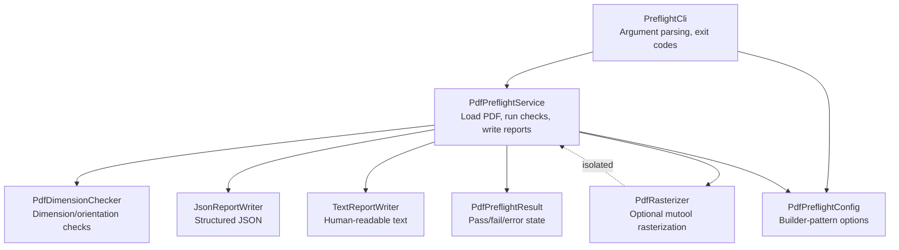
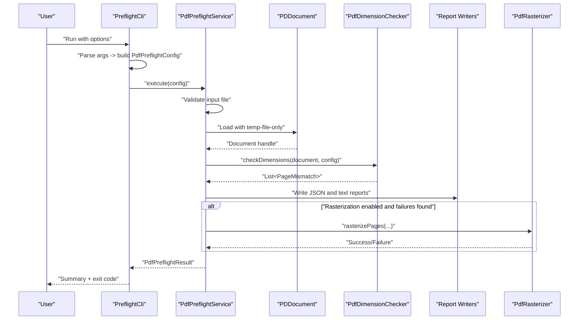
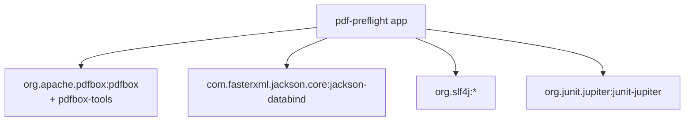
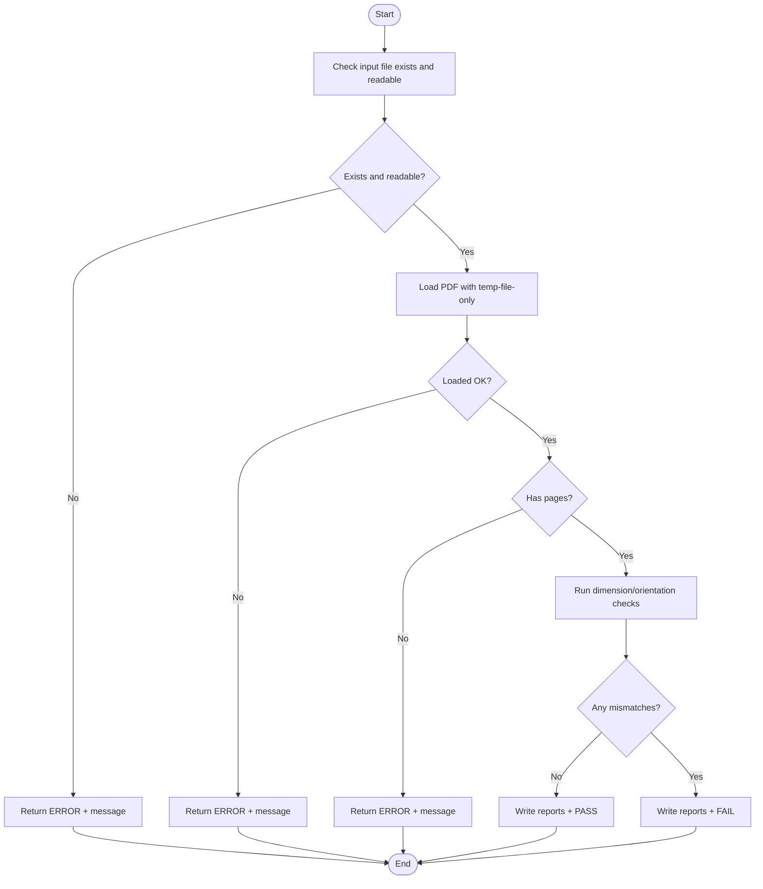

# Troubleshooting and FAQ

<cite>
**Referenced Files in This Document**
- [README.md](file://README.md)
- [QUICKSTART.md](file://QUICKSTART.md)
- [CLI_EXAMPLES.md](file://CLI_EXAMPLES.md)
- [DEPENDENCIES.md](file://DEPENDENCIES.md)
- [IMPLEMENTATION_SUMMARY.md](file://IMPLEMENTATION_SUMMARY.md)
- [PreflightCli.java](file://src/main/java/com/preflight/PreflightCli.java)
- [PdfPreflightService.java](file://src/main/java/com/preflight/service/PdfPreflightService.java)
- [PdfRasterizer.java](file://src/main/java/com/preflight/rasterizer/PdfRasterizer.java)
- [PdfDimensionChecker.java](file://src/main/java/com/preflight/checker/PdfDimensionChecker.java)
- [PdfPreflightConfig.java](file://src/main/java/com/preflight/config/PdfPreflightConfig.java)
- [PdfPreflightResult.java](file://src/main/java/com/preflight/model/PdfPreflightResult.java)
- [JsonReportWriter.java](file://src/main/java/com/preflight/report/JsonReportWriter.java)
- [TextReportWriter.java](file://src/main/java/com/preflight/report/TextReportWriter.java)
- [pom.xml](file://pom.xml)
- [build.gradle](file://build.gradle)
</cite>

## Table of Contents
1. [Introduction](#introduction)
2. [Project Structure](#project-structure)
3. [Core Components](#core-components)
4. [Architecture Overview](#architecture-overview)
5. [Detailed Component Analysis](#detailed-component-analysis)
6. [Dependency Analysis](#dependency-analysis)
7. [Performance Considerations](#performance-considerations)
8. [Troubleshooting Guide](#troubleshooting-guide)
9. [Conclusion](#conclusion)
10. [Appendices](#appendices)

## Introduction
This document provides comprehensive troubleshooting and frequently asked questions for the PDF Preflight Module. It focuses on diagnosing and resolving common issues related to memory usage, MuPDF integration, corrupted or encrypted PDFs, missing files, runtime errors, performance tuning, diagnostics, and environment setup. It also includes step-by-step guidance for upgrades and dependency management.

## Project Structure
The module is organized around a clear separation of concerns:
- CLI entry point parses arguments and orchestrates execution
- Service layer loads PDFs with low-memory settings, runs validations, writes reports, and optionally rasterizes
- Checker validates dimensions and orientation
- Rasterizer integrates with MuPDF CLI
- Report writers produce JSON and text outputs
- Configuration encapsulates all runtime options

**Diagram sources**
- [PreflightCli.java:18-62](file://src/main/java/com/preflight/PreflightCli.java#L18-L62)
- [PdfPreflightService.java:28-125](file://src/main/java/com/preflight/service/PdfPreflightService.java#L28-L125)
- [PdfDimensionChecker.java:17-99](file://src/main/java/com/preflight/checker/PdfDimensionChecker.java#L17-L99)
- [PdfRasterizer.java:20-98](file://src/main/java/com/preflight/rasterizer/PdfRasterizer.java#L20-L98)
- [JsonReportWriter.java:19-56](file://src/main/java/com/preflight/report/JsonReportWriter.java#L19-L56)
- [TextReportWriter.java:16-94](file://src/main/java/com/preflight/report/TextReportWriter.java#L16-L94)
- [PdfPreflightConfig.java:7-71](file://src/main/java/com/preflight/config/PdfPreflightConfig.java#L7-L71)
- [PdfPreflightResult.java:9-42](file://src/main/java/com/preflight/model/PdfPreflightResult.java#L9-L42)

**Section sources**
- [README.md:238-272](file://README.md#L238-L272)
- [IMPLEMENTATION_SUMMARY.md:48-82](file://IMPLEMENTATION_SUMMARY.md#L48-L82)

## Core Components
- PreflightCli: Parses CLI arguments, constructs configuration, executes service, prints summary, and exits with appropriate codes.
- PdfPreflightService: Loads PDFs with temp-file-only mode, validates pages, generates reports, and optionally rasterizes failed pages.
- PdfDimensionChecker: Single-pass validation comparing each page’s measured box to the reference page.
- PdfRasterizer: Optional component invoking mutool to render pages as images.
- Report Writers: Produce JSON and text reports.
- PdfPreflightConfig: Immutable configuration built via a fluent builder.
- PdfPreflightResult: Encapsulates pass/fail/error state, timing, and mismatch details.

**Section sources**
- [PreflightCli.java:18-62](file://src/main/java/com/preflight/PreflightCli.java#L18-L62)
- [PdfPreflightService.java:28-125](file://src/main/java/com/preflight/service/PdfPreflightService.java#L28-L125)
- [PdfDimensionChecker.java:17-99](file://src/main/java/com/preflight/checker/PdfDimensionChecker.java#L17-L99)
- [PdfRasterizer.java:20-98](file://src/main/java/com/preflight/rasterizer/PdfRasterizer.java#L20-L98)
- [JsonReportWriter.java:19-56](file://src/main/java/com/preflight/report/JsonReportWriter.java#L19-L56)
- [TextReportWriter.java:16-94](file://src/main/java/com/preflight/report/TextReportWriter.java#L16-L94)
- [PdfPreflightConfig.java:7-71](file://src/main/java/com/preflight/config/PdfPreflightConfig.java#L7-L71)
- [PdfPreflightResult.java:9-42](file://src/main/java/com/preflight/model/PdfPreflightResult.java#L9-L42)

## Architecture Overview
The system is designed for production use with:
- Low-memory PDF loading using temp-file-only mode
- Optional rasterization isolated from core logic
- Clear exit codes for CI/CD integration
- Structured reporting for automation

**Diagram sources**
- [PreflightCli.java:20-62](file://src/main/java/com/preflight/PreflightCli.java#L20-L62)
- [PdfPreflightService.java:48-125](file://src/main/java/com/preflight/service/PdfPreflightService.java#L48-L125)
- [PdfDimensionChecker.java:26-99](file://src/main/java/com/preflight/checker/PdfDimensionChecker.java#L26-L99)
- [JsonReportWriter.java:29-56](file://src/main/java/com/preflight/report/JsonReportWriter.java#L29-L56)
- [TextReportWriter.java:19-94](file://src/main/java/com/preflight/report/TextReportWriter.java#L19-L94)
- [PdfRasterizer.java:39-98](file://src/main/java/com/preflight/rasterizer/PdfRasterizer.java#L39-L98)

## Detailed Component Analysis

### CLI Argument Parsing and Exit Codes
- The CLI validates required inputs and prints usage on missing or invalid arguments.
- Exit codes:
  - 0: PASS
  - 1: FAIL (mismatches found)
  - 2: ERROR (invalid file, runtime error)
- The CLI prints a concise summary and exits accordingly.

**Section sources**
- [PreflightCli.java:67-156](file://src/main/java/com/preflight/PreflightCli.java#L67-L156)
- [PreflightCli.java:184-248](file://src/main/java/com/preflight/PreflightCli.java#L184-L248)
- [README.md:150-154](file://README.md#L150-L154)

### Service Execution and Error Handling
- Validates input existence and readability.
- Loads PDF with temp-file-only mode to support large files.
- Extracts reference page info and runs dimension/orientation checks.
- Writes reports and optionally rasterizes failed pages.
- Closes the document in a finally block to prevent resource leaks.
- Converts exceptions into error results with exit code 2.

**Section sources**
- [PdfPreflightService.java:48-125](file://src/main/java/com/preflight/service/PdfPreflightService.java#L48-L125)
- [PdfPreflightService.java:164-183](file://src/main/java/com/preflight/service/PdfPreflightService.java#L164-L183)
- [PdfPreflightService.java:188-230](file://src/main/java/com/preflight/service/PdfPreflightService.java#L188-L230)

### Dimension and Orientation Checking
- Single-pass algorithm compares each page to the reference page using the configured tolerance.
- Uses CropBox by default, falls back to MediaBox if CropBox is invalid.
- Records mismatch reasons for width, height, and orientation.

**Section sources**
- [PdfDimensionChecker.java:26-99](file://src/main/java/com/preflight/checker/PdfDimensionChecker.java#L26-L99)
- [PdfDimensionChecker.java:105-128](file://src/main/java/com/preflight/checker/PdfDimensionChecker.java#L105-L128)

### Rasterization with MuPDF
- Optional component invoked only when failures are present.
- Uses mutool draw with configurable DPI and page selection.
- Isolated from core logic; failures do not alter preflight pass/fail.

**Section sources**
- [PdfPreflightService.java:188-230](file://src/main/java/com/preflight/service/PdfPreflightService.java#L188-L230)
- [PdfRasterizer.java:39-98](file://src/main/java/com/preflight/rasterizer/PdfRasterizer.java#L39-L98)

### Reporting
- JSON report includes structured data for automation.
- Text report provides human-readable summaries and counts.

**Section sources**
- [JsonReportWriter.java:29-56](file://src/main/java/com/preflight/report/JsonReportWriter.java#L29-L56)
- [TextReportWriter.java:19-94](file://src/main/java/com/preflight/report/TextReportWriter.java#L19-L94)

## Dependency Analysis
- Apache PDFBox: PDF parsing and low-memory document loading
- Jackson: JSON serialization for reports
- SLF4J: Logging
- JUnit 5: Testing

**Diagram sources**
- [pom.xml:26-68](file://pom.xml#L26-L68)
- [build.gradle:18-33](file://build.gradle#L18-L33)

**Section sources**
- [DEPENDENCIES.md:3-86](file://DEPENDENCIES.md#L3-L86)
- [pom.xml:26-68](file://pom.xml#L26-L68)
- [build.gradle:18-33](file://build.gradle#L18-L33)

## Performance Considerations
- Memory usage: temp-file-only mode prevents loading entire PDF into heap; recommended heap is 512 MB for large files.
- Disk space: 2–3x the PDF size for temp files during processing.
- Streaming: Pages are processed sequentially; no rendering unless rasterization is enabled.
- Typical performance targets are provided for large files.

**Section sources**
- [DEPENDENCIES.md:76-81](file://DEPENDENCIES.md#L76-L81)
- [README.md:273-283](file://README.md#L273-L283)
- [IMPLEMENTATION_SUMMARY.md:144-151](file://IMPLEMENTATION_SUMMARY.md#L144-L151)

## Troubleshooting Guide

### Memory-Related Problems and OutOfMemoryError Mitigation
Symptoms
- JVM heap exhaustion when processing large PDFs
- Slow performance or timeouts

Mitigations
- Use Java 11+ (prefer LTS versions 17/21) for improved memory management
- Increase heap size using the -Xmx JVM option
- Ensure sufficient disk space for temp files (2–3x PDF size)
- Confirm temp-file-only mode is active (enabled by default in the service)

Validation steps
- Verify the service loads the PDF with temp-file-only mode
- Monitor disk usage during processing
- Reduce tolerance or disable rasterization if needed

**Section sources**
- [README.md:349-355](file://README.md#L349-L355)
- [DEPENDENCIES.md:76-81](file://DEPENDENCIES.md#L76-L81)
- [PdfPreflightService.java:67-73](file://src/main/java/com/preflight/service/PdfPreflightService.java#L67-L73)

### MuPDF Integration Issues
Common symptoms
- “MuPDF not available” warnings
- Rasterization skipped or fails silently

Root causes and fixes
- MuPDF not installed or not on PATH
  - Install per OS-specific instructions
  - Provide explicit path via --mutool-path
- Incorrect path or permissions
  - Verify executable permissions and path correctness
- Rasterization disabled intentionally
  - Remove --rasterize flag if not needed

Behavior
- Rasterization is optional and non-blocking; absence of images does not change pass/fail

**Section sources**
- [README.md:356-362](file://README.md#L356-L362)
- [CLI_EXAMPLES.md:99-110](file://CLI_EXAMPLES.md#L99-L110)
- [PdfPreflightService.java:188-230](file://src/main/java/com/preflight/service/PdfPreflightService.java#L188-L230)
- [PdfRasterizer.java:122-135](file://src/main/java/com/preflight/rasterizer/PdfRasterizer.java#L122-L135)

### Handling Corrupted or Encrypted PDFs
Symptoms
- Error messages indicating corruption or encryption
- Exit code 2

Resolution
- Corrupted PDFs: The service returns an error result with exit code 2
- Encrypted PDFs: The tool cannot decrypt; return exit code 2 with an encryption-related message
- Empty PDFs: Detected and reported as an error

Recommendations
- Decrypt the PDF externally before validation
- Use trusted PDF repair tools if corruption is suspected
- Validate with small samples first

**Section sources**
- [README.md:363-369](file://README.md#L363-L369)
- [PdfPreflightService.java:71-80](file://src/main/java/com/preflight/service/PdfPreflightService.java#L71-L80)
- [CLI_EXAMPLES.md:226-285](file://CLI_EXAMPLES.md#L226-L285)

### Missing File Scenarios
Symptoms
- “Input file not found” error
- Exit code 2

Resolution
- Verify absolute or relative path correctness
- Ensure the file exists and is readable
- Use --input with proper quoting if paths contain spaces

**Section sources**
- [PdfPreflightService.java:55-63](file://src/main/java/com/preflight/service/PdfPreflightService.java#L55-L63)
- [CLI_EXAMPLES.md:205-223](file://CLI_EXAMPLES.md#L205-L223)

### Runtime Errors
Symptoms
- Unexpected error messages and exit code 2
- Stack traces in stderr

Resolution
- Check logs emitted by the service
- Validate Java version and dependencies
- Re-run with verbose logging if needed

**Section sources**
- [PreflightCli.java:57-62](file://src/main/java/com/preflight/PreflightCli.java#L57-L62)
- [PdfPreflightService.java:121-124](file://src/main/java/com/preflight/service/PdfPreflightService.java#L121-L124)

### Diagnosing Validation Failures
Interpreting reports
- JSON report: Inspect mismatchCount, mismatches array, and referencePage
- Text report: Review mismatch details and summary counts

Debugging steps
- Adjust tolerance (--tolerance) for minor differences
- Switch box selection (--use-mediabox) if CropBox is missing
- Rasterize failed pages (--rasterize) to visually inspect issues

**Section sources**
- [README.md:156-236](file://README.md#L156-L236)
- [JsonReportWriter.java:29-56](file://src/main/java/com/preflight/report/JsonReportWriter.java#L29-L56)
- [TextReportWriter.java:19-94](file://src/main/java/com/preflight/report/TextReportWriter.java#L19-L94)
- [CLI_EXAMPLES.md:60-77](file://CLI_EXAMPLES.md#L60-L77)

### Performance Optimization Techniques
- Keep rasterization off unless needed
- Use default tolerance unless your workflow introduces measurable variances
- Prefer absolute paths to avoid filesystem overhead
- Monitor processing time and adjust JVM heap as needed

**Section sources**
- [README.md:273-283](file://README.md#L273-L283)
- [CLI_EXAMPLES.md:323-339](file://CLI_EXAMPLES.md#L323-L339)

### Environment Setup and Dependency Conflicts
- Java requirement: Java 11+ (LTS recommended)
- Build systems: Maven or Gradle
- Optional: MuPDF tools for rasterization

Upgrade procedure
- Update Java to LTS version
- Rebuild with Maven or Gradle
- Re-test with sample PDFs

**Section sources**
- [README.md:21-26](file://README.md#L21-L26)
- [DEPENDENCIES.md:82-87](file://DEPENDENCIES.md#L82-L87)
- [pom.xml:16-24](file://pom.xml#L16-L24)
- [build.gradle:9-12](file://build.gradle#L9-L12)

### Frequently Asked Questions
- What exit codes mean
  - 0: PASS, 1: FAIL, 2: ERROR
- Supported PDF features
  - Validates page dimensions and orientation; does not render pages unless rasterization is enabled
- Can I validate very large PDFs?
  - Yes, temp-file-only mode supports up to 1 GB+ files
- Do I need MuPDF?
  - No; rasterization is optional and non-blocking
- How do I interpret the reports?
  - JSON for machines, text for humans; review mismatch details and reference page

**Section sources**
- [README.md:150-154](file://README.md#L150-L154)
- [README.md:156-236](file://README.md#L156-L236)
- [README.md:17-19](file://README.md#L17-L19)
- [README.md:10-19](file://README.md#L10-L19)

## Conclusion
This guide consolidates practical troubleshooting steps for the PDF Preflight Module. By leveraging low-memory PDF loading, structured reporting, and optional rasterization, most issues can be resolved quickly. Follow the environment and upgrade guidance to maintain compatibility and performance.

## Appendices

### Exit Codes Reference
- 0: PASS — All pages match
- 1: FAIL — Mismatches found
- 2: ERROR — Invalid file, runtime error

**Section sources**
- [README.md:150-154](file://README.md#L150-L154)
- [QUICKSTART.md:48-53](file://QUICKSTART.md#L48-L53)

### Diagnostic Flowchart

**Diagram sources**
- [PdfPreflightService.java:55-125](file://src/main/java/com/preflight/service/PdfPreflightService.java#L55-L125)
- [PdfDimensionChecker.java:26-99](file://src/main/java/com/preflight/checker/PdfDimensionChecker.java#L26-L99)